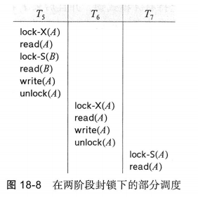
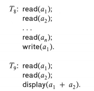
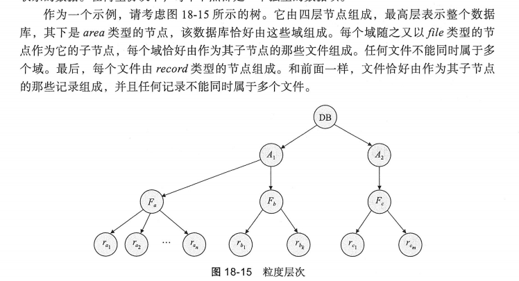
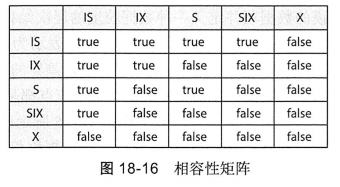
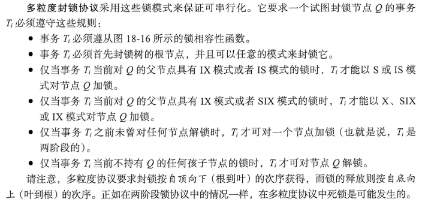

# 事务管理

术语事务指的是构成单一的逻辑工作单元的操作的集合。

事务的ACID特性：
- 原子性（Atomicity）：事务是不可分割的工作单元，要么全部执行，要么全部不执行。
- 一致性（Consistency）：事务执行前后，数据库的状态必须保持一致。
- 隔离性（Isolation）：多个事务并发执行时，每个事务的执行不受其他事务的影响。
- 持久性（Durability）：事务一旦提交，其结果对数据库的修改是永久性的，即使系统发生故障，事务的结果也不会丢失。

## 可串行化

在并发执行的条件下，通过保证所执行的任何调度的效果都与没有进行任何并发执行的调度效果一样，来保证数据库的**一致性**。这种调度被称为可串行化的调度。

这里的调度先只考虑读写操作对变量进行修改所带来的一致性问题。

### 冲突可串行化

考虑调度S中的 属于事务$T_i$和$T_j$的两条连续指令I和J。如果I和J引用相同的数据项，则有下面四种情况

- I = read(Q), J = read(Q) 这种情况下I，J次序无关紧要
- I = read(Q), J = write(Q) 这种情况下顺序是重要的
- I = write(Q), J = read(Q) 同上
- I = write(Q), J = write(Q) 这种情况下I，J次序可能是无关紧要的，但是会影响到下一条read(Q)指令

所以只有两个都是read的情况下，相对顺序才是真正无关紧要的。

定义I和J是冲突的，如果他们由**不同事务**在**相同的数据项**上执行操作，并且其中至少有一条指令是**write操作**。

如果I和J是属于不同事务的指令，并且I和J不冲突，则可以交换I和J的次序来产生一个新的调度S'。此时S和S'是等价的。

如果调度S可以经过一系列非冲突指令的交换而变成调度S'，则称调度S和S'是冲突等价的。

如果一个调度S和一个串行调度是冲突等价的，则称S是**冲突可串行化的。**

### 如何确定一个调度是否是冲突可串行化的

对调度S构造一个有向图，称为优先图。

顶点是事务集，如果二者存在冲突，则产生一条边。也即：

1. 在$T_j$执行read(Q)之前，$T_i$执行write(Q)
2. 在$T_j$执行write(Q)之前，$T_i$执行write(Q)
3. 在$T_j$执行write(Q)之前，$T_i$执行read(Q)

如果优先图中存在一条$T_i\to T_j$的边，则等价于在任何S的串行调度S'中，$T_i$在$T_j$之前执行。

如果关于S的优先图中存在**环**，则调度S是非冲突可串行化的。无环就是冲突可串行化的。

可以借助优先图的偏序关系得到可串行化次序，使用拓扑排序算法即可。

## 事务的隔离性和原子性

可恢复调度要求： 任何事务 $T_i$ 的提交，必须等到它 **读取的所有数据** 已经由**写入**这些数据的事务 $T_j$ 提交。

无级联调度：对于每对$T_i$和$T_j$，如果满足$T_j$读取了先前由$T_i$写的数据项，则$T_i$的提交操作必须出现在$T_j$的这个读操作之前。（否则对于 i 的 abort 可能会级联到j和更多的k）

## 隔离性级别的实现

事务可以只用锁封锁它访问的那些数据项，而不是整个数据库。

可以使用两阶段锁来确保可串行化。

- 在事务的第一个阶段过程中，事务可以获得锁，但不能释放锁。
- 在事务的第二个阶段过程中，事务可以释放锁，但不能获得锁。

其他可能的实现：时间戳，多版本和快照隔离。

## 18章 - 并发控制

为了确保事务的**隔离**，系统必须对并发事务之间的交互加以控制，这种控制是通过名为并发控制的机制来实现的。本章的讨论忽略了故障。

### 基于锁的协议

确保隔离性的方式之一是对数据项以互斥的方式进行访问。最简单的方式之一，就是持有锁者才能对数据进行修改。

两种锁模式：

1. 共享锁。可以读但是不能写。
2. 排他锁。可以读也可以写。

这两种锁模式允许多个事务读取一个数据项。但是同时只有一个事务进行写访问。

注意，排他模式的锁和共享模式不相容。也即，如果一个数据上已经有人持有了共享锁。那取排他锁的人要排队等待所有共享锁释放，才能获取排他锁。

具体的是否相容关系，可以使用**相容控制矩阵**来表示。

事务通过lock-S(Q)申请Q上的共享锁。使用lock-X(Q)申请Q上的排他锁。使用unlock(Q)释放Q上的锁。

为了保证一致性，不能过早的释放锁（否则可能会让另一个并发事务看到中间不一致的状态）。但是如果拖到最后再释放锁，有可能会由于饥饿持有带来死锁。这种情况下就需要数据库系统回滚其中一个事务。

锁的授予：当一个事务申请对一个数据项加一种特定模式的锁并且没有其他事务在相同数据项上持有一种冲突模式的锁时，该锁可以被授予。

有一种可能是，一个申请排他锁的事务在等待共享锁的释放，但是源源不断有事务加入使用共享锁，因此这个申请排他锁的事务被饿死。

避免饿死的方法：当申请排他锁时，不允许加新的共享锁。（引入新的其他锁类型也是一样的道理）

#### 两阶段锁

两阶段封锁协议要求每个事务分两个阶段提出加锁和解锁申请。

1. 增长阶段：一个事务可以获得锁，但不能释放任何锁。
2. 缩减阶段：一个事务可以释放锁，但是不能获得任何新锁。

两阶段锁保证了冲突可串行化。在调度中该事务获得其最后锁的为止被称为该事务的封锁点。这样，多个事务就可以根据他们的封锁点进行排序，这种次序就是对这些事务的一个可串行化次序。

**两阶段锁并不保证不会发生死锁**

**两阶段锁可能会导致级联回滚**

在上图T7的read(A)步骤之后T5发生故障会导致T6和T7的级联回滚。

可以通过将两阶段所修改为严格两阶段封锁协议来避免。不但要求封锁是两阶段的，而且**要求事务所持有的排他模式锁（也即写入）必须在事务提交后方可释放。**

另一种变体是强两阶段封锁协议。要求事务提交之前保留所有的锁。这种情况下事务可以按照其提交的顺序串行化。

还可以允许锁转换以获得更高的并发度。

由于在T8中需要read和write a1，如果按照两阶段锁的要求，需要对a1加排他锁，并在write后才释放。这样T8和T9以任何顺序其实都是串行执行。

一种改进是对基本的两阶段锁进行修改，允许锁转换。

- 升级，表示从共享到排他模式的转换
- 降级，表示排他模式到共享模式的转换

锁转换并不允许随意进行。升级只能在增长阶段，降级只能在缩减阶段。

锁管理器是可以实现为一个进程，其中使用链表管理不同数据项的锁。

不使用两阶段锁的话，还可以有其他的方式，比如给数据项集合增加偏序关系，然后形成一个有向无环图，人为规定一个访问顺序。

### 死锁处理

两种解决方法：一是死锁预防协议保证系统不进入死锁。二是允许系统进入死锁，使用死锁检测和死锁恢复。

死锁预防：对封锁请求进行排序，或要求同时获得所有的锁来保证不会发生循环等待。另一种方法是每当等待有可能导致死锁时，它就执行事务回滚而不是等待锁。

死锁检测：

死锁可以用一种称为等待图的有向图来精确描述，顶点集由所有的事务组成，边集E中的每一个元素是一个有序对$T_i\to T_j$，表示**事务$T_i$正在等待$T_j$释放一个$T_i$所需的数据项。**

如果事务图中出现了环路，系统中就存在死锁。

发现死锁后需要从死锁中恢复，常用方法是回滚一个或多个事务：选择牺牲者 - 回滚 - 饿死（防止出现饿死的情况一般会给代价因素加入回滚次数）。

### 多粒度

前面讨论的都以一个数据项为粒度进行加锁和解锁，但是可以将数据聚合，以不同粒度进行加锁操作，这对性能是有帮助的，所以可以构建粒度层次树，如下图，可以对树中不同层次的对象进行加锁。

当事务对一个节点以共享模式或排他模式加锁时，**该事务也以同样的锁模式隐含地封锁这个节点的全部后裔节点。**

为了让这种依赖关系能够更加高效的被获取，引入一类被称为**意向锁模式**的新的锁模式。如果一个节点加上了意向模式的锁，则意味着要在更细力度上进行显式加锁。

希望给一个节点（比如说Q）加锁的事务必须遍历树中从根到Q的一条路径。在遍历树的过程中，该事务以意向模式对各节点加锁。

意向锁是一种“提示”机制，表示事务打算在更低层次的数据单元上加锁。通过检查祖先节点的意向锁，可以快速判断是否存在潜在的锁冲突，而无需遍历整个层次结构。

- 意向共享（IS）模式：将在树的较低层进行显式封锁，但只能加共享模式锁
- 意向排他（IX）模式：将在树的较低层进行显式封锁，但只能加排他模式锁
- 共享意向排他（SIX）模式：以该节点为根的子树以共享模式被显式封锁，并且将在树的低层进行显式加排他模式的锁。

### 基于时间戳的协议

对于系统中的每个事务$T_i$，我们把唯一的一个固定的时间戳和他关联起来，记为$TS(T_i)$。是在事务$T_i$开始之前由数据库系统赋予的。

事务的时间戳决定了可串行化的次序。若$TS(T_i)<TS(T_j)$，则系统必须保证所产生的调度等价于事务$T_i$在$T_j$之前执行。

将每个数据项Q与两个时间戳值关联：

1. W-timestamp(Q)：数据项Q上一次被成功写入的时间戳
2. R-timestamp(Q)：数据项Q上一次被成功读取的时间戳

#### 时间戳排序协议

时间戳排序协议保证任何有冲突的read和write操作按时间戳的次序执行。

假设事务$T_i$发出read(Q):

- 若TS($T_i$) < W-timestamp(Q)，则$T_i$需要读取的Q值已经被覆盖，read操作被拒绝，并且$T_i$被回滚。
- 若TS($T_i$) $\geq$ W-timestamp(Q)，则$T_i$可以读取Q的值，并且将R-timestamp(Q)更新。

假设事务$T_i$发出write(Q):

- 若TS($T_i$) < R-timestamp(Q)，则$T_i$产生的Q值是先前所需要，并且系统已假定该值不会再被产生。因此，系统拒绝该write操作，并回滚$T_i$。
- 若TS($T_i$) < W-timestamp(Q)，则$T_i$试图写入的Q值是过时的，系统拒绝这个write操作并回滚$T_i$
- 否则执行write操作并将W-timestamp(Q)更新。

事务$T_i$如果由于发出read或者write操作而被并发控制机制回滚，那么系统回复于它一个**新的**时间戳，并重新启动它。

## 19章 - 恢复系统

恢复系统主要实现ACID中的持久性和原子性。另一个要求是高可用性。（能在出现故障时迅速恢复）

故障有以下三种：

- 事务故障：事务在执行过程中由于某种错误而未能完成，需要回滚。
- 系统故障：系统在运行过程中由于某种错误而出现故障，需要恢复。
- 介质故障：由于硬件故障导致数据丢失。

定义四种操作：read，write，input和output。read和write都针对主存，input和output是在主存和磁盘间搬运数据的操作。

### 恢复与原子性

目标是要么执行事务$T_i$对数据库的所有修改，要么不执行任何修改。

为了达到原子性的目标，需要在修改数据库前，先向**稳定存储器**输出信息，描述要做的修改。这里描述的是使用基于日志的恢复。

更新日志记录描述一次数据库写操作，它具有以下字段：

- 事务标识
- 数据项标识
- 旧值
- 新值

还有一些其他的日志记录，记录重要事件，比如<$T_i$, start>，<$T_i$, commit>，<$T_i$, abort>。

两种操作：撤销操作和重做操作。

- 撤销操作使用一条日志记录，将指定数据项置为旧值。
- 重做操作使用一条日志记录，将指定数据项置为新值。

为了避免级联撤销，回复算法一般要求如果**一个数据项被一个事务修改了，那么在该事务提交或者中止前不允许其他事务修改该数据项。**（使用排他锁）

当一个事务的commit记录被输入到稳定存储器后，我们就说这个事务提交了，此时日志中有足够的信息保证，即使发生系统崩溃，事务所做的更新也可以被重做。如果系统崩溃在commit记录被输入到稳定存储器后，则需要回滚。

- $redo(T_i)$：重做事务$T_i$的更新。但是实际操作会对日志进行依次扫描，并对每条日志记录进行重做。而不是只重做$T_i$的日志记录。
- $undo(T_i)$：撤销事务$T_i$的更新。撤销操作还写日志记录执行的更新。撤销顺序也非常重要！

发生系统崩溃后，系统为了原子性而查阅日志确定哪些事务要重做：

- 如果包含<$T_i$,start>，但是不包含<$T_i$,commit>和<$T_i$,abort>，则**撤销**$T_i$。
- 如果包含<$T_i$,start>和<$T_i$,commit>，或<$T_i$,abort> **要重做$T_i$。** 如果日志包含<$T_i$,abort>，仍要重做的原因是只要存在abort，**也会存在read-only的撤销日志**。这种情况的最终结果是对$T_i$的所有修改进行撤销。是一个冗余，但是可以简化恢复过程。

检查点（checkpoint）：降低恢复开销。

检查点的执行过程如下：

- 将当前位于主存的所有日志记录输出到稳定存储器。
- 将所有修改过的缓冲块输出到磁盘
- 写入一条<checkpoint L>的日志记录。

检查点执行过程中，不允许事务执行任何更新操作。

如果任何事务的commit和abort在checkpoint前，就不需要重做了。

系统发生崩溃后，系统检查日志找到最后一条checkpoint，然后在这个基础上顺序扫描，进行redo和undo。

### 恢复算法

正常操作时的事务回滚：

- 从后往前扫描日志，对每一条<$T_i$,$x_j$,$v_1$,$v_2$>，将$v_1$写入$x$
- 然后往日志里写一条redo-only日志$<T_i,X_j,v_1>$，被称为补偿日志记录

此时对事务所做的每个更新动作（包括恢复成旧值）都在日志里了。

系统崩溃后：

- 在重做阶段，系统通过最后一个checkpoint开始**正向扫描**，重演所有的事务更新。
- 具体的，将待回滚事务的列表undo-list初始化设定为<checkpoint L>日志记录中的列表L。
- 一旦遇到形如$<T_i,X_j,V_1,V_2>$的正常日志记录，或者redo-only的日志记录，就执行重做。
- 一旦发现$<T_i start>$记录，就加入$T_i$到undo-list。
- 发现$<T_i,abort>$或$<T_i,commit>$记录，就从undo-list中移除$T_i$。

在重做阶段末尾，undo-list包含所有尚未完成的事务。

在撤销阶段，系统回滚undo-list中的事务。它从**尾端**开始**反向**扫描日志执行回滚。

- 一旦发现属于undo-list的事务的日志记录，就执行撤销操作。
- 发现undo-list事务的$<T_i,start>$，就往日志里写一条$<T_i,abort>$，然后从undo-list中移除$T_i$。
- 一旦undo-list变为空，撤销阶段就结束了。

组提交：不一定事务提交就直接写日志，而是攒一批事务，然后一起写日志。

### 缓冲区管理

#### 日志记录缓冲

上面的假设是每条日志记录在创建时都直接写入稳定存储器。但实际开销非常大。所以一般在日志记录创建时，先写入日志记录缓冲，然后定期将缓冲区中的日志记录写入稳定存储器。

但是，如果系统崩溃，缓冲区中的日志记录会丢失。所以需要对恢复技术增加一些额外要求：

- 在日志记录<$T_i$, commit>输出到稳定存储器后，事务$T_i$进入提交状态
- 在日志记录<$T_i$, commit>输出到稳定存储器前，与$T_i$相关的所有日志记录必须已经输出到稳定存储器
- 在主存的数据块输出到数据库前，所有相关日志必须已经输出到稳定存储器

#### 数据库缓冲

根据提交事务时是否强制将修改过的所有块写入磁盘，分为两种策略：强制策略和非强制策略。

类似的，一个仍然活跃的事务修改过的块不应该被写出到磁盘，这被称为非抢占策略，所对应的另一个策略是抢占策略。

一般系统标准采用抢占策略和非强制策略以获得更好的性能。

只要遵循先写日志的规则，采用抢占策略，恢复算法也能够正常工作。

当在抢占时需要把块写到磁盘上时，需要加锁，以确保此时没有对块的写入。

