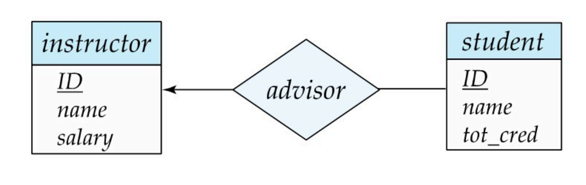
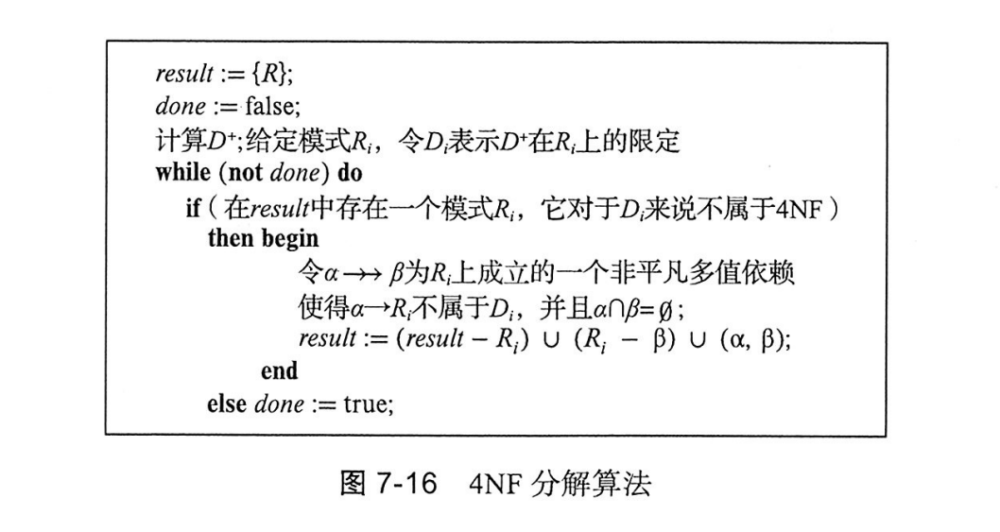

以下是关系代数中常用的符号及其含义汇总表：

| 符号             | 操作名称           | 含义                                                                 |
|------------------|------------------|--------------------------------------------------------------------|
| $\sigma_{C}(r)$ | **选择（Selection）** | 从关系 $r$ 中选择满足条件 $C$ 的元组。                              |
| $\Pi_{A}(r)$   | **投影（Projection）** | 从关系 $r$ 中选择属性集合 $A$ 的列，移除其他属性。                       |
| $r \bowtie s$  | **自然连接（Natural Join）** | 根据两个关系 $r$ 和 $s$ 的公共属性值连接它们。                          |
| $r \times s$   | **笛卡尔积（Cartesian Product）** | 返回关系 $r$ 和 $s$ 的所有可能的元组组合。                              |
| $r \cup s$     | **并（Union）**        | 返回两个关系 $r$ 和 $s$ 中的所有元组（去重）。                            |
| $r - s$        | **差（Difference）**   | 返回关系 $r$ 中有但 $s$ 中没有的元组。                                   |
| $r \cap s$     | **交（Intersection）**  | 返回同时出现在关系 $r$ 和 $s$ 中的元组（可由 $r - (r - s)$ 推导）。       |
| $\rho_{B}(r)$  | **重命名（Rename）**    | 将关系 $r$ 重命名为 $B$。                                               |
| $\gamma_{A, agg}(r)$ | **分组聚合（Grouping and Aggregation）** | 按属性集合 $A$ 分组，并对每组进行聚合操作（如求和、计数）。                  |
| $r \div s$     | **除（Division）**     | 返回关系 $r$ 中的元组，它们与 $s$ 中所有元组都相关联。                      |
| $r \bowtie_C s$ | **条件连接（Conditional Join）** | 类似自然连接，但在公共属性外增加条件 $C$ 进行连接。                            |
| $\cup_+$ 或 $\bowtie_+$ | **外连接（Outer Join）** | 返回普通连接的结果，并保留未匹配元组，用空值补齐。                                  |

---

### 详细解释：
1. **选择操作（Selection）**:
   - 示例：$\sigma_{Age > 30}(Employee)$
   - 含义：选择所有 `Age > 30` 的员工记录。

2. **投影操作（Projection）**:
   - 示例：$\Pi_{Name, Salary}(Employee)$
   - 含义：从 `Employee` 中提取 `Name` 和 `Salary` 列。

3. **自然连接（Natural Join）**:
   - 示例：$Employee \bowtie Department$
   - 含义：在 `Employee` 和 `Department` 中根据公共属性（如 `Dept_ID`）连接。

4. **笛卡尔积（Cartesian Product）**:
   - 示例：$Employee \times Department$
   - 含义：返回两个关系中所有可能的元组组合，通常用于连接操作的中间步骤。

5. **并操作（Union）**:
   - 示例：$R \cup S$
   - 含义：两个关系 $R$ 和 $S$ 的并集，要求 $R$ 和 $S$ 有相同的属性结构。

6. **差操作（Difference）**:
   - 示例：$R - S$
   - 含义：返回 $R$ 中有但 $S$ 中没有的元组。

7. **交操作（Intersection）**:
   - 示例：$R \cap S$
   - 含义：返回两个关系中共有的元组。

8. **重命名操作（Rename）**:
   - 示例：$\rho_{NewName}(R)$
   - 含义：将关系 $R$ 重命名为 $NewName$。

9. **分组聚合操作（Grouping and Aggregation）**:
   - 示例：$\gamma_{Dept, AVG(Salary)}(Employee)$
   - 含义：按 `Dept` 分组，计算每组 `Salary` 的平均值。

10. **除操作（Division）**:
    - 示例：$R \div S$
    - 含义：返回 `R` 中的元组，这些元组与 $S$ 中所有元组相关。

---

### 小结
关系代数符号提供了操作关系型数据库的强大工具，用于执行各种查询逻辑。从基本选择和投影到高级的分组聚合和连接，它们共同定义了关系数据库中数据的操作方式。 

在关系数据库中，符号 $r(R)$ 通常表示一个**关系实例**（即某个具体的关系数据表）对应于关系模式 $R$ 的一个实例。具体来说：

- **$R$** 表示一个**关系模式**（Relation Schema），也就是一个关系的结构，包括关系的名称以及它所包含的属性（字段）。
- **$r(R)$** 表示基于关系模式 $R$ 所定义的一个具体的数据实例。即，一个具体的关系表，它包含了具体的行（元组）和数据。

### 关系模式与关系实例

- **关系模式（$R$）**: 是描述关系结构的元数据，定义了表格的列和每列的数据类型。例如，关系模式可以定义一个学生表，包含学生的学号、姓名、年龄等属性。

  举个例子：

  $R = \{ \text{学号}, \text{姓名}, \text{年龄} \}$

  这表示一个学生表，包含三个属性：学号、姓名和年龄。

- **关系实例（$r(R)$）**: 是一个具体的表，它包含了一组数据。这些数据行符合关系模式 $R$ 的结构要求。每一行都是一个**元组**，对应具体的数据。

  举个例子：

  $r(R) = \{  (1001, \text{张三}, 20),  (1002, \text{李四}, 21),  (1003, \text{王五}, 22) \}$

  这是一个关系实例，包含了三行数据，每行数据符合关系模式 $R$ 的定义。

### 总结

- **$R$** 是一个关系模式，定义了数据表的结构。
- **$r(R)$** 是关系模式 $R$ 对应的一个关系实例，表示实际的数据表及其内容。

这两个概念有助于区分数据库的结构（模式）和实际存储的数据（实例）。

### ER模型

ER模型是实体-关系模型，用于描述现实世界中的实体及其之间的关系。

ER模型包括实体、实体集、实体类型、实体集的属性、实体集的联系、联系集、联系类型、联系集的属性。

ER图中，实体集用矩形表示，联系集用菱形表示。如果联系集有除了实体集元素外的其他元素，用虚线连接一个新的矩形表示。

可以自连接，这样用两条线连接一个实体集和一个联系集，上面写明每个实体集不同的role。

联系关系有一对一，多对一，一对多，多对多。**使用箭头就是1，使用直线就是多。**

比如上面这种就是一对多。

完全参与与部分参与：部分参与就是普通的连线，完全参与是双线。

也可以在线上标最大基数和最小基数，标记为a..b，a是最小基数，b是最大基数。

实体集的主键就直接用下划线标识，联系集的主键要根据映射基数选择主键。

- 1对1：选择其中一个实体集的主键即可，哪个都行
- 1对多，多对1：主键是多侧的主键
- 多对多：主键是两个实体集主键的并集

弱实体集：如果一个实体集的属性完全依赖于另一个实体集，则这个实体集是弱实体集。

弱实体集不使用主键来标识自己，使用强实体集和额外的属性来唯一标识。

### 函数依赖

如果$K\to R$ 在 $r(R)$ 上成立，则 $K$ 是$r(R)$的一个超码。

对于每对元组 $t_1$ 和 $t_2$ ，只要$t_1[K]=t_2[K]$ 则有$t_1[R]=t_2[R]$

### BCNF

BCNF 定义：

- 所有非平凡的函数依赖 $X\to Y$ 的左边 $X$ 必须是超码。
- 或者函数依赖是平凡的，也即 $Y\subseteq X$。

如何分解为BCNF？

**对于模式 $R$ ，存在函数依赖$X\to Y$ ，且$X$ 不是$R$ 的超码，则将$R$ 分解为$X \cup Y$ 和 $R-(Y-X)$。**

然后做递归分解。

### 3NF

每个函数依赖都应该满足以下的定义中的至少一个：

如何理解？3NF保证了说，不存在借助非主属性传递依赖于候选码的情况。（即A是主键，B依赖于A，C依赖于B，这样就有一个A->C的传递依赖，且BC都是非主键，不满足3NF）

这样就能保证一定程度的减少冗余。要不然如果存在这个B->C的依赖，那么B的值如果重复，C的值也会重复，那其实应该开一张新的表出来放BC的关系。

判定的时候就直接看有没有$A\to B\to C$的依赖，且B是非主键，C是非主键，A是主键。

> 假设有一个数据表，表的结构如下：
> 
> | 学号 | 学生姓名 | 学院名称 | 学院地址 |
> |------|----------|----------|----------|
> | 1001 | 张三     | 计算机学院| 北京     |
> | 1002 | 李四     | 数学学院  | 上海     |
> | 1003 | 王五     | 计算机学院| 北京     |
> 
> 在这个表中：
> 
> - 学号 是主键，唯一标识每一行。
> - 学生姓名、学院名称 和 学院地址 都是非主属性。
> 
> 假设我们发现：
> - 学号 → 学生姓名：知道学号就能确定学生姓名。
> - 学院名称 → 学院地址：知道学院名称就能确定学院地址。
> 
> 这种情况下，学院地址 是通过 学院名称 间接依赖于 学号（即通过 学院名称）。这就违反了3NF，因为它存在传递依赖（学院名称 → 学院地址，然后 学号 → 学院名称）。
> 
> 为了解决这个问题，我们可以将表拆分成两个表：
> 
> 学生表（包含学生的基本信息）：
> 
> | 学号 | 学生姓名 | 学院名称   |
> |------|----------|------------|
> | 1001 | 张三     | 计算机学院 |
> | 1002 | 李四     | 数学学院   |
> | 1003 | 王五     | 计算机学院 |
> 
> 学院表（包含学院的地址信息）：
> 
> | 学院名称   | 学院地址 |
> |------------|----------|
> | 计算机学院 | 北京     |
> | 数学学院   | 上海     |
> 
> 通过这种拆分，我们消除了传递依赖，现在每个非主属性（学院地址）只依赖于主键（学院名称），而不再依赖于其他非主属性。这就符合了3NF的要求。

### 1NF和2NF

1NF和2NF的定义如下：

1NF：所有属性都是原子值，即不可再分。

2NF：每个元组都可以被区分，所有非主属性都完全依赖于候选码。（只有历史意义，一般不做考虑）（假设（A,B,C,D）其中(A,B)是候选码，则不能存在B->C的依赖，否则应该变成（A,B,D）和（B,C）两个表）

### 函数依赖

闭包：对一个集合做n次floyd得到的结果就是闭包。（以一种OI的视角来看）

函数依赖的闭包就是所有满足$F\to f$的$f$的集合。

### 正则覆盖

#### 属性冗余

- 从左侧移除：如果满足以下条件，则属性 $A$ 在 $\alpha$ 中是冗余的：
$A \in \alpha$ 且$F$ 逻辑蕴含 $(F-\{\alpha \to \beta\})\cup\{(\alpha -A)\to \beta\}$

- 从右侧移除：如果满足以下条件，则属性 $A$ 在 $\beta$ 中是冗余的：
$A \in \beta$ 且函数依赖集 $(F-\{\alpha\to\beta\})\cup\{\alpha \to(\beta-A)\}$ 逻辑蕴含 $F$

注意从左侧删除一个变量会让约束变得更强，而从右侧删除会变得更弱，所以如果把移除条件的左右颠倒，判定会总是成立！

#### 测试属性是否冗余

设 $R$ 是一个关系模式，$F$ 是在 $R$ 上成立的一组函数依赖。考虑函数依赖 $\alpha \to \beta$ 中的一个属性：

要测试属性 $A \in \beta$ 是否在 $\beta$ 中是冗余的：
1. 考虑集合：$F' = (F - \{\alpha \to \beta\}) \cup \{\alpha \to(\beta-A)\}$
2. 检查 $F'$ 下 $\alpha^+$ 是否包含 $A$；如果包含，则 $A$ 在 $\beta$ 中是冗余的

要测试属性 $A \in \alpha$ 是否在 $\alpha$ 中是冗余的：
1. 令 $\gamma = \alpha - \{A\}$
2. 检查 $\gamma \to \beta$ 是否能从 $F$ 中推导出来：
   - 计算 $\gamma^+$ (使用 $F$ 中的依赖)
   - 如果 $\gamma^+$ 包含 $\beta$ 中的所有属性，则 $A$ 在 $\alpha$ 中是冗余的

**这里的 $\alpha^+$ 和 $\gamma^+$ 表示属性集的闭包，即从这些属性出发，使用给定的函数依赖能够推导出的所有属性的集合。**

通过这种方法，我们可以识别并移除函数依赖中的冗余属性，从而得到更简洁的函数依赖集。

**F的正则覆盖Fc：F逻辑蕴涵Fc中的所有依赖，并且Fc逻辑蕴含F中的所有依赖。**

- **Fc中任何函数依赖不包含无关属性**
- **Fc中每个函数依赖的左边都是唯一的**

   

### 保持依赖

保持依赖是指在关系模式分解后，原模式中的函数依赖关系在分解后的模式中仍能推导出来。具体来说：

- 设 $R$ 是一个关系模式，$F$ 是其上的函数依赖集
- 将 $R$ 分解为 $R_1, R_2, ..., R_k$
- 如果在分解后的模式上定义的函数依赖的闭包等价于原来的函数依赖闭包，则称这个分解是保持依赖的

判断方法：
1. 计算原函数依赖集 $F$ 的闭包 $F^+$
2. 计算分解后各子模式上函数依赖的并集的闭包
3. 比较两个闭包是否相等

当然实际有多项式做法（上面这个是指数做法）

保持依赖的重要性：
- 确保数据完整性约束不会丢失
- 便于在分解后的关系中实施依赖检查
- 是评价分解质量的重要标准之一

## 使用函数依赖的分解算法

### BCNF分解

#### BCNF判定

- 检测某个依赖$\alpha\to\beta$是否违反BCNF：计算$\alpha$的属性闭包$\alpha^+$，如果$\alpha^+$包含R中的所有属性，则不违反。
- 为了检测一个关系R是否属于BCNF，只需要检测F而不需要检测$F^+$（但是只适用于R是未进行过分解的，如果分解了一次就不适用了，可能需要一些$F^+$中的约束来判定）

第一次分解后的下一步判定方式：

- **对于$R_i$中的每一个属性子集$\alpha$，计算$\alpha^+$，要么$\alpha^+$包含$R_i$中的所有属性，要么$\alpha^+$不包含$R_i-\alpha$中的任何属性。**

#### 分解算法

为什么成立？

对于新生成的模式 $(\alpha, \beta)$：
- $\alpha$ 是这个子模式的超码（因为 $\alpha \to \beta$ 是原函数依赖）
- 所有在这个子模式上的函数依赖的左边必然包含 $\alpha$
- 因此这个子模式满足BCNF（所有函数依赖的左边都是超码）

对于新生成的模式 $(R_i - \beta)$：
- 移除了 $\beta$ 后，原来的 $\alpha \to \beta$ 在这个子模式上不再存在
- 这消除了之前违反BCNF的依赖

>假设有关系模式 R(A,B,C,D)，函数依赖：A→B, B→C
>其中B→C违反BCNF（因为B不是超码）
>
>第一次分解：
>- 基于B→C分解为：
>  - R1(B,C)
>  - R2(A,B,D)
>
> 第二次分解：
> - R1(B,C)已满足BCNF
> - R2(A,B,D)中A→B仍然满足BCNF（因为A是超码）
>
> 最终得到的分解：R1(B,C), R2(A,B,D)都满足BCNF

### 3NF分解

### 4NF与多值依赖

令$r(R)$为一个关系模式，并令$\alpha$和$\beta$为$R$的子集。

多值依赖$\alpha\to\to\beta$在R上成立的条件是：

对于$r(R)$的任意两个元组$t_1$和$t_2$，如果$t_1[\alpha]=t_2[\alpha]$，则存在$r(R)$中的元组$t_3$和$t_4$，使得$t_1[R-\alpha-\beta]=t_3[R-\alpha-\beta]$，$t_2[R-\alpha-\beta]=t_4[R-\alpha-\beta]$，并且$t_3[\alpha\beta]=t_2[\alpha\beta]$，$t_4[\alpha\beta]=t_1[\alpha\beta]$。

这个定义的意思是$\alpha$和$\beta$的联系独立于$\alpha$和$\R-\alpha-\beta$的联系。

函数依赖要求当$A\to B$存在时，不能有其他元组A的值和B的值不同。多值依赖反其道而行之，不对此进行要求，而是要求必须有对应特殊形式的元组存在。因此有时候函数依赖被称为 相等产生依赖 ，而多值依赖被称为 元组产生依赖。

一个性质：$\alpha\to\to\beta$等价于$\alpha\to\to\R-\alpha-\beta$。

另一个性质：若$\alpha\to \beta$ 则$\alpha\to\to\beta$。

#### 4NF

集合D，关系模式R，对于$D^+$中所有形如$\alpha\to\to\beta$的函数依赖，如果$\alpha$不是R的超码，那么$\alpha\to\to\beta$是一个平凡的多值依赖（$\beta\subseteq\alpha$）。这种情况下R满足4NF。

每个4NF都属于BCNF

#### 4NF分解

基本跟BCNF差不多，就是把函数依赖集和闭包换成了多值依赖的

