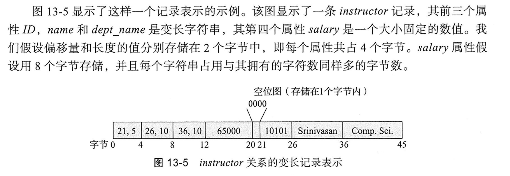

# 数据存储结构

首先持久存储的介质基本都是以块为单位的，但是数据库记录会比块大小小很多，所以一般会引入文件系统文件作为中间层。

## 文件组织

每个文件在逻辑上被分为定长的存储单元，称为块。块是存储分配和数据传输的单位。

要求每条记录被完整的包含在单个块中，不跨块，便于管理。

数据库的记录的存储方式有定长和不定长两种。

### 定长记录

直接按实占一块块放进去，给每个块一个metadata，记录第一个空闲位置的地址，作为一个指针，那个空闲位置记录下一个空闲位置的地址，相当于组成一个链表。

### 变长记录

使用定长的初始位置记录，这里变长的就记录初始指针位置和长度，定长的就直接写入，然后再使用一个空位图（bitmap）来记录是否有属性没有值。

使用slotted-page structure进行存储

**在这种设计下，自由空间在中间**，如果有变长或者删除，暴力移动就可以了，因为页大小是固定的4KB，直接移动的代价并不高。

## 文件中记录的组织

### 堆文件组织

在堆文件组织中，记录可以存储在对应于一个关系的文件中的任何位置。

一般使用自由空间图标识一个块中剩余自由空间的比例。可以有一级自由空间图和二级。

使用懒更新（定期扫描更新），所以可能出现不同步的现象。

### 顺序文件组织

顺序文件是为了高效处理按某个搜索码的顺序排序的记录而设计的。搜索码是任意的属性或者属性的集合。

在读取的时候非常快，但是在插入和删除时维护困难。（也可以用链表保持逻辑上的顺序，而不是物理上的顺序，这样子插入和删除速度就变快了）

### 多表聚簇文件组织

大多数关系数据库系统将每个关系存储在一个单独的文件中，但是有些时候如果在单个块不止一个关系的记录会很有用。

跟sql语句中的group by差不多，几个关系，按某个属性聚类放一块。
