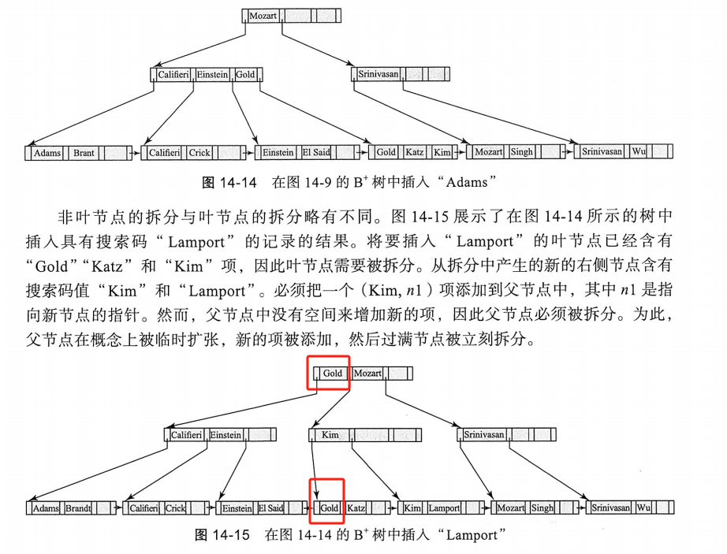

# 数据存储结构

首先持久存储的介质基本都是以块为单位的，但是数据库记录会比块大小小很多，所以一般会引入文件系统文件作为中间层。

## 文件组织

每个文件在逻辑上被分为定长的存储单元，称为块。块是存储分配和数据传输的单位。

要求每条记录被完整的包含在单个块中，不跨块，便于管理。

数据库的记录的存储方式有定长和不定长两种。

### 定长记录

直接按实占一块块放进去，给每个块一个metadata，记录第一个空闲位置的地址，作为一个指针，那个空闲位置记录下一个空闲位置的地址，相当于组成一个链表。

### 变长记录

使用定长的初始位置记录，这里变长的就记录初始指针位置和长度，定长的就直接写入，然后再使用一个空位图（bitmap）来记录是否有属性没有值。


使用slotted-page structure进行存储

**在这种设计下，自由空间在中间**，如果有变长或者删除，暴力移动就可以了，因为页大小是固定的4KB，直接移动的代价并不高。


## 文件中记录的组织

### 堆文件组织

在堆文件组织中，记录可以存储在对应于一个关系的文件中的任何位置。

一般使用自由空间图标识一个块中剩余自由空间的比例。可以有一级自由空间图和二级。

使用懒更新（定期扫描更新），所以可能出现不同步的现象。

### 顺序文件组织

顺序文件是为了高效处理按某个搜索码的顺序排序的记录而设计的。搜索码是任意的属性或者属性的集合。

在读取的时候非常快，但是在插入和删除时维护困难。（也可以用链表保持逻辑上的顺序，而不是物理上的顺序，这样子插入和删除速度就变快了）

### 多表聚簇文件组织

大多数关系数据库系统将每个关系存储在一个单独的文件中，但是有些时候如果在单个块不止一个关系的记录会很有用。

跟sql语句中的group by差不多，几个关系，按某个属性聚类放一块。

# 索引

- 稠密索引与稀疏索引

稠密索引的索引数目跟搜索码的不同数目相同，稀疏索引一般直接指向数据块，每个块一个索引。

- 主索引与辅助索引（主索引一般也被称为聚集索引）

一般来说，主索引决定了存储的顺序，辅助索引和存储顺序无关，在SQL中创建一个表的时候，主键会自动创建主索引。一个表只能有一个主索引，但是可以有多个辅助索引。

并且由于辅助索引并不会根据顺序排序，一般有一个二级结构（是一个连续的指针数组，相邻的指向的是相同类型的记录的位置），然后辅助索引就和主索引一样只要指到第一个记录的地址，然后再通过二级的指针找到实际的物理地址。因此**辅助索引一定是稠密索引。**

## B+树索引文件

B+ Tree属于一种多级索引。它有几个性质：

- 每个非叶子节点（root除外）有$\lceil n/2 \rceil$个到$n$个孩子，n对于特定的树是固定的
- 根有2到n个孩子。
- 叶节点内的码数在$\lceil (n-1)/2 \rceil$到$n-1$之间。
- 同一层节点内的码的顺序是递增的。
- 如果B+树是稠密索引，那么每个搜索码值都必须出现在某个叶节点中。


B+ Tree的非叶节点形成叶节点之上的一个**多级稀疏索引**，同一个子节点（块）只会有一条边连接它和它的父节点。

对于一个包含m个指针的节点，指针$P_i$指向的子树所包含的搜索码值均小于$K_i$且大于等于$K_{i-1}$。


注意，如果搜索码不能保证唯一性，需要使用一个类似上面辅助索引那样提到的一个辅助二级结构来维护，但是引入了额外的开销，另一个方法是重构搜索码，假设原始的搜索码为$a_i$，可以重构为$(a_i,A_p)$，其中$A_p$是主码。

对于B+树的查询：由于是平衡树，顺着树往下走即可，查询满足区间条件的点就走到第一个大于等于l的节点，然后横着遍历。

B+树的更新会复杂一点（更新可以视为插入+删除）考虑插入和删除，他们会带来一个问题，就是有可能一个节点需要拆分或合并。

- 插入



**在B+Tree中要注意的一点是，每个非叶节点的搜索码$K_i$实际上是对应的那个右子树（比如$K_i$对应$i+1$个子树(1index)）的最左侧的搜索码（也就是大于它的最小数，比如上面的根的Gold和子节点的Gold。**

每次插入拆分节点最坏可能一路拆到根（并且根也可以被拆开，然后出现新根，原本的根变成第二层）

- 删除


注意到这个删除了"Srinivasan"后的树的结构发生了很大变化，由于删掉后它对应的那个叶子就太空了，所以需要让它和边上的节点进行合并。

接着产生了连锁反应，父节点对应的子树数目太少了（只有一个），如果可以的话需要和兄弟节点合并，但是兄弟节点也是满的，所以需要进行再次平衡。再次平衡后注意到原本在根的Mozart到了第二层，然后原本在第二层的Gold到了根。可以仔细对比14-18和14-14，并模拟其变化过程进行理解。


这个对Gold的删除也很有趣，导致了树的降层，并且在进行了删除后，非叶子节点上的值有可能在叶子节点中不存在，见图中红框。

B+ Tree操作的复杂度和树的高度有关，且在数据库中树的高度意味着IO次数的多少，B+ Tree是一个矮胖的树，所以特别适用于数据库中。


拓展：B+ Tree不仅可以用于多层索引，即直接用B+ Tree的叶子节点作为文件组织（而不是作为一个指向实际表的指针）。

## 散列索引（Hash Index）

散列索引是基于散列函数构建的，散列函数将搜索码映射到散列值，散列值作为索引的键值。

静态散列：桶的数目是固定的，所以可能有一部分桶装的记录非常多。（映射不均匀）

解决方法是可以使用动态散列，逐步扩展桶的大小。

## 索引的创建

可以使用以下语句进行创建索引

```sql
CREATE INDEX index_name ON <relation_name>(attribute_name);
```

也可以使用drop来删除：

```sql
DROP INDEX index_name;
``` 

