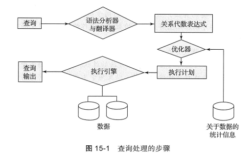

# 查询处理

## 查询代价的度量

在课本提出的模型中，主要以从存储中传输的块数和随机IO访问数作为估计查询执行代价的两个重要因素。

记$t_T$为磁盘子系统传输一个数据块的时间，$t_S$为平均的块访问时间（磁盘寻道时间加上旋转延迟），传输一个b个块并进行S次随机IO访问的运算将要花费$b*t_T+S*t_S$。

## 选择运算

- A1：线性索引，进行一次额外搜索找第一个块。然后顺序访问所有的块。
- 

