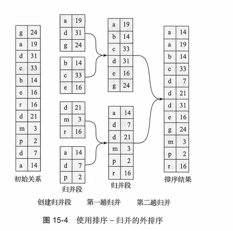
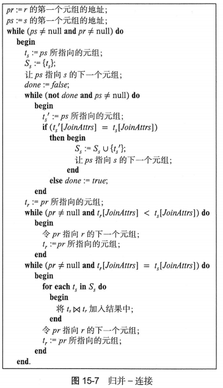
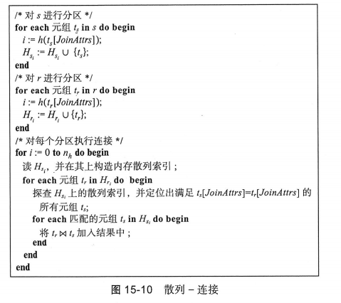

# 查询处理

## 查询代价的度量

在课本提出的模型中，主要以从存储中传输的块数和随机IO访问数作为估计查询执行代价的两个重要因素。

记$t_T$为磁盘子系统传输一个数据块的时间，$t_S$为平均的块访问时间（磁盘寻道时间加上旋转延迟），传输一个b个块并进行S次随机IO访问的运算将要花费$b*t_T+S*t_S$。

## 选择运算

选择运算有很多种，根据不同的搜索算法，和不同的存储数据结构，有不同的代价。

> 图中的$t_S$是磁盘寻道时间，$t_T$是磁盘传输时间，$b_r$是磁盘块数。
> $h_i$是索引高度

只要提前知道匹配元组的数量，查询优化器就可以根据代价估计在使用辅助索引和使用线性搜索之间进行选择。但是经常无法精确得知。

PostgreSQL使用位图索引扫描的混合算法。获取辅助索引块，但不直接获取，而是标记位图，然后对位图中为1的块进行线性搜索。是一种折中的算法。

而对于复杂的选择，比如包含合取和析取，还有否定等，有其他的方法。

使用合取举例：

- A7(使用一个索引的合取选择)：判断对于其中一个简单条件中的属性是否存在一条存取路径可用。如果可用就用A2~A6的一种选择算法来检索所有记录，再在内存中进行剩下是否满足的判断。
- A8（使用组合索引）
- A9（使用标识交集的合取选择）各个条件涉及的字段上都带有记录指针的索引，该算法对每个索引进行扫描，以获取指向满足单个条件的元组的指针。所有指针的交集就是满足合取条件的元组的指针集合。
- A10（使用标识并集的析取选择）如果析取条件中涉及的属性都带有记录指针的索引，则可以对每个索引进行扫描，以获取指向满足单个条件的元组的指针。所有指针的并集就是满足析取条件的元组的指针集合。

## 排序

通过在排序码上建立索引，然后使用该索引按序读取关系，可以完成对关系的排序。但这一过程仅仅在逻辑上通过索引对关系进行排序，而没有在物理上进行排序。因此按序读取元组可能导致随机IO访问。

由于读磁盘块的IO代价很高，所以需要专门设计排序算法。

### 外排序 - 归并算法

对不能全部放入内存中的关系进行的排序被称为**外排序**。对于外排序最常用的基数是外排序 - 归并算法。

首先设M标识主存的缓冲区中可用于排序的块数。

在第一阶段，创建多个排好序的归并段，其仅包含关系的部分记录。

在第二阶段，对归并段进行归并，假设归并段总数N小于M，可以为每个归并段分配一个块，并且还有剩下的空间能够为输出保留一个块，归并阶段的操作如下：

如果关系比内存大得多，第一阶段可能产生M各甚至更多的归并段，并且在归并阶段为每个归并段分配一个块是不可能的。所以需要分多趟进行。

初始趟：对前M-1个归并段进行归并，然后得到单个归并段作为下一趟的输入。对接下来的M-1个归并段进行类似的操作，直到处理所有的归并段为止。每次这样操作完归并段的数量就会减少为原来的1/(M-1).

代价分析：令$b_r$为包含关系r的记录块数，在第一阶段读入关系的每个块然后将它们重新写出，共需要$2b_r$次块传输。初始归并段的数量为$\lceil \frac{b_r}{M} \rceil$，在贵宾过程中，每次在一个归并段中读入一个块会导致大量寻道，所以尽量一次读取或写入更多的块，表示为$b_b$，这就需要将$b_b$个缓冲块分配给输入的归并段和输出的归并段。每趟归并可以归并$\left\lfloor \frac{M}{b_b} \right\rfloor -1$个归并段。总共需要的趟数为$\left\lceil \log_{M/b_b-1} \left\lceil \frac{b_r}{M} \right\rceil \right\rceil$。

## 连接运算

### 嵌套循环连接

这个是最简单的做法，但是代价昂贵，对于每条记录都要进行一次寻道和块传输，最坏情况下一条记录对应一次块传输。

而这种做法的代价方差很大，在能够把一个关系塞入内存的情况下，一般就把它当作内层的关系，这样就只需要读入一次，此时只需要$b_r+b_s$次块传输和两次寻道。

但是最坏情况下块传输次数是$n_r*b_s+b_r$次块传输。（如果主存只能放入两个块的话）

### 块嵌套 - 循环连接

如果缓冲区**没办法放下任何一个关系**，使用基于每个块的方式处理而不是基于元组处理仍然能带来性能上的提升。

这种做法在最坏情况下只需要$b_r*b_s+b_r$次块传输，和$2*b_r$次寻道（对内层关系的每次扫描需要一次寻道，对外层关系的每次扫描需要一次寻道）

进一步的优化：每次读入都尽可能地多用几次，比如可以读入M-2个外层关系地块，然后读入1个内层关系的块，然后进行连接，这样内层关系的扫描次数从$b_r$次减少到了$b_r/(M-2)$次。

如果内层循环的连接属性上有索引可用，可以使用更高效的索引查找来代替文件扫描。

### 归并 - 连接

该做法可以用于计算自然连接和等值连接，假设关系$r(R)$和$s(S)$都按照$R\cap S$排序，则可以对两个关系进行归并，在归并过程中进行连接。

该算法要求每个$S_s$元组集合都能够装入主存。如果不能装入，就使用多趟算法，类似上面的块嵌套 - 循环连接。

如果两个关系在连接属性上都存在辅助索引时，可以对未排序的元组执行归并-连接运算的一种变种。通过索引扫描记录，从而顺序检索记录。但是并不是物理逻辑下最优的。

### 散列 - 连接

使用散列函数h来划分两个关系的元组，基本思想是把每个关系的元组划分成在连接属性值上具有相同散列值的集合。

这种连接方法基于这样的思想：如果两个元组在连接属性上具有相同的值，那么它们在散列值上也具有相同的值。如果散列值不相同，则两个元组不可能匹配。

## 其他运算

去重 - 和排序等价。

投影 - 一次扫描就行了。

集合运算 - 并交合集合差运算，首先要对两个关系进行排序，然后对每个已排序的关系扫描一次以产生结果。

外连接（比如左外连接）：首先计算对应的连接，将结果存为对应的临时关系$q_1$，接着计算$r-\prod_R(q_1)$已得到r中未参与连接的元组。

聚集：和去重一样的方式实现。

## 表达式执行

可以使用物化方法，将一个表达式构建为一个表达式树，然后从叶节点往根执行运算。

有一个技术是double buffering（双缓冲），其中一块用于执行算法，另一块用于写出结果，通过并行执行CPU活动和IO活动，允许算法执行的更快。

另一种方式是通过流水线的方法，通过减少产生的临时文件数，可以提高查询的效率。可以将多个能够同时做的运算合并到一起，比如选择和投影。这种执行方式叫做流水线执行。

流水线可以按下面两种方式之一来执行：

- 需求驱动流水线：在需要结果时，才执行运算。
- 生产者驱动流水线：在可以执行运算时，就执行运算。

需求驱动流水线每个运算都可以作为**迭代算子**实现，提供`open()`、`next()`、`close()`方法。调用`open()`后，对`next()`的每次调用都会下一个输出元组。只有在调用迭代器的时候才会进行运算。

生产者驱动流水线会创建一个缓冲区保存一个运算传递给下一个运算的元组，不同运算的进程和线程会并发执行。流水线底部每个运算不断产生输出元组，并将其放入输出缓冲区，直到该缓冲区已满。然后就会等待其父运算将该元组从缓冲区移除。

表达式树中的每条边可以是物化的（阻塞的）/流水化的（非阻塞的）

# 查询优化

相同意思的查询语句有多种表达方式，而我们期望选择产生中间结果最小的，执行代价最小的。

给定一个关系代数表达式，查询优化器的任务是产生一个查询执行计划，该计划能够计算出与给定表达式相同的结果，并且能够以代价最小（或者至少代价比较可以接受）的方式来产生结果。

## 关系表达式的转换

存在以下的等价规则：

1. 合取选择运算可以分解为单个选择运算的序列：$\sigma_{F_1 \land F_2}(r) = \sigma_{F_1}(\sigma_{F_2}(r))$
2. 选择运算满足交换律：$\sigma_F(r_1 \land r_2) = \sigma_F(r_2 \land r_1)$
3. 在一系列投影运算中，只有最后一个是必须的，其余可以省略。$\prod_{L_1} \prod_{L_2} \prod_{L_3} E = \prod_{L_1} E$
4. 选择运算可以与笛卡尔积和$\theta$连接相结合：$\sigma_F(r \times s) = E_1 \bowtie_{\theta} E_2$, 且$\sigma_{\theta_1}(E_1 \bowtie_{\theta_1\land \theta_2} E_2) = E_1 \bowtie_{\theta_1} \sigma_{\theta_2}(E_2)$
5. $\theta$连接满足交换律，$E_1 \bowtie_\theta E_2 = E_2 \bowtie_\theta E_1$
6. 自然连接满足结合律，$(E_1 \bowtie E_2) \bowtie E_3 = E_1 \bowtie (E_2 \bowtie E_3)$，而$\theta$连接满足以下结合律$(E_1\bowtie_{\theta_1} E_2) \bowtie_{\theta_2 \land \theta_3} E_3 = E_1 \bowtie_{\theta_1 \land \theta_3}(E_2\bowtie_{\theta_2} E_3)$，其中$\theta_2$只涉及$E_2$和$E_3$的运算。
7. 选择条件$\theta_1$中的所有属性只涉及一个被连接的表达式的属性时，满足以下分配律\[
\sigma_{\theta_1}(E_1 \bowtie_{\theta} E_2) \equiv (\sigma_{\theta_1}(E_1)) \bowtie_{\theta} E_2
\]
如果$\theta_1$只涉及$E_1$，$\theta_2$只涉及$E_2$
\[
\sigma_{\theta_1 \land \theta_2}(E_1 \bowtie_{\theta} E_2) \equiv (\sigma_{\theta_1}(E_1)) \bowtie_{\theta} (\sigma_{\theta_2}(E_2))
\]
8. 投影运算在如下条件下对$\theta$连接运算满足分配律：
   令$L_1$和$L_2$分别代表$E_1$和$E_2$的属性，假设连接条件$\theta$只涉及$L_1\cup L_2$中的属性
\[
\Pi_{L_1 \cup L_2}(E_1 \bowtie_{\theta} E_2) \equiv (\Pi_{L_1}(E_1)) \bowtie_{\theta} (\Pi_{L_2}(E_2))
\]
   $L_1$和$L_2$分别代表$E_1$和$E_2$的属性，$L_3$是$E_1$中出现在$\theta$但不出现在$L_2$中的属性；$L_4$同理
\[
\Pi_{L_1 \cup L_2}(E_1 \bowtie_{\theta} E_2) \equiv \Pi_{L_1 \cup L_2}\left((\Pi_{L_1 \cup L_3}(E_1)) \bowtie_{\theta} (\Pi_{L_2 \cup L_4}(E_2))\right)
\]
9. 集合的并与交运算满足交换律：$E_1\cap E_2 = E_2\cap E_1, E_1\cup E_2 = E_2\cup E_1$，**集合的差运算不满足**
10. 集合的并与交运算满足结合律：$(E_1\cup E_2)\cup E_3=E_1\cup(E_2\cup E_3)$，$(E_1\cap E_2)\cap E_3=E_1\cap(E_2\cap E_3)$
11. 选择运算对集合的分配律\[
\sigma_{\theta}(E_1 \cup E_2) \equiv \sigma_{\theta}(E_1) \cup \sigma_{\theta}(E_2)
\]

\[
\sigma_{\theta}(E_1 \cap E_2) \equiv \sigma_{\theta}(E_1) \cap \sigma_{\theta}(E_2)
\]

\[
\sigma_{\theta}(E_1 - E_2) \equiv \sigma_{\theta}(E_1) - \sigma_{\theta}(E_2)
\]

12. 投影运算对并满足分配律
\[
\Pi_L(E_1 \cup E_2) \equiv (\Pi_L(E_1)) \cup (\Pi_L(E_2))
\]
13. G是一组属性的集合，A是一组聚集表达式的集合。当$\theta$仅设计G中的属性时，下面的表达式成立
\[
\sigma_{\theta}(G_{\gamma(A)}(E)) \equiv G_{\gamma(A)}(\sigma_{\theta}(E))
\]
14. 全外连接满足交换律：\[
E_1 \bowtie E_2 \equiv E_2 \bowtie E_1
\]
**左外连接和右外连接没有交换律**，但是可以以以下形式交换：
\[
E_1 \bowtie_{\text{左}} E_2 \not\equiv E_2 \bowtie_{\text{右}} E_1
\]
15. 在某些情况下，选择运算对左外连接和右外连接满足交换律，具体而言，当选择条件$\theta_1$只涉及被连接的其中一个表达式（比如$E_1$）中的属性时，下面的规则成立：

\[
\sigma_{\theta_1}(E_1 \bowtie_{\text{左}\theta} E_2) \equiv (\sigma_{\theta_1}(E_1)) \bowtie_{\text{左}\theta} E_2
\]\[
\sigma_{\theta_1}(E_2 \bowtie_{\text{右}\theta} E_1) \equiv E_2 \bowtie_{\text{右}\theta} (\sigma_{\theta_1}(E_1))
\]
16. 某些情况下，外连接可以替换为内连接：每当$E_2$的属性是**空**时：
\[
\sigma_{\theta_1}(E_1 \bowtie_{\text{左}\theta} E_2) \equiv \sigma_{\theta_1}(E_1 \bowtie E_2)
\]

\[
\sigma_{\theta_1}(E_2 \bowtie_{\text{右}\theta} E_1) \equiv \sigma_{\theta_1}(E_2 \bowtie E_1)
\]

应用上面的规则可以将查询的中间结果缩小

选择合理的连接次序很重要！

查询优化器可以使用等价规则来系统地产生与给定的查询表达式等价的表达式，表达式的代价时根据统计信息来计算的。

## 表达式结果的统计信息估计

数据库系统目录存储了有关数据库关系的下面统计信息：

- $n_r$ 关系 r 中的元组数
- $b_r$ 包含关系 r 中元组的块数
- $l_r$ 关系r中一个元组的字节数
- $f_r$ 关系r的块因子，一个块中能够容纳的关系r的元组数
- $V(A,r)$ 关系 r 中出现的对于属性A的非重复值数量

关于索引的统计信息，比如B+树索引的高度和叶节点的页数也在目录中维护。

但是每次更新都维护这个信息的代价太大，所以一般的选择是在系统处于轻负载的时候更新这些统计信息。

### 选择规模估计

对于$\sigma_{A=a}(r)$，如果a是一个出现次数有可用统计值的频繁出现的值，可以直接使用，否则就假设数据是均匀分布的然后进行估计。

对于$\sigma_{A\leq v} (r)$，假设有最大值和最小值的数据，如果大于最大值和小于最小值很好估计，否则就假设在这个区间内均匀分布。

复杂选择，比如合取和析取，对每个组合的简单规则用上面的规则进行估计，然后假设各条件相互独立，进行估计。合取就是简单乘积

### 连接规模估计

笛卡尔积相对简单，$r\times s$的元组数为$n_r*n_s$。每个元组占用$l_r+l_s$个字节。

估计自然连接的规模会困难一点，假设$r(R)$和$s(S)$为两个关系

- 若$R\cap S$为空，则$r\bowtie s$的元组数为$n_r*n_s$
- 若$R\cap S$是R的码，s的一个元组至多与r的一个元组相连接，所以不会超过s中的元组数，如果是s的码，同理
- $R\cap S$既不是R的码也不是S的码。这种情况下，每个值是等概率出现的。考虑r中的元组$t$，且$R\cap S=\{A\}$，估计元组t在$r\bowtie s$中产生$\frac {n_s} {V(A,s)}$个元组。估计一共有$\frac {n_r*n_s} {V(A,s)}$个元组。

对于$\theta$连接，可以写成$\sigma_{\theta}(r\times s)$，然后用估计选择运算和估计笛卡尔积运算的方式来估计它的规模。

## 执行计划的选择

虽然理论上的连接的方案很多，但是实际上可以用动态规划算法，复用前面找到的最优结果而不是对每个一直重新算。

物理等价规则：允许诸如连接那样的逻辑运算转换成散列-连接、嵌套-循环连接这样的物理运算

但是即使查询优化的代价可以通过巧妙的算法来降低，但是一个查询的不同执行计划的数量还是非常大，仍然需要很大的计算代价。所以还有一些启发式的方法：

- 尽早执行选择运算
- 尽早执行投影运算

