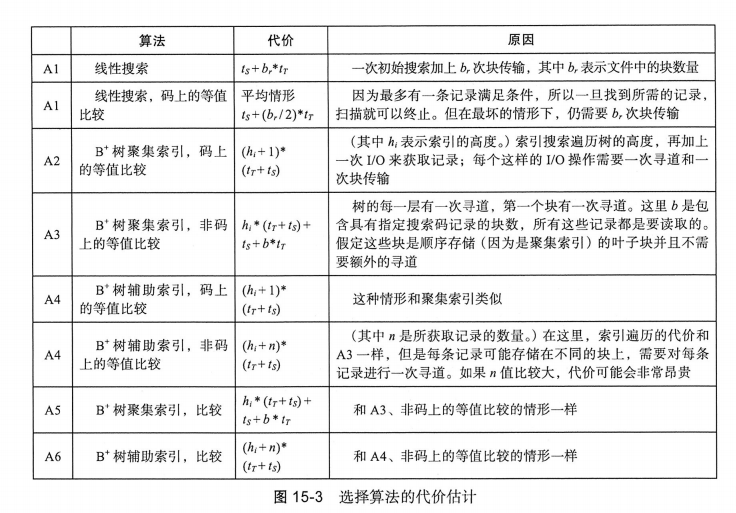

# 查询处理

## 查询代价的度量

在课本提出的模型中，主要以从存储中传输的块数和随机IO访问数作为估计查询执行代价的两个重要因素。

记$t_T$为磁盘子系统传输一个数据块的时间，$t_S$为平均的块访问时间（磁盘寻道时间加上旋转延迟），传输一个b个块并进行S次随机IO访问的运算将要花费$b*t_T+S*t_S$。

## 选择运算

选择运算有很多种，根据不同的搜索算法，和不同的存储数据结构，有不同的代价。

> 图中的$t_S$是磁盘寻道时间，$t_T$是磁盘传输时间，$b_r$是磁盘块数。
> $h_i$是索引高度

只要提前知道匹配元组的数量，查询优化器就可以根据代价估计在使用辅助索引和使用线性搜索之间进行选择。但是经常无法精确得知。

PostgreSQL使用位图索引扫描的混合算法。获取辅助索引块，但不直接获取，而是标记位图，然后对位图中为1的块进行线性搜索。是一种折中的算法。

而对于复杂的选择，比如包含合取和析取，还有否定等，有其他的方法。

使用合取举例：

- A7(使用一个索引的合取选择)：判断对于其中一个简单条件中的属性是否存在一条存取路径可用。如果可用就用A2~A6的一种选择算法来检索所有记录，再在内存中进行剩下是否满足的判断。
- A8（使用组合索引）
- A9（使用标识交集的合取选择）各个条件涉及的字段上都带有记录指针的索引，该算法对每个索引进行扫描，以获取指向满足单个条件的元组的指针。所有指针的交集就是满足合取条件的元组的指针集合。
- A10（使用标识并集的析取选择）如果析取条件中涉及的属性都带有记录指针的索引，则可以对每个索引进行扫描，以获取指向满足单个条件的元组的指针。所有指针的并集就是满足析取条件的元组的指针集合。

## 排序

