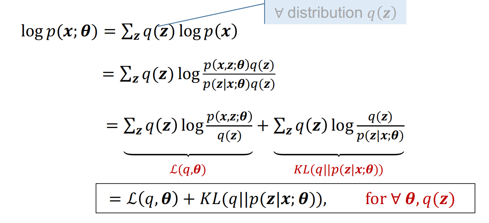
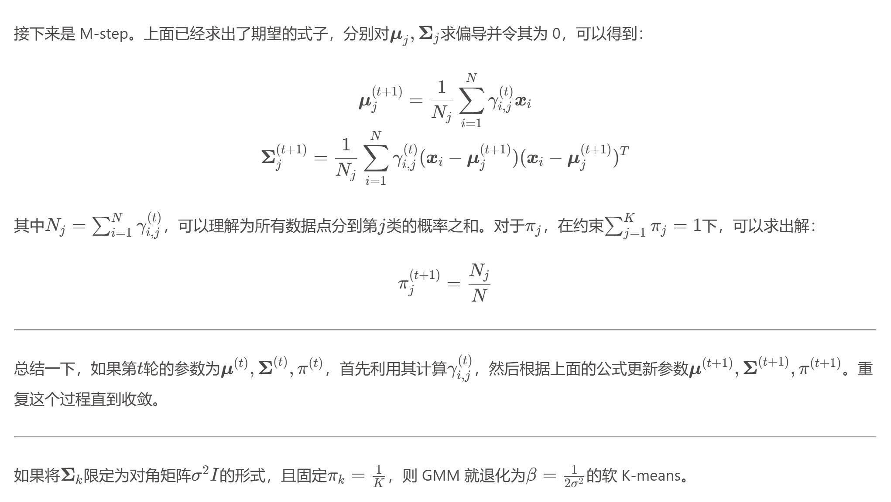
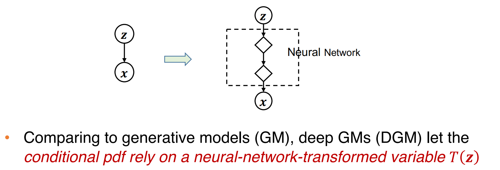
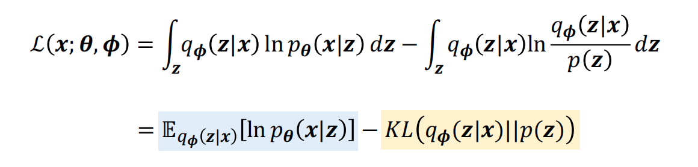
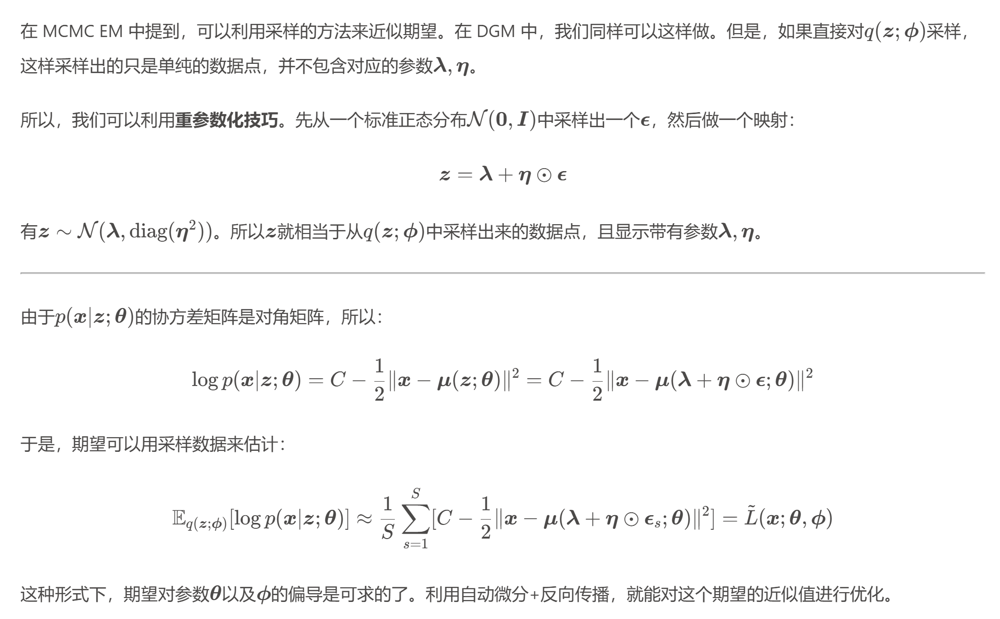
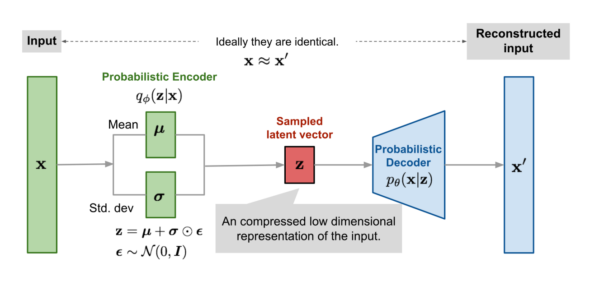

# 生成模型

## 潜变量模型(Latent-Variable Model)

在监督学习中，回归和分类都可以理解为学习条件概率分布$p(y|\mathbf{x};\mathbf{w})$

而在无监督学习中，直接学习$x\to x'$的这个分布很难（也即，怎么从一堆无监督学习中得到$x$的分布并能够根据这个分布重建一个相似的$x$）

有一种方法是引入潜变量$z$，我们学习$x\to z$相对简单，而学习$z\to x'$也相对简单。(这个$z$通常会是某些信息熵很高的信息，也就是关键特征)

另一个角度是，在无监督学习中，一个简单的学习$x$的分布的方法是，假设它一定服从某种分布（钦定），然后学习在这个分布下的参数，比如钦定$p(x,w)=\mathcal{N} (x;\mu \sum)$

这样子可以通过优化学习最优的$\mu$和$\sum$，使得对于一组数据分布最优。但显然没有什么意义，这能够表示的函数太少了。

而我们可以学习两个简单的函数的联合分布，他们可以表示的范围就大了很多（对于一部分函数，可以证明其可以拟合任何函数），比如现在有一个简单的分类函数和一个高斯分布，使用他们导出的边缘概率复杂度会高很多：

$p(x) = \sum_z p(x|z)p(z) = \sum_{k=1}^K \pi_z \mathcal{N}(x| \mu{z}, \sigma_z^2)$

一般来说潜变量模型就是学习到怎么完成$x\to z$和$z\to x'$这两个过程。

然后在潜变量模型里，可以借助边缘概率分布重构$x$的值：$p(x) = \int_z p(x,z) dz$

### 高斯潜变量模型

高斯潜变量模型假设了先验概率和似然函数都是服从高斯分布的。也就是$p(z)=\mathcal(z;0,I)$, $p(x|z)=\mathcal(x;Wz+\mu,\sigma^2I)$

训练的目标就是最大化对数似然函数，也即$\max_W \sum_{n=1}^N \log p(x_n)$

由于高斯函数的良好性质，可以直接在指数上做加法，也即满足线性性（大概这个意思），本来$p(x_n)$的边缘积分不好算（因为高维情况下$p(x_n,z_n)$不好求，在这个场景下直接套公式$p(x_n)=\mathcal(x_n;\mu,WW^T+\sigma^2I)$

在这种情况下梯度下降也好做。

### 混合高斯模型

先用一个潜变量的视角，就是潜变量$z$是一个one-hot向量。

联合分布是每个不同高斯模型的乘积，指数上是onehot向量中的其中一个值，这个潜变量等价于指示这个数据属于哪一个高斯分布。

$$
p(x) = \sum_{k=1}^K \pi_k \mathcal N (x;\mu_k,\sigma_k)
$$

其中$\sum_{k=1}^K \pi_k=1$，是第$k$个分布的权重。

在潜变量模型下的条件概率分布$p(x|z)$和先验概率$p(z)$可以表示为

$$
p(x|z=\mathbf{1}_k) = \mathcal(x;\mu_k,\sigma_k) \\
p(z=\mathbf{1}_k) = \pi_k
$$

> 在潜变量模型中，各个概率的含义及其在重建任务中的应用如下：
>
>1. **\( p(x) \)**: 这是数据 \( x \) 的边缘概率分布，表示在所有可能的潜变量 \( z \) 下，数据 \( x \) 出现的概率。它反映了数据的总体分布，通常是复杂且难以直接计算的。
>
>2. **\( p(z) \)**: 这是潜变量 \( z \) 的先验分布，通常假设为简单的分布（如高斯分布），以便于模型处理。
>
>3. **\( p(z|x) \)**: 这是在给定观测数据 \( x \) 的情况下，潜变量 \( z \) 的后验分布。在重建任务中，它用于推理或生成新数据。
>
>4. **\( p(x|z) \)**: 这是在给定潜变量 \( z \) 的情况下，数据 \( x \) 的条件分布，即 likelihood。在生成模型（如 VAE）中，它由解码器建模，用于从 \( z \) 生成 \( x \)。
>
>5. **\( p(x,z) \)**: 这是 \( x \) 和 \( z \) 的联合分布，结合了先验和 likelihood，表示 \( x \) 和 \( z \) 之间的关系。
>
>在重建任务中，这些概率的应用如下：
>
>- 在变分自编码器（VAE）中，编码器用于估计 \( p(z|x) \)，解码器用于估计 \( p(x|z) \)。
>- 训练目标是通过最大化证据下界（ELBO）来优化这些分布，使得生成的数据尽可能接近原始数据。
>- ELBO 包含重构损失（衡量生成数据与原始数据的相似度）和 KL 散度（衡量 \( p(z|x) \) 与先验 \( p(z) \) 之间的差异）。
>
>选择潜变量分布 \( p(z) \) 时，通常选择高斯分布因其数学性质便于处理，但在某些特定任务中，其他分布可能更合适。
>
>在评价重建质量时，除了均方误差（MSE），还可以使用结构相似性指数（SSIM）或感知损失（perceptual loss）等指标，以更好地反映人类视觉的相似度。
>
>总之，理解这些概率的含义及其在模型中的作用，对于掌握潜变量模型至关重要。通过实际编程实现简单的 VAE，可以加深对这些概念的理解。
>
> 实际上最难获得的就是能够正确近似$p(z)$的变分后验$p(z|x)$

一个很好的解答：

## EM算法

EM算法解决这么一个问题：已知联合分布$p(x,z)$，而优化目标是边缘分布：

$$
\theta = \arg \max_{\theta} \log p(x;\theta)
$$

EM算法将这个问题分为两步，E-step和M-step。

E-step中，我们优化$Q(\theta;\theta^{(t)})$，也就是$Q(\theta;\theta^{(t)}) = E_{z\sim p(z|x;\theta^{(t)})}[\log p(x,z;\theta)]$

M-step中，我们优化$\theta^{(t+1)} = \arg \max_{\theta} Q(\theta;\theta^{(t)})$

核心思想就是：

1. 给出参数$\theta$的初始值
2. 固定$\theta$，求出$z_i$的**期望**（即使用隐变量表示似然概率的平均值）（E步）
3. 固定$z_i$，求出$\theta$（M步）
4. 循环迭代
5. 直到$\theta$收敛

理论推导：

目标函数可以重写为：

KL散度的定义如下：$KL(q||p) = \int q(x) \log \frac{q(x)}{p(x)} dx$，衡量两个分布之间的差异。$KL\geq 0$总是满足，当且仅当两个分布完全相同的时候取0.

按照EM算法的流程去进行运算，总是能让目标对数似然分布单调不降。

### 使用EM训练高斯混合模型

摘选自：[小橙的博客](https://smallorange666.github.io/2024/10/25/%E6%9C%BA%E5%99%A8%E5%AD%A6%E4%B9%A0%E7%AC%94%E8%AE%B0/)

### EM的问题

EM的想法很美好，首先计算后验分布$p(z|x;\theta)$，然后计算相对于$p(z|x;\theta)$,$\log p(x,z;\theta)$的期望。

然后最大化$Q(\theta;\theta^{(t)})$，也就是$Q(\theta;\theta^{(t)}) = E_{z\sim p(z|x;\theta^{(t)})}[\log p(x,z;\theta)]$

但是这三步不是总是能够实现的。

首先这个最大化过程不一定能够实现，比如Q非凸，就能得到局部最优解。第二个问题是$p(z|x;\theta)$不一定有解析解。而且即使有解析解，对数似然函数相对于它的期望也不一定有闭式表达式（可能是一个无穷级数）

所以这种情况下可能就不要把它求出来了，使用SGD进行梯度上升求解是一个可行的方法。

另一个方法是使用马尔科夫链蒙特卡洛方法（MCMC）近似目标函数。

## Deep Generative Model

生成模型都是一类隐变量模型，两个例子是PCA和GMM：

PCA：$p(z)=\mathcal N (z;0,I)$，$p(x|z)=\mathcal N (x;Wz+\mu,\sigma^2I)$

GMM：$p(z)=Cat(z;\pi)$, $p(x|z)=\prod_{m=1}^M [\mathcal N (x;\mu_m,\sigma_m^2)]^{z_m}$

为了增加模型的表达能力，可以在z和x之间再加入一层神经网络：

DGM也是隐变量模型，所以可以使用EM算法进行训练。

正常EM算法的流程是：

1. 获得当前参数下的后验分布$p(z|x;\theta)$
2. 派生对应的期望$E_{z\sim p(z|x;\theta)}[\log p(x,z;\theta)]$
3. 最大化期望，获得新的参数$\theta$

但是由于神经网络的存在，第一步和第二步都很难做。所以可以使用VB-EM算法，使用一个简单的分布来逼近真实的后验分布$p(z|x;\theta)$。

VB-EM尝试使用下面的式子最大化对数似然函数下界：

$$
\mathcal L (x;\theta,\Phi)=\int q_\phi(z|x) \log \frac{p(x,z;\theta)}{q_\phi(z|x)} dz
$$

$q_\phi(z|x)$是$p(z|x;\theta)$的近似分布，$\Phi$是$q_\phi(z|x)$的参数。

将$p(x,z;\theta)=p_\theta(x|z)p(z)$代入，得到：

为了优化这个表达式，需要同时求解变分后验和模型的梯度，因此一般会选择一个比较简单的形式。

比如$p_\theta(x|z)=\mathcal N (x;\mu_\theta(z),I)$, $q_\Phi(z|x)=\mathcal N (z;\mu_\Phi(x),\Sigma_\Phi(x))$

$\mu_\theta$代表的是神经网络的参数，$\Phi$代表后验参数。

（这里的w.r.t.是相对于的意思）

回顾上面的表达式选择，由于后验分布选择了简单的高斯分布，所以KL散度有相应的闭式表达，其梯度也容易求。

但是前面的最大似然期望由于神经网络的存在，难以求解。梯度也很难求。现在剩下的问题就是求前面的$\mathcal L (x;\theta,\Phi)$相对于$\theta$和$\Phi$的梯度。

相对于$\theta$的梯度可以使用类似蒙特卡罗采样的方法估计得到（因为$\log p_\theta(x|z)$是关于$\theta$的可微函数）。但是$\Phi$需要结合期望不断更新，没办法这样简单得到。

相对于$\Phi$的梯度需要使用重参数化的技巧。

### 重参数化

## Representation Learning

好的表征：表征应该包含尽可能多的语义信息，而尽可能少的冗余特征。

两种典型的模型结构。第一个是auto-encoder，第二个是VAE（Variational Auto-Encoder）。

PCA可以被视为一个线性的auto-encoder

### VAE

**变分自编码器（Variational Autoencoder, VAE）** 是一种生成模型，属于概率图模型与深度学习结合的范畴。VAE 不仅能够进行降维和特征提取，还能够生成数据，同时保留输入数据的概率分布信息。

以下是对 VAE 的详细介绍：

---

#### **VAE 的核心思想**
VAE 是自编码器的一种扩展，它在普通自编码器的基础上引入了概率建模，假设潜在表示 \( z \) 服从某个先验分布（通常是标准正态分布 \( \mathcal{N}(0, I) \)）。通过学习从输入数据 \( x \) 到潜在分布的映射，VAE 能够在潜在空间中生成新数据。

##### **与普通自编码器的区别**
- 普通自编码器学习一个固定的潜在表示 \( z \)，VAE 学习一个分布 \( p(z) \)。
- VAE 的解码器能够基于潜在分布生成新样本，而普通自编码器只能重构输入数据。

---

#### **VAE 的模型结构**

VAE 的结构分为两部分：
1. **编码器（Encoder）**：
   
   - 将输入数据 \( x \) 映射为潜在变量 \( z \) 的分布参数（均值 \( \mu \) 和标准差 \( \sigma \)）：s$q_\phi(z|x) = \mathcal{N}(z|\mu, \sigma^2)$

   - 输出：均值 \( \mu \) 和标准差 \( \sigma \)。

2. **解码器（Decoder）**：
   - 从潜在变量 \( z \) 重构输入数据 \( x \)：$p_\theta(x|z)$
   - 解码器试图最大化重构输入数据 \( x' \) 与真实数据 \( x \) 的相似性。

##### **重参数化技巧（Reparameterization Trick）**

为了使 \( z \) 的采样过程可微（以便优化），VAE 使用重参数化技巧：$z = \mu + \sigma \odot \epsilon, \quad \epsilon \sim \mathcal{N}(0, I)$

通过引入标准正态分布噪声 \( \epsilon \)，使采样过程分离为可学习的参数 \( \mu, \sigma \) 和固定的噪声。

---

#### **VAE 的训练目标**

VAE 的目标是最大化输入数据 \( x \) 的边缘对数似然：$\log p_\theta(x) = \int p_\theta(x|z)p(z)dz$

由于直接计算该积分不可行，VAE 通过变分推断引入证据下界（ELBO）作为优化目标：$\mathcal{L}_{\text{ELBO}} = \mathbb{E}_{q_\phi(z|x)}[\log p_\theta(x|z)] - D_{\text{KL}}(q_\phi(z|x) \| p(z))$

分为两部分：

-  **重构误差**（第一项）：

      - 使重构样本 \( x' \) 与真实数据 \( x \) 越接近越好。
      - 使用对数似然交叉熵/MSE作为损失函数。

-  **KL 散度**（第二项）：

   - 让近似后验分布 \( q_\phi(z|x) \) 与先验分布 \( p(z) \) 越接近越好。
   - KL散度的表达式：$D_{KL}(q_\phi(z|x)||p(z)) = \int q_\phi(z|x) \log \frac {q_\phi(z|x)} {p(z)} dz$

---

#### **VAE 的生成过程**

1. **训练阶段**：
   - 输入数据 \( x \)，编码器生成 \( z \) 的分布参数 \( \mu \) 和 \( \sigma \)。
   - 解码器基于 \( z \) 重构 \( x' \)，并通过 ELBO 优化模型参数。

2. **生成阶段**：
   - 从先验分布 \( p(z) = \mathcal{N}(0, I) \) 中采样潜在变量 \( z \)。
   - 使用解码器生成数据 \( x' \)，即：
     \[
     x' \sim p_\theta(x|z)
     \]

---
