## 线性回归

$y = w_0 + w_1x_1 + w_2x_2 + ... + w_nx_n$

写成向量形式：$\mathbf{y} = \mathbf{X}\mathbf{w}$

损失函数定义为

$L(\mathbf{w}) = \sum_{i=1}^{m}(\mathbf{y_i} - \mathbf{X_i}\mathbf{w})^2$

也即$ L(\mathbf{w})=\frac 1 n ||\mathbf{y} - \mathbf{X}\mathbf{w}||^2$

求导，$\nabla_w L(\mathbf{w}) = \frac 2 n \mathbf{X}^T(-\mathbf{y} + \mathbf{X}\mathbf{w})$

令导数为0，$\mathbf{X}^T\mathbf{X}\mathbf{w} = \mathbf{X}^T\mathbf{y}$

解得$\mathbf{w} = (\mathbf{X}^T\mathbf{X})^{-1}\mathbf{X}^T\mathbf{y}$

当然不是所有时候都有精准的数值解，所以可以用梯度下降法求解。

### 梯度下降法

$\mathbf{w^{k+1}} = \mathbf{w^k} - \eta \nabla_w L(\mathbf{w^k}) |_{w^k}$

其中$\eta$是学习率，$\nabla_w L(\mathbf{w^k})$是损失函数对$\mathbf{w}$的梯度，具体的，可以写为：

$\nabla_w L(\mathbf{w^k}) = \frac 2 n \sum_{i=1}^{n}\nabla_w L(\mathbf{w^i,x^i,y^i}) |_{\mathbf {w^i}}$

但是如果每次都对所有数据点都求梯度，每次迭代的代价大，可以使用随机梯度下降法(SGD)，只对一部分点求梯度（也就是采用minibatch）。将求导的式子改为：

$\nabla_w L(\mathbf{w^k}) = \frac 2 {|B|} \sum_{i=1}^{|B|}\nabla_w L(\mathbf{w^i,x^i,y^i}) |_{\mathbf {w^i}}$

其中$|B|$是batch的大小。

SGD的梯度是对全量梯度的一个无偏估计。

## 线性分类器

### 二分类，逻辑回归

逻辑回归可以写为$f(\mathbf{x}) = \sigma(\mathbf{w}^T\mathbf{x})$，其中$\sigma(x) = \frac 1 {1+e^{-x}}$。用于将输入映射到$[0,1]$区间。

和线性回归不同的是，线性回归是回归类任务，一般使用MSE（均方误差）作为损失函数，逻辑回归作为分类任务，一般使用交叉熵损失。

$L(\mathbf{w}) = -y\log \sigma(\mathbf{w}^T\mathbf{x}) - (1-y)\log (1-\sigma(\mathbf{w}^T\mathbf{x}))$

由于真实标签y的取值只有0和1，所以两个项只会同时取到一个。

对比：MSE不是一个凸函数，但交叉熵是凸函数。

#### 逻辑回归的梯度下降

对所有的数据点求导并求和，得到数据集的平均梯度：

$\nabla_w L(\mathbf{w}) = \frac 2 n \sum_{i=1}^{n}\nabla_w L(\mathbf{w^i,x^i,y^i}) |_{\mathbf {w^i}}=\frac 2 n \sum_{i=1}^{n}(\sigma(\mathbf{w}^T\mathbf{x^i}) - y^i)\mathbf{x^i}^T$

**这个可以写成一个简单的预测值和实际值相减再和x进行点乘的形式主要是因为交叉熵和sigmoid函数性质优秀（sigmoid求导后是sigmoid(1-sigmoid)），求个导后可简化成这个样子。**

$\mathbf{xw}=0$代表一个超平面，对于一个k维的决策空间，超平面总是k-1维的。

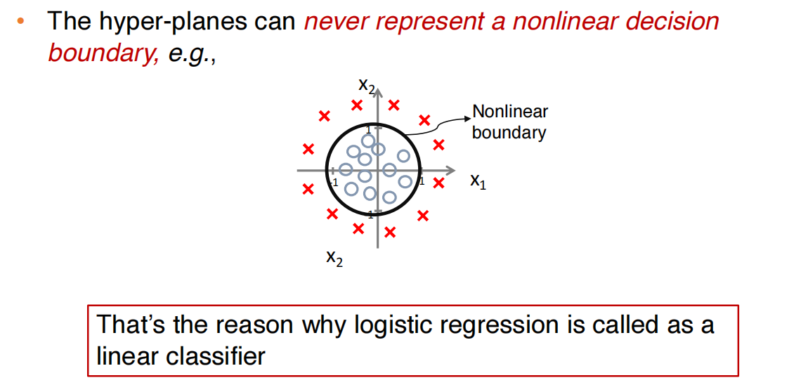

### 多分类

多分类有几种处理方法，一种是one-vs-rest，一种是使用softmax函数。

one-vs-rest训练n个二分类器，每个精准识别其中一种类型，然后对输入数据进行n次分类。如图：

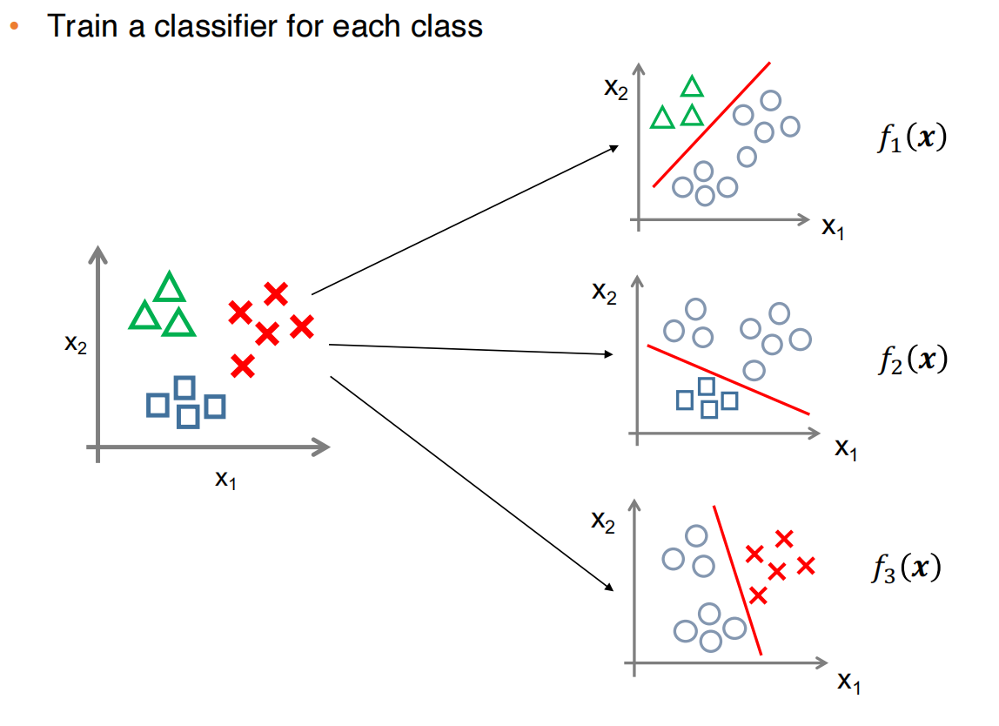

对于一个物品，使用以下函数决定它属于哪一类：

$f(\mathbf{x}) = \arg\max_c \mathbf{w}_c^T\mathbf{x}$

softmax函数将输入映射到$[0,1]$区间，并归一化，得到一个概率分布。

$softmax_i(\mathbf{x}) = \frac {e^{{x_i}}} {\sum_{j=1}^{n}e^{{x_j}}}$

在softmax函数下，一个物品$\mathbf{x}$属于哪一类，可以使用下式求解：

$f_i(\mathbf{x}) = softmax_i(\mathbf{W}^T\mathbf{x})=\frac {e^{w_i^T\mathbf{x}}} {\sum_{j=1}^{n}e^{w_j^T\mathbf{x}}}$

在分类数为2时，softmax和逻辑回归是等价的（进行函数化简就行）

y可以视为一个one-hot向量。从而损失函数可以书写如下：

$$L(\mathbf{w_1,w_2,...,w_k}) = - \frac 1 N\sum_{l=1}^n \sum_{k=1}^n \mathbf{y}_k^T \log[softmax_k(\mathbf{W}^T\mathbf{x}_l)]$$

对损失函数求导得到梯度，交叉熵下的softmax求导性质也很优良，略去推导过程，记忆结论为：

$\nabla_{\mathbf{w_j}} L(\mathbf {w_1, w_2, ... , w_K}) = \frac 1 N \sum_{l=1}^N(softmax_j(\mathbf x^l \mathbf W)-\mathbf y_j^l)\mathbf x^{lT} $

即LOSS求导后的结果仍然是预测值-实际值再和x相乘。

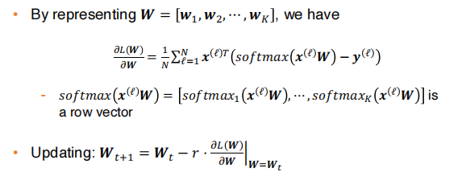

### 概率视角下的回归与分类

其实都是求$P(y|\mathbf{x})$，回归是求Mean，相当于$\int_y yP(y|\mathbf{x})dy$，分类是求MAP(Maximum A Posteriori)，相当于$\arg\max_y P(y|\mathbf{x})$。

- 多维高斯分布

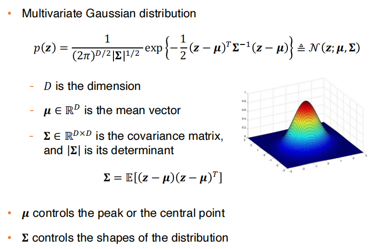

概率视角下的回归的大概意思就是回归求解过程跟求解最大对数似然估计的过程实际是等价的。

> From the perspective of probabilistic modelling, linear regression is actually equivalent to
> Modeling: assuming conditional distribution to be diagonal Gaussian
> Training: training the model by maximizing the log-likelihood

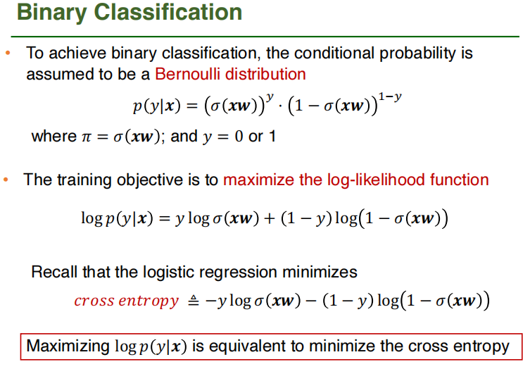

> The logistic regression is equivalent to
> Modeling: assuming Bernoulli conditional distribution for the output
> Training: training the model by maximizing the log-likelihood

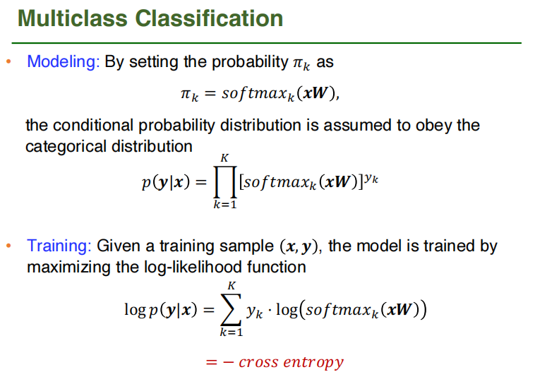

多分类可以视为使用分类分布，对应的概率选取softmax函数，然后梯度下降优化loss的过程也等价于求解最大对数似然估计。

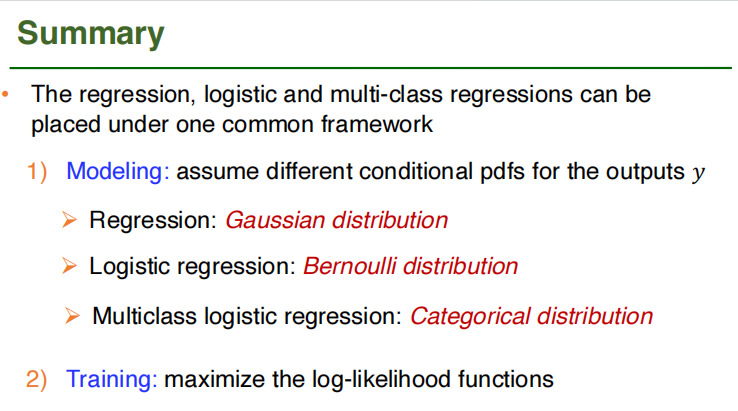

## 非线性场景

逻辑回归和线性回归都是线性模型，非线性场景没办法处理，如果要拓展到非线性场景，最基本的想法就是拓展自变量，使用多项式拟合，自变量从x变成$x,x^2,x^3...$，这也被称为核函数。(核函数不止多项式，也可以是任何非线性函数)

$\mathbf{y} = \mathbf{w}^T\mathbf{x} \to \mathbf{y} = \mathbf{w}^T \phi(\mathbf{x})$

有了核函数，就可以将线性回归和逻辑回归拓展到非线性场景。

回归问题的loss可以改写如下：

$L(\mathbf{w}) = \frac 1 n\sum_{i=1}^{n}(\mathbf{y_i} - \mathbf{w}^T\phi(\mathbf{x_i}))^2$

分类问题的loss可以改写如下：

$L(\mathbf{W}) = - \frac 1 N \sum_{l=1}^n \sum_{k=1}^n \mathbf{y}_k^T \log[softmax_k(\mathbf W^T\phi(\mathbf x_l))]$

分类问题的梯度：

$\nabla_{\mathbf{W}} L(\mathbf{W}) = \frac{1}{N} \sum_{l=1}^N \left( \text{softmax}_j(\mathbf{\phi}(\mathbf{x}^l) \mathbf{W}) - y_j^l \right) \mathbf{\phi}(\mathbf{x}^l)^{\top}$

### 过拟合

非线性场景使用了核函数后，有一个问题就是不知道目标的实际分布是什么样子的，所以可能使用太简单/太复杂的模型，导致过拟合。即在训练集上表现很好，但在测试集上表现很差。

一个解决方法是选取一部分原始训练集中的数据作为训练集，然后剩下的一部分数据作为验证集（20%~30%），然后在各种模型中，选出在验证集上表现最好的。

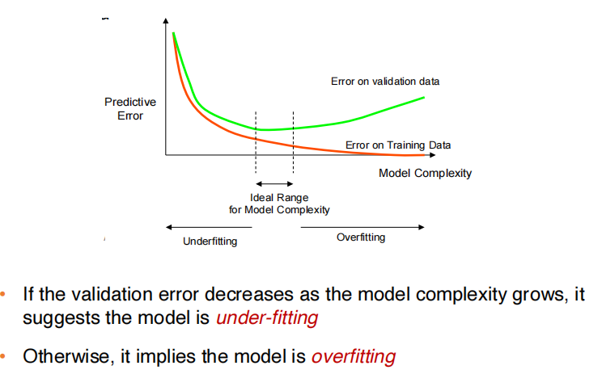

- k折交叉验证

概念：将数据集分为k份，每次使用其中一份作为验证集，剩下的k-1份作为训练集，进行k次训练和验证，最后对训练的参数取平均值。

- 信息准则

在损失函数中对参数进行惩罚，防止过拟合。

有AIC和BIC两种，AIC是$AIC = -2\log L + 2k$，BIC是$BIC = -2\log L + \log n \cdot k$，其中L是似然函数，k是参数个数，n是数据集大小。

注意，这些准则只能用于概率模型，因为需要使用log-likelihood。

### 正则化

正则化是另一种防止过拟合的方法，在损失函数中加入对参数的惩罚，防止参数过大。

$L_1(\mathbf{w}) = L(\mathbf{w}) + \lambda ||\mathbf{w}||^2$

称为L2正则化方法，$||w||^2$是L2范数，也称为岭回归。其值等于$\sqrt{w_1^2+w_2^2+...+w_n^2}$。

$\lambda$是控制正则化程度的超参数。

L1正则化方法：$L_1(\mathbf{w}) = L(\mathbf{w}) + \lambda ||\mathbf{w}||$

称为L1正则化方法，$||w||$是L1范数，也称为Lasso回归。其值等于$|w_1|+|w_2|+...+|w_n|$。

正则化方法的loss倾向于将模型参数缩小到接近0，但通常不会完全变成0

## SVM

### 最大间隔分类器

令$h(x)=wx+b$，即超平面，一个点$(x,y)$到超平面的距离是$\frac {y(w^Tx+b)}{||w||}$，**其中y是-1或1（分类问题！）**。

SVM的目的是最大化margin，即最大化距离。

$Margin = \min_{i=1,...,n} \frac {y_i(w^Tx_i+b)}{||w||}$

优化目标：$\mathbf{w^*},b^* = \arg \max_{\mathbf{w},b} \frac {1}{||\mathbf{w}||} \min_{i=1,...,n} y_i(\mathbf{w}^T\mathbf{x}_i+b)$

> Tips: $||w||=\sqrt {\sum_{i=1}^n w_i^2}$

显然对于一个已经是最优解的$\mathbf{w^*}, b^*$，如果把整个式子乘上一个数$c$，那仍然是在这个限制条件下的最优解。

所以一定存在一个c，使得$y^l(c\mathbf{w^*}^T\mathbf{x}^l+cb^*)\geq 1 \text{for all } l = 1, 2, ..., n$并且等号成立（等比例放缩坐标轴）

所以加上这个限制条件的也是等价的，下面这个问题跟原问题等价。

$$
\max_{\tilde{\mathbf{w}}, b} \left[ \frac{1}{\|\tilde{\mathbf{w}}\|} \min_{\ell} \left( y^{(\ell)} \cdot \left( \tilde{\mathbf{w}}^\top \mathbf{x}^{(\ell)} + \tilde{b} \right) \right) \right] \\
\text{s.t.:} \quad y^{(\ell)} \cdot \left( \tilde{\mathbf{w}}^\top \mathbf{x}^{(\ell)} + \tilde{b} \right) \geq 1 \quad \text{for all } \ell = 1, 2, \cdots, n \\
\text{there exists at least one '=' holding.}
$$

由于至少有一个等号成立，所以必然有$\min_{\ell} y^{(\ell)} \cdot (\tilde{\mathbf{w}}^\top \mathbf{x}^{(\ell)} + \tilde{b}) = 1$，所以可以写成一个仅和$\tilde{\mathbf{w}}$有关的式子，且最大化$\frac 1 {||\tilde{\mathbf{w}}||}$等价于最小化$||w||^2$。

所以原问题等价于：

$$
\min_{\mathbf{w}, b} \frac{1}{2} \|\mathbf{w}\|^2 \\
\text{s.t.:} \quad y^{(\ell)} \cdot (\mathbf{w}^\top \mathbf{x}^{(\ell)} + b) \geq 1 \quad \text{for all } \ell = 1, 2, \cdots, n
$$

将问题化简到这个程度后，就需要使用凸优化的对偶方法求解了。

构造拉格朗日方程：

$\mathcal{L}(\mathbf{w}, b, \mathbf{a}) = \frac 1 2 ||\mathbf{w}||^2 - \sum_{\ell=1}^N a_{\ell} (y^{(\ell)}(\mathbf{w}^T\mathbf{x}^{(\ell)}+b)-1)$ , $a_\ell$均大于等于0

拉格朗日对偶方程：$g(\mathbf{a}) = \min_{\mathbf{w},b}\mathcal{L}(\mathbf{w}, b, \mathbf{a})$

对偶格式是：
$$
\max_{\mathbf{a}} g(\mathbf{a}) \\ 
s.t.: \mathbf{a\geq 0}$$

由于目标函数是凸函数，对偶问题的最大值就是原问题的最小值。所以原问题不好求解，就求解对偶问题，解出$a$后，再求解$\mathbf{w},b$。

拉格朗日函数取最值的时候有$\nabla_{\mathbf{w},b}\mathcal{L} = 0$，所以有：

$\mathbf{w} = \sum_{\ell=1}^N a_{\ell} y^{(\ell)} \mathbf{x}^{(\ell)}$

$0 = \sum_{\ell=1}^N a_{\ell} y^{(\ell)}$

所以对偶问题可以化为：

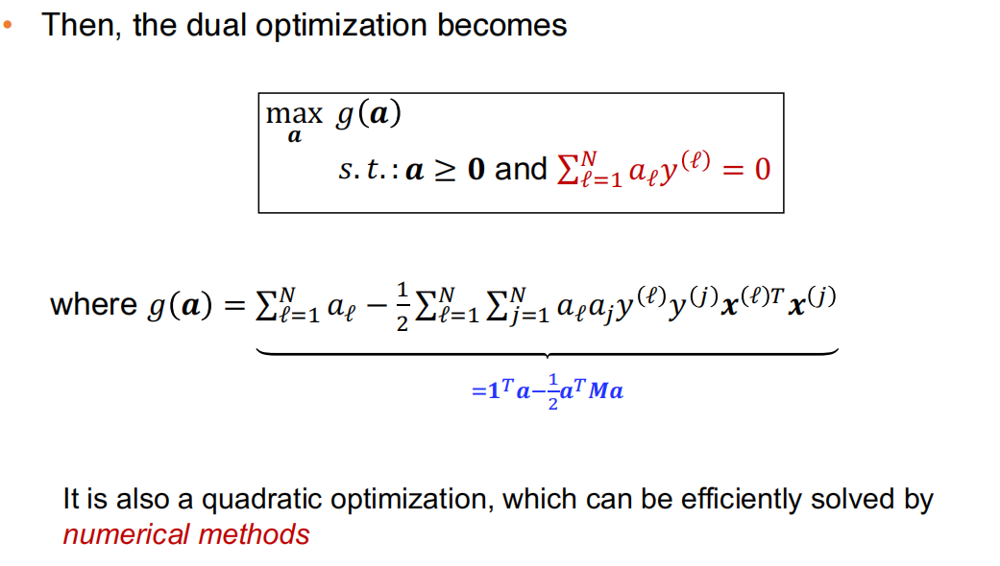

由于支持向量边界上的点满足$y^{(\ell)}(\mathbf{w}^T\mathbf{x}^{(\ell)}+b) = 1$，所以可以求解出$b$：

$$
b^* = \frac{1}{N_S} \sum_{n \in \mathcal{S}} \left( y^{(n)} - \sum_{m} a_m^* y^{(m)} \mathbf{x}^{(n)\top} \mathbf{x}^{(m)} \right)
$$

S：位于边界上的样本集合（支持向量集合）

所以在通过数值方法得到a后也就可以得到w和b，从而得到分类器。分类器可以写成下面的形式：

$$
f(\mathbf{x}) = \text{sign}(\mathbf{w}^* \cdot \mathbf{x} + b^*)
$$

带入$w$的表达式，得到（其中带上标的x和y是训练数据，没有的是测试数据）：

$$
f(\mathbf{x}) = \text{sign}(\sum_{\ell=1}^N a_{\ell} y^{(\ell)} \mathbf{x}^{(\ell)\top} \mathbf{x} + b^*)
$$

看起来实际计算中，上面这个表达式计算量并不小。但实际上绝大多数的$a_\ell$都是0，只需要计算支持向量对应的$a_\ell$。

$$
\begin{aligned}
a_n^* \geq 0 \\
y^{(n)} \left( \mathbf{w}^* \cdot \mathbf{x}^{(n)} + b^* \right) - 1 \geq 0
\\
a_n^* \left[ y^{(n)} \left( \mathbf{w}^* \cdot \mathbf{x}^{(n)} + b^* \right) - 1 \right] = 0
\end{aligned}
$$

而只有支持向量满足方括号里为0.

也就是说只需要对支持向量上的点计算$x^Tx$

### 软间隔分类器

上面这个只能解决线性可分的。如果数据线性不可分，则需要使用软间隔分类器。

引入松弛变量$\xi$，将约束条件改为$y^{(\ell)}(\mathbf{w}^T\mathbf{x}^{(\ell)}+b)\geq 1-\xi^{(\ell)}$，并且最小化$\sum_{\ell=1}^N \xi^{(\ell)}$。

则拉格朗日函数变为：

$$
\mathcal{L}(\mathbf{w}, b, \mathbf{a}, \mathbf{\xi}, \mathbf{\mu}) = \frac{1}{2} \|\mathbf{w}\|^2 + C \sum_{\ell=1}^N \xi^{(\ell)} - \sum_{\ell=1}^N a_{\ell} \left( y^{(\ell)} (\mathbf{w}^T \mathbf{x}^{(\ell)} + b) - 1 + \xi^{(\ell)} \right) - \sum_{\ell=1}^N \mu_{\ell} \xi^{(\ell)}
$$

其中$C$是惩罚系数，$a_\ell$和$\mu_\ell$是拉格朗日乘子。

剩下的推导跟最大间隔分类器没什么区别。

### 支持向量机

要解决线性不可分的问题，就要将数据映射到高维空间，这个就是核函数的作用了。

可以通过一番推导得到下面的结果。

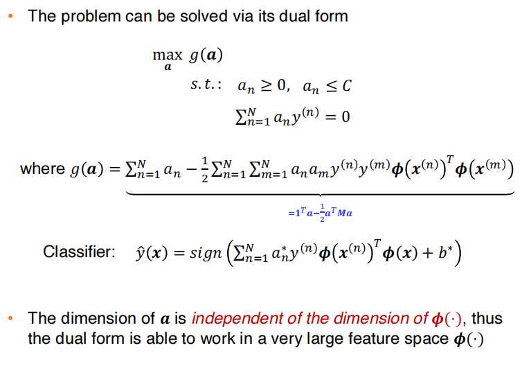

但是在高维情况下，计算核函数内积的计算量很大，而且也不像线性情况那么好找支持向量了，所以需要使用核技巧。

定义核函数：$K(\mathbf{x}, \mathbf{z}) = \phi(\mathbf{x})^\top \phi(\mathbf{z})$

有一个定理：如果一个函数$K(\mathbf{x}, \mathbf{z})$满足是对称正定的，则存在一个映射$\phi$，使得$K(\mathbf{x}, \mathbf{z}) = \phi(\mathbf{x})^\top \phi(\mathbf{z})$。以只要找到K，就不需要显式的映射再计算，直接使用这个函数计算。省去高昂的映射开销。

其中一个典型的核函数是高斯核函数：

$$K(\mathbf{x}, \mathbf{z}) = \exp(-\frac 1 {2\sigma^2} ||\mathbf{x}-\mathbf{z}||^2)$$

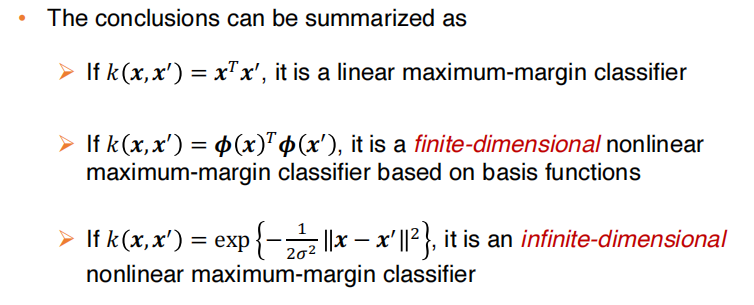

## 神经网络

其他的都做烂了，记一下损失函数应该就行

1. Regression loss:

$$
\mathcal{L}_r(\theta) = \frac{1}{N} \sum_{(x, y) \in \mathcal{D}} |y - \hat{y}(x)|^2
$$

2. Multi-class classification loss:

$$
\mathcal{L}_c(\theta) = -\frac{1}{N} \sum_{(x, y) \in \mathcal{D}} \sum_{k=1}^{K} y_k \log \hat{y}_k(x)
$$

反向传播回忆一下。

池化：对一个$n*n$的矩阵，取一个$k*k$的窗口，取最大值或平均值。

### 优化方法

SGD: 随机梯度下降，每次只对一部分样本求梯度。

问题：容易陷入局部最优。

一个优化方法是使用动量优化，增强对之前梯度的依赖。

记动量为$v_t$，则有$v_t = \gamma v_{t-1} + \nabla_\mathbf{w_t} L(\mathbf{w_t})$，$\mathbf{w_t} = \mathbf{w_{t-1}} - lr*v_t$。

(好像网上看到的都是$v_t = \gamma v_{t-1} + (1-\gamma)\nabla_\mathbf{w_t} L(\mathbf{w_t})$)

#### RMSProp

使用平方和作为动量，$v_t = \gamma v_{t-1} + (1-\gamma)\nabla_\mathbf{w_t} L(\mathbf{w_t})^2$，$\mathbf{w_t} = \mathbf{w_{t-1}} - lr*\frac {\nabla_\mathbf{w_t} L(\mathbf{w_t})} {\sqrt{v_t}}$。

RMSProp对所有的梯度进行拉伸到同一尺度，使得优化更加稳定。

越早的梯度占的权重会比较小，因为会一直乘上$\gamma$衰减。并且可以进行一个等比数列求和发现所有的权重求和接近1.（因此是拉伸到同一尺度的）

#### Adam

Adam是RMSProp和动量优化的结合。

公式如下：

$$
\mathbf{m_t} = \beta_1 \mathbf{m_{t-1}} + (1-\beta_1)\nabla_\mathbf{w_t} L(\mathbf{w_t})
$$

$$
\mathbf{v_t} = \beta_2 \mathbf{v_{t-1}} + (1-\beta_2)\nabla_\mathbf{w_t} L(\mathbf{w_t})^2
$$

$$
\mathbf{w_t} = \mathbf{w_{t-1}} - \frac {\eta} {\sqrt{\mathbf{v_t}}} \mathbf{m_t}
$$

Default settings: $\beta_1= 0.9,\beta_2 = 0.999$ and $\eta = 10^{-3}$

By setting $\beta_1 = 0$, Adam is degenerated to RMSProp

### 训练技巧

#### 数据预处理

常用的预处理方法包括：

- Centering（中心化）：减去数据的均值，使数据的中心移动到原点。
- Normalizing the Variance（方差归一化）：对每个维度的方差进行归一化，使其方差变为 1。
- Whitening（白化）：去除不同维度之间的相关性，使数据的协方差矩阵变为单位矩阵。

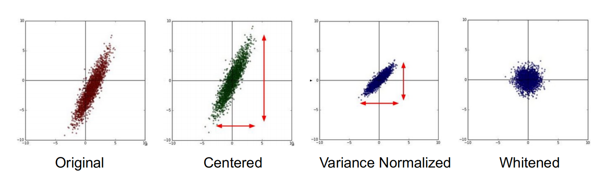

未中心化和归一化的，在进行梯度下降时，会沿着梯度方向之字形下降，导致收敛速度慢。    

#### 权重初始化

层数较浅时，使用正态分布进行初始化$W \sim N(0, {0.01}^2)$

层数较深时（>8），第i层从正态分布$W \sim N(0, \sigma^2)$中采样，$\sigma = \frac 1 {\sqrt{n_{i-1}}}$，$n_{i-1}$是第i-1层的神经元数量。

#### Dropout

Dropout是一种正则化方法，在训练时随机将一部分神经元的输出置为0，以防止过拟合。

但是在训练后测试时应该关闭Dropout，保持输出的稳定性，但为了输出一致，需要将输出乘上Dropout的比例。

#### BatchNorm

BatchNorm是一种正则化方法，BatchNorm通过在训练过程中对隐藏层的输出进行标准化来解决梯度消失/爆炸等问题。

$h_i = \frac {x_i - \mu_i} {\sqrt{\sigma_i^2 + \epsilon}}$

$\mu_i = \frac 1 m \sum_{j=1}^m x_j$

$\sigma_i^2 = \frac 1 m \sum_{j=1}^m (x_j - \mu_i)^2$

然后进行缩放和平移：$z_i = \gamma_i h_i + \beta_i$，其中$\gamma_i$和$\beta_i$是可学习的参数。

计算实际的$\mu_i$和$\sigma_i^2$比较昂贵，一般直接对minibatch求。

但是在测试阶段，输出不能依赖于特定的minibatch的均值和方差，所以一个解决方法是计算一次整个训练数据集的均值和方差，然后作为层固定参数进行推理。

另一种方式在训练过程中平滑更新最终推理的参数，比如$\mu = \mu \cdot 0.9 + \mu_{batch} \cdot 0.1$。0.9和0.1是超参数，可以调整。

$\mu$和$\sigma$都是向量，对整个批量中的所有数据的不同特征分别求。（如果是CNN就是不同通道）

#### LayerNorm

和BatchNorm不同的是沿着层维度归一化，也就是对**单个样本**的所有特征进行归一化。

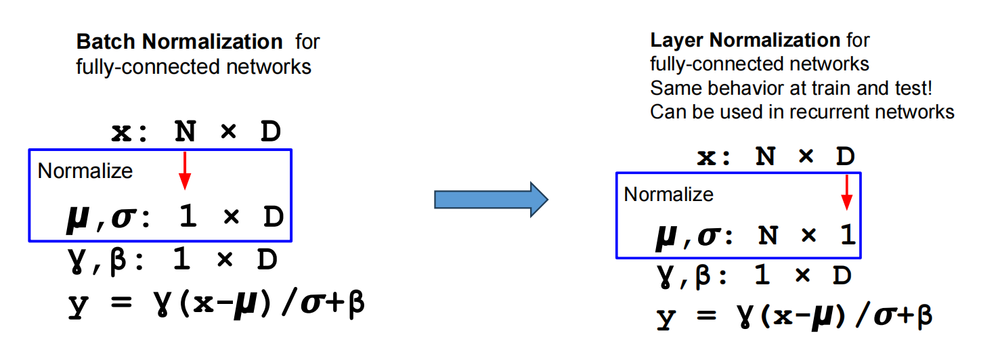

#### InstanceNorm

还有一个InstanceNorm，Instance Normalization (实例归一化, InstanceNorm) 是另一种归一化技术，主要用于风格迁移和生成对抗网络（GAN）等任务。与 Batch Normalization (批量归一化, BatchNorm) 和 Layer Normalization (层归一化, LayerNorm) 不同，InstanceNorm 的归一化维度是按单个样本的单个通道进行归一化。

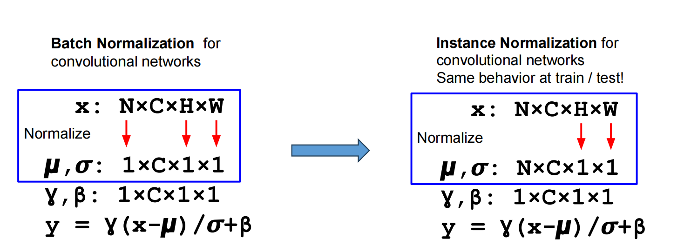

#### 超参数调整

> • Train the model on the training set
> • Tune the hyper-parameters according to the performance on 
> the validation set
> • Test the performance on the test set, and report it as the final performance

## 决策树

本质也是一个分类算法（可以是二分类，也可以是多分类）

算法流程：

1. 现在在树的某个节点上，根据不同的算法，选择最优的划分属性（标签）
2. 对每个标签（属性）生成对应的子节点，并把不同的数据分过去，重复这个迭代过程

算法关键在于：**如何确定这一层中用于划分的标签是最优的**

常用的有三种方法，对应不同的三种决策树：信息增益，增益率，基尼指数

### ID3：信息增益

首先引入一个信息熵的概念，代表一串数据有效信息的比例：

$Ent(D)=-\sum_{k=1}^{|y|} p_k \log_2 p_k$

$Ent(D)$的值越小，D 的信息纯度越高，对于二分
类任务，$|y|=2$

信息增益：一个标签对于分类的有效程度，信息增益越大，使用属性 a 进行划分所获得的纯度提升越大。

$Gain(D,a)=Ent(D)-\sum_{v=1}^V \frac {|D^v|}{|D|} Ent(D^v)$

**选择$Gain(D,a)$值最大的作为分类的标签**

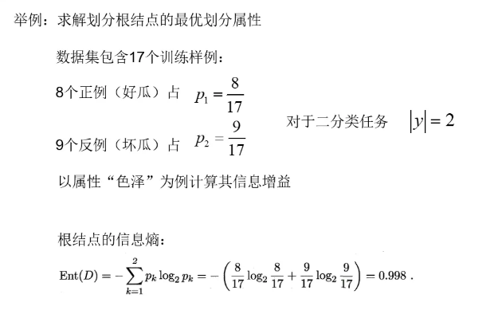

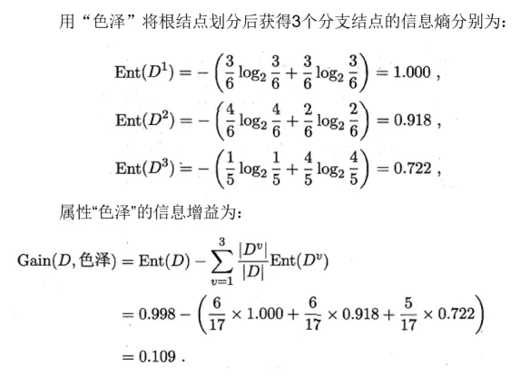

### 其他方法

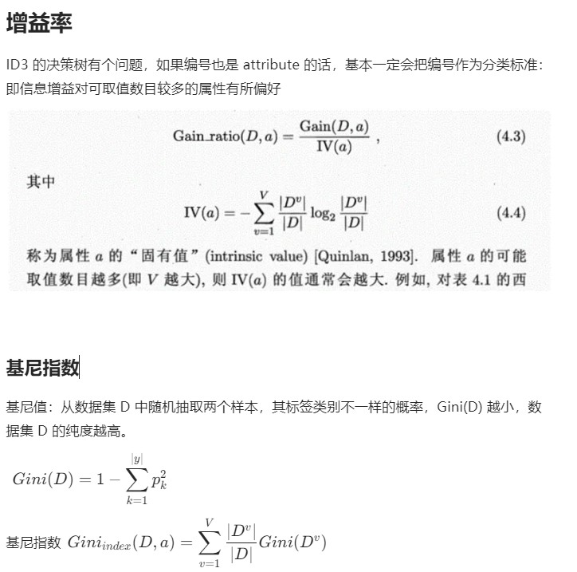

## 集成学习（Ensemble Learning）

获取一个强分类器是比较难的，但是获取到某些方面比较强而不是全局强的分类器是简单的。可以使用集成学习的方法，将多个分类器的结果进行组合，得到一个更强的分类器。

各个分类器可以是任意类型的，可以是决策树、SVM、神经网络等。

### Bagging（投票）

我们并不直接尝试获得在不同样本子集上表现良好的分类器，而是尝试获得独立预测错误的分类器。这意味着希望每个分类器的预测结果尽可能不相关，从而在集成的时候减少误差。

方法：

1. 从训练数据集中有放回地抽取N个样本，生成K个不同的训练数据子集。
2. 在每个子集上训练决策树。
3. 使用投票的方法，将所有分类器的结果进行投票，得到最终的结果。（少数服从多数）

如果每个分类器预测误差仍然高度相关，需要使用随机森林。

在构建每棵决策树时，不使用所有特征，而是**从所有特征中随机选择一个子集**（通常是特征总数的平方根）。

这种方法确保了每棵决策树在不同的特征子集上进行分裂，从而减少了树之间的相关性。

### Boosting

Boosting是一种串行集成学习方法，其核心思想是通过逐步训练多个弱分类器，并逐步纠正前一个分类器的错误，从而提高整体模型的性能。（一般这里用的分类器是决策树，逻辑回归，神经网络等）

过程：

1. 识别上次训练中分类器预测错误的样本，并给予更高的权重。
2. 使用新的分类器对这些样本进行训练。
3. 重复这个过程，直到达到预定的迭代次数或满足某个停止条件。

**关键问题在于如何给予错误样本更高的权重，以及最终如何给各个分类器加权。**

#### AdaBoost

分类器$G_m(x)$的权重$a_m$：$a_m = \frac 1 2 \ln \frac {1-\epsilon_m} {\epsilon_m}$

错误分类的样本的权重会乘上$e^{a_m}$，正确分类的样本会乘上$e^{-a_m}$。

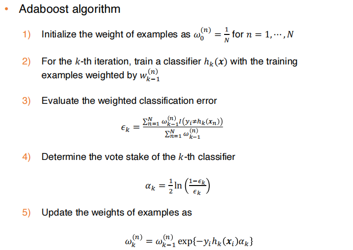

至于第二步，怎么做根据具体的弱分类器类型而定。比如如果是决策树，就直接划分的时候把每个分类的error加起来（error就是w的权重），总error最小的就是最优的划分点。

实质上数学原理就是最小化指数损失函数。

$\mathcal{L}=\sum_{i=1}^n \exp \{-y^{(n)} h_{combine}(\mathbf{x}^{(n)}) \}$

$h_{combine} = \sum_{m=1}^M a_m h_m(\mathbf{x}^{(n)})$

## 主成分分析PCA

(1) 基于特征值分解协方差矩阵实现PCA算法
输入：数据有n个维度，需要降到k维。

1) 去平均值(即去中心化)，即每一位特征减去各自的平均值。

2) 计算协方差矩阵 $\Sigma = \frac 1 n \mathbf{X}^T \mathbf{X}$

3) 用特征值分解方法求协方差矩阵的特征值与特征向量。

4) 对特征值从大到小排序，选择其中最大的k个。然后将其对应的k个特征向量分别作为行向量组成特征向量矩阵P。

5) 将数据转换到k个特征向量构建的新空间中，即Y=PX。

投影：$x1 = \sum_{i=1}^k u_i^T x u_i$

选择最大的k个特征值的原因是为了让投影后的方差尽可能大，也就保留了尽可能多的信息。

第三步也可以改成用SVD

## K-Means聚类

算法流程：

1. 确定簇k的个数
2. 随机选择k个点作为初始中心
3. 对每个点，计算其与各个中心的距离，选择距离最小的中心，并将其归类到该中心
4. 更新中心，计算每个簇的中心，即簇内所有点的平均值
5. 重复3-4，直到中心不再变化

K-means在有限次迭代后总是会收敛（目标函数非负且每次迭代都会减小或不变。）

K的选取原则：1. 根据领域知识 2. 肘部法则：绘制k和SSE的关系图，找到下降明显变慢的点

初始化：

1. 随机 
2. 随机选择一个点作为聚类中心，然后选择距离已有聚类中心最远的点作为下一个中心
3. K-means++：随机选择一个点作为聚类中心，然后按距离加权概率选择下一个中心

有一个问题是，K-means使用one-hot向量，每个点只能属于一个聚类，无法很好表达边界点。另一个方法是Soft K-means。还是用原始的K-means方法，但是不再是使用one-hot向量。

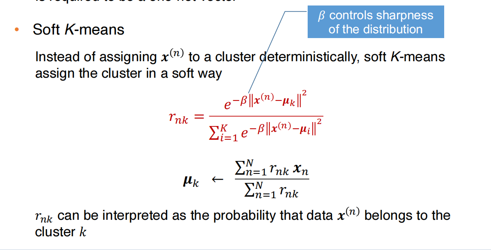  

## 潜变量模型(Latent-Variable Model)

在监督学习中，回归和分类都可以理解为学习条件概率分布$p(y|\mathbf{x};\mathbf{w})$

在无监督学习中，可以理解为学习联合概率分布$p(\mathbf{x}, \mathbf{z})$，其中$\mathbf{z}$是潜变量。

对x进行建模会比对标签y进行建模要难。一个简单的方式是将概率分布限制到某些特定的形式，比如高斯分布。但是显然能力十分有限。

...剩下暂时看不懂

## Deep Generative Model

...

## Representation Learning

好的表征：表征应该包含尽可能多的语义信息，而尽可能少的冗余特征。

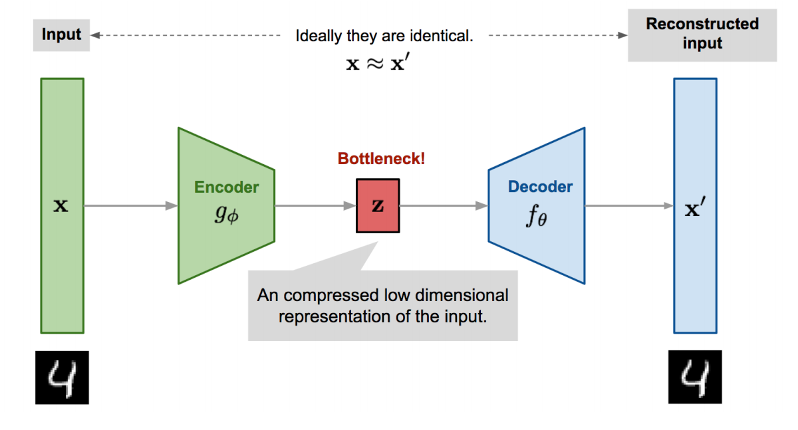

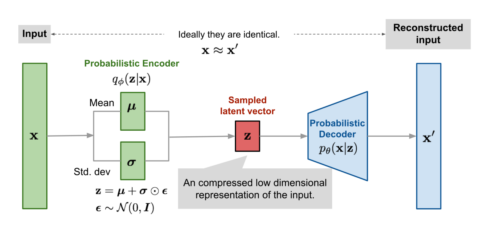

两种典型的模型结构。第一个是auto-encoder，第二个是VAE（Variational Auto-Encoder）。

PCA可以被视为一个线性的auto-encoder

### VAE

**变分自编码器（Variational Autoencoder, VAE）** 是一种生成模型，属于概率图模型与深度学习结合的范畴。VAE 不仅能够进行降维和特征提取，还能够生成数据，同时保留输入数据的概率分布信息。

以下是对 VAE 的详细介绍：

---

#### **VAE 的核心思想**
VAE 是自编码器的一种扩展，它在普通自编码器的基础上引入了概率建模，假设潜在表示 \( z \) 服从某个先验分布（通常是标准正态分布 \( \mathcal{N}(0, I) \)）。通过学习从输入数据 \( x \) 到潜在分布的映射，VAE 能够在潜在空间中生成新数据。

##### **与普通自编码器的区别**
- 普通自编码器学习一个固定的潜在表示 \( z \)，VAE 学习一个分布 \( p(z) \)。
- VAE 的解码器能够基于潜在分布生成新样本，而普通自编码器只能重构输入数据。

---

#### **VAE 的模型结构**

VAE 的结构分为两部分：
1. **编码器（Encoder）**：
   
   - 将输入数据 \( x \) 映射为潜在变量 \( z \) 的分布参数（均值 \( \mu \) 和标准差 \( \sigma \)）：s$q_\phi(z|x) = \mathcal{N}(z|\mu, \sigma^2)$

   - 输出：均值 \( \mu \) 和标准差 \( \sigma \)。

2. **解码器（Decoder）**：
   - 从潜在变量 \( z \) 重构输入数据 \( x \)：$p_\theta(x|z)$
   - 解码器试图最大化重构输入数据 \( x' \) 与真实数据 \( x \) 的相似性。

##### **重参数化技巧（Reparameterization Trick）**

为了使 \( z \) 的采样过程可微（以便优化），VAE 使用重参数化技巧：$z = \mu + \sigma \odot \epsilon, \quad \epsilon \sim \mathcal{N}(0, I)$

通过引入标准正态分布噪声 \( \epsilon \)，使采样过程分离为可学习的参数 \( \mu, \sigma \) 和固定的噪声。

---

#### **VAE 的训练目标**

VAE 的目标是最大化输入数据 \( x \) 的边缘对数似然：$\log p_\theta(x) = \int p_\theta(x|z)p(z)dz$

由于直接计算该积分不可行，VAE 通过变分推断引入证据下界（ELBO）作为优化目标：$\mathcal{L}_{\text{ELBO}} = \mathbb{E}_{q_\phi(z|x)}[\log p_\theta(x|z)] - D_{\text{KL}}(q_\phi(z|x) \| p(z))$

分为两部分：

-  **重构误差**（第一项）：

      - 使重构样本 \( x' \) 与真实数据 \( x \) 越接近越好。
      - 使用对数似然交叉熵/MSE作为损失函数。

-  **KL 散度**（第二项）：

   - 让近似后验分布 \( q_\phi(z|x) \) 与先验分布 \( p(z) \) 越接近越好。
   - KL散度的表达式：$D_{KL}(q_\phi(z|x)||p(z)) = \int q_\phi(z|x) \log \frac {q_\phi(z|x)} {p(z)} dz$

---

#### **VAE 的生成过程**

1. **训练阶段**：
   - 输入数据 \( x \)，编码器生成 \( z \) 的分布参数 \( \mu \) 和 \( \sigma \)。
   - 解码器基于 \( z \) 重构 \( x' \)，并通过 ELBO 优化模型参数。

2. **生成阶段**：
   - 从先验分布 \( p(z) = \mathcal{N}(0, I) \) 中采样潜在变量 \( z \)。
   - 使用解码器生成数据 \( x' \)，即：
     \[
     x' \sim p_\theta(x|z)
     \]

---

### TextRepresentation

#### 经典NLP表征方法

one-hot编码：每个词都是一个维度，向量长度是词典大小，每个向量只有1个1，其余都是0。

Bag-of-Words: 使用所有出现过的单词构建词汇表，对每个文档，统计词汇表中的词的出现次数，然后对每个文档构建一个向量，维度是词表的大小，每个属性代表该词的出现次数。（只关心出现次数，不关心词序）

TFIDF: 
- $tfidf(w,d,D)=tf(w,d)\times idf(w,D)$
- w: word, d: d-th document D: corpus(是所有文档的集合)
- $tf(w,d) = \frac {\text{word w in d}} {\text{all words in d}}$
- $idf(w,D) = \log \frac {|D|} {|d \in D: w \in d|}$
- idf衡量了在文档库中，单词w的信息量，idf越大，说明w在文档库中越稀有，信息量越大。
- tf衡量了单词w在文档d中的重要性，tf越大，说明单词w在文档d中越重。（词频高）
- TFIDF均衡了词频和信息含量的权重。

几种编码方式的缺点：
- one-hot: 维度高，词多太稀疏了，并且没办法识别出语义相同的词
- BOW和TFIDF：没有考虑词序以及语义相同，同样高维且稀疏（但是比one-hot好不少）

#### Word2Vec Embedding

目标: 尽量让相似的词在向量空间中距离相近，且对比前面几种稀疏的方法，更dense一点。

基本方法：

1. Skip-grams
2. Continuous Bag of Words (CBOW)

##### Skip-gram

目标是使用中心单词$w_t$预测左右上下文$w_{t+j}$。基于此预测任务，学习每个单词的低维表示。

方法：

- 随机初始化word-embedding
- 目标函数：$J(\theta) = -\frac 1 n \sum_{i=1}^n \sum_{-c \leq j \leq c, j \neq 0} \log P(w_{t+j}|w_t)$
- 预测概率$P(w_{t+j}|w_t)$使用softmax函数，$P(w_{t+j}|w_t) = \frac {\exp(u_{w_{t+j}}^T u_{w_t})} {\sum_{w=1}^W \exp(u_{w}^T u_{w_t})}$(注意分母的求和界是词表大小)

在训练后，嵌入之间的余弦相似度应该可以表示词相似度。

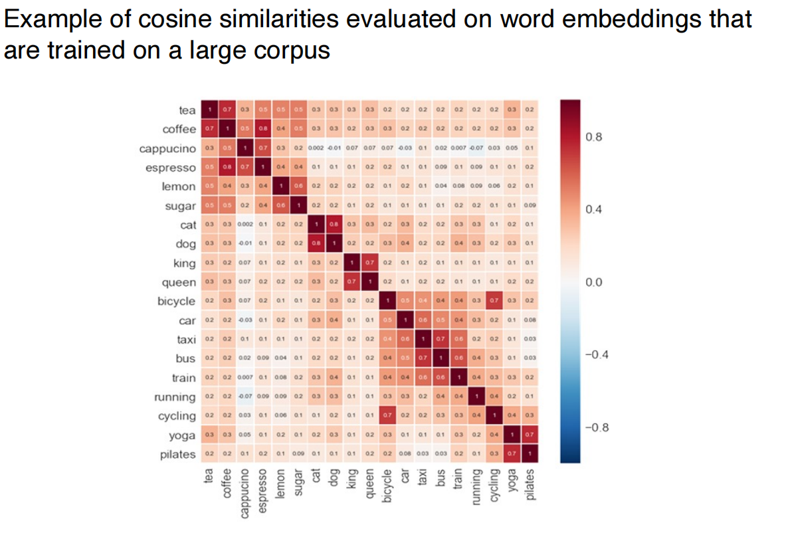

##### CBOW

和Skip-gram相反，使用上下文预测中心单词。

目标函数：$J(\theta) = -\frac 1 n \sum_{i=1}^n \log P(w_t|w_{t-m},...,w_{t+m})$

对上下文的嵌入向量进行聚合，一般使用平均或者加权。然后通过全连接和softmax层，借助hidden layer的输出h得到概率分布。$P(w_t|\text{context}) = \frac {\exp(h^T u_{w_t})} {\sum_{w=1}^W \exp(h^T u_{w})}$

#### Sentence Embedding

有几种使用word embedding表示sentence的方法：

1. 直接平均（得到向量）
2. 拼接（得到矩阵）
3. 通过CNN（根据下游任务微调过的CNN）
4. 通过RNN（根据下游任务微调过的RNN）

#### 注意上下文的词表示

Word2Vec给每个词分配固定的embedding，但是词在不同上下文可能有变化。

一些可能的实现

1. ELMo(基于双向LSTM)
2. BERT
3. GPT

### BERT-Based Representation

ELMo的问题：只能捕捉局部上下文，串行执行。

引入了Transformer，可以并行处理，并且注意力头关注全局的上下文。

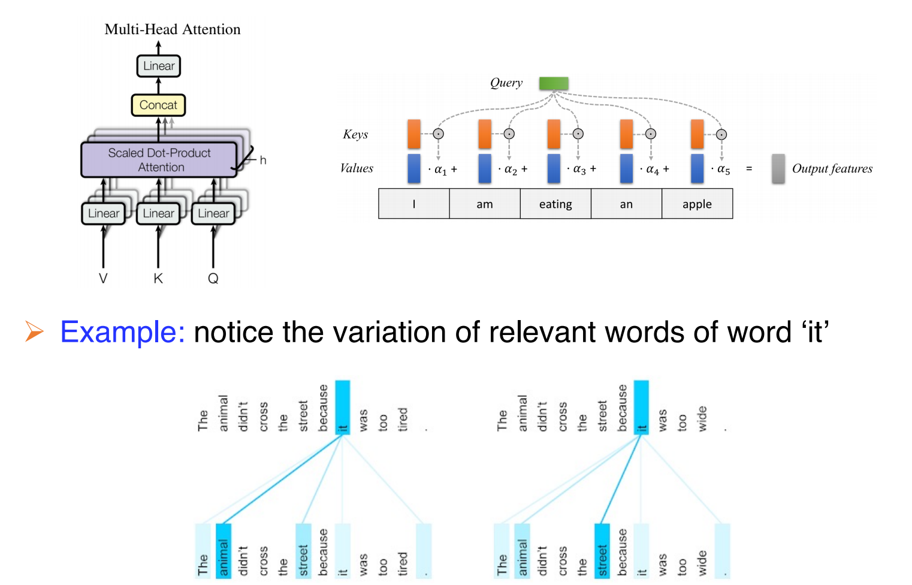

训练过程：

- Masked Language Model: 随机mask掉一些词，然后预测这些词。
- Next Sentence Prediction: 预测两个句子是否是连续的。

提供给BERT的输入：token embedding+segment embedding+position embedding

## 推荐系统

推荐系统的**主要目的**是通过分析用户的行为和偏好，向用户提供个性化的内容或物品建议，从而提升用户体验和满意度。

**应用**：电子商务，新闻，视频，音乐，社交网络，广告

推荐系统中有Utility Matrix，表示用户对物品的偏好。

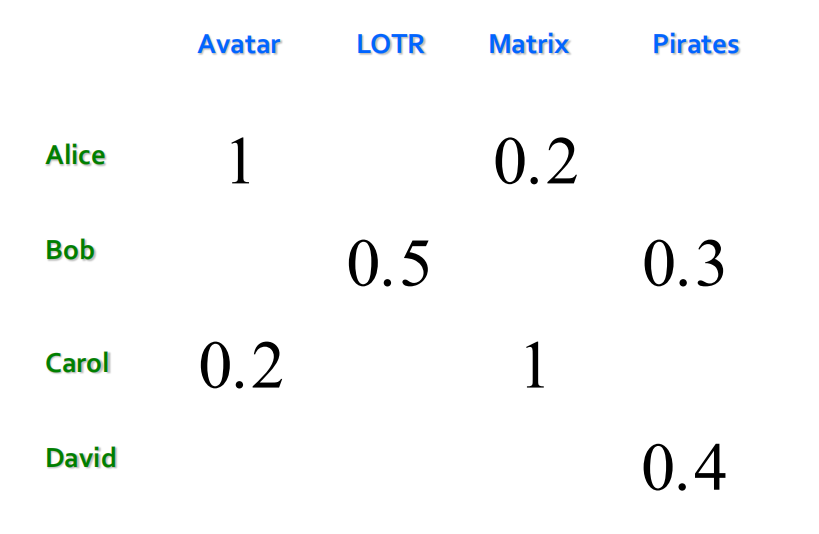

推荐系统的核心问题：

- 如何获得Utility Matrix
- 如何根据已知偏好预测位置偏好
- 如何评估推荐方法好坏

对于第一个问题：有两种方法，显示要求评分（这并不太可能实现），还有隐式的收集，从用户的行为中学习排序

对于第二个问题：Utility Matrix有几个特点，一是Sparsity（稀疏），二是Cold Start（数据有限），三是新物品或新用户的加入时如何推荐

### 基于内容的推荐

主要的想法：向顾客x推荐和之前他高评分/喜欢的物品

比如：向用户推荐之前看过的演员的作品/之前看过的导演的作品，博客/新闻推荐相似的内容

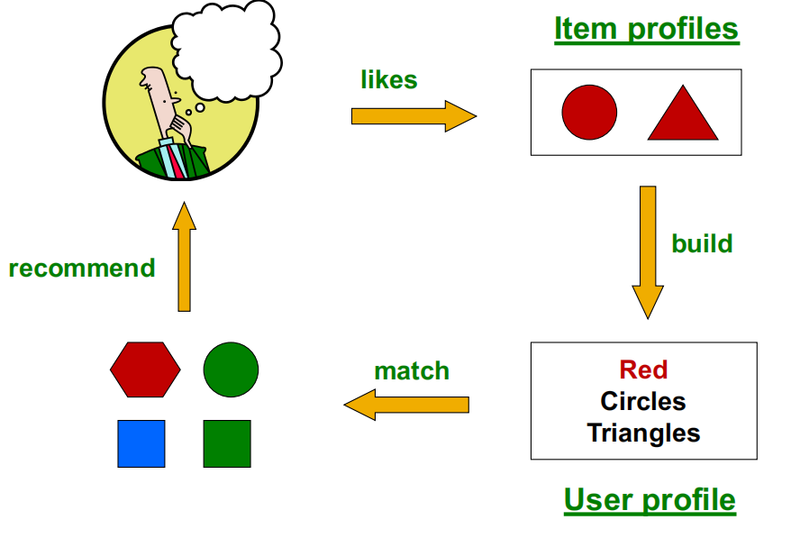

Item profile: 一个包含物品特征的向量，使用IF-IDF等方法识别最重要的特征

User profile: 通过对已评分物品的向量进行average，得到用户偏好，或者根据和平均物品评分的差异得到用户偏好

预测时，使用余弦相似度，假设User Profile $\mathbf x$ 和 Item Profile $\mathbf y$ ，他们的相似度为$\cos(\mathbf x, \mathbf y)$

优点：

- 不需要其他用户的数据，没有冷启动和稀疏的问题
- 可以对品味独特的用户也进行推荐
- 可以推荐新的/冷门的物品（没有first-rater的问题）
- 可解释性

缺点：

- 找到合适的特征是困难的
- 如何对新用户进行推荐（如何构建用户profile）
- Overspecialization（过度专业化），比如用户喜欢看科幻电影，但是推荐系统只推荐科幻电影，用户可能就不愿意使用推荐系统了。

### 用户-用户协同过滤

可以借助其他用户的评价，对基于内容的推荐系统进行改进。

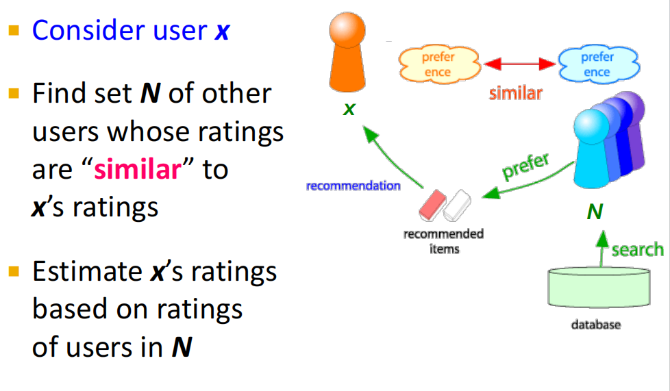

如何找到相似的用户：记$r_x$是用户x的rating

- 余弦相似度$sim(x,y) = \frac {r_x^T r_y} {\|r_x\| \|r_y\|}$
- $S_{xy}$ 是用户x和用户y共同评分的物品
- $sim(x,y)=\frac{\sum_{s\in S_{xy}(r_{xs}-\overline r_x)(r_{ys}-\overline r_y)}} {\sqrt{\sum_{s\in S_{xy}}(r_{xs}-\overline r_x)^2}\sqrt{\sum_{s\in S_{xy}}(r_{ys}-\overline r_y)^2}}$
- $\overline r_x$ 是用户x的平均评分
- $sim(x,y)$越接近1越相关，越接近-1越不相关

但是，协同过滤的问题在于，用户和物品的评分矩阵是稀疏的，所以相似度计算的准确性不高。并且矩阵应该是稀疏的，直接把空的位置视为0是不可取，解决方法是减掉行平均值，中心化数据后再计算余弦相似度。

评价预测：

$N$ 是k个和x最相似的用户的集合（且评价过物品i），下面是两种可能的预测方法（平均加权和相似度加权）

$r_{xi} = \frac {1} {k} \sum_{y\in N} r_{yi}$

或$r_{xi} = \frac {\sum_{y\in N} sim(x,y)r_{yi}} {\sum_{y\in N} sim(x,y)}$

### 物品-物品协同过滤

通过分析物品而不是用户的相似性进行协同过滤。

可以使用相似的方法：

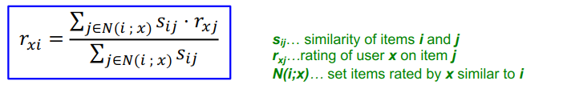

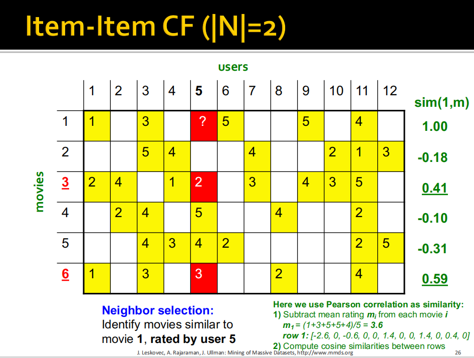

一般的做法如下，会多一个baseline，一般是物品的全局得分。

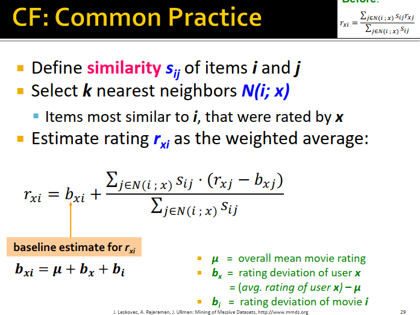

Q: 但是协同过滤和基于内容的推荐非常相似，为什么基于内容的推荐需要特征选择而协同过滤不用？

A: 协同过滤依赖于用户和物品的交互，而基于内容的推荐依赖于物品的特征。也就是说物品是什么样子的不关心，只关心人们对物品的评价。但是基于内容的推荐依赖于物品是什么样子的。

协同过滤的问题：

- 冷启动（推荐系统的冷启动问题是指在系统初始阶段或面对新用户、新物品时，由于缺乏足够的历史数据，难以进行有效推荐的情况）
- 稀疏性
- First rater（不能推荐一个没有被之前评分过的物品）
- 流行偏见（更倾向于推荐流行物品）
- 可扩展性（如果物品-用户矩阵很大就不能这么搞）

### 基于矩阵分解的做法

将效用矩阵Utility Matrix分解为两个低维矩阵

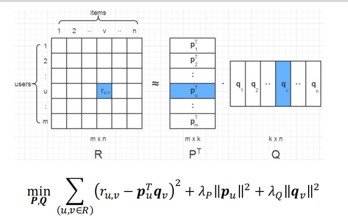

可以使用SGD优化这个目标函数，然后训练完毕后就可以使用$p_u^T q_i$来预测用户u对物品i的评分。

### 推荐效果评估

指标有

RMSE: 均方根误差

P@K：推荐列表中前K个物品中，用户喜欢的概率

召回率：推荐列表中用户喜欢的物品的比例

可以这样子划分测试集

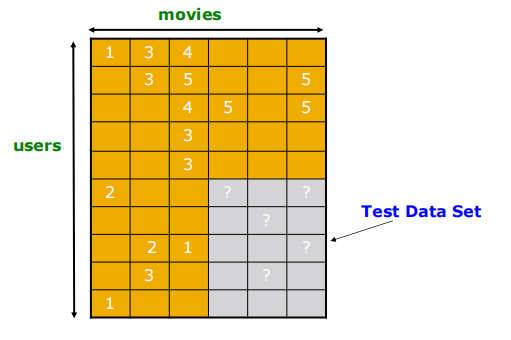
