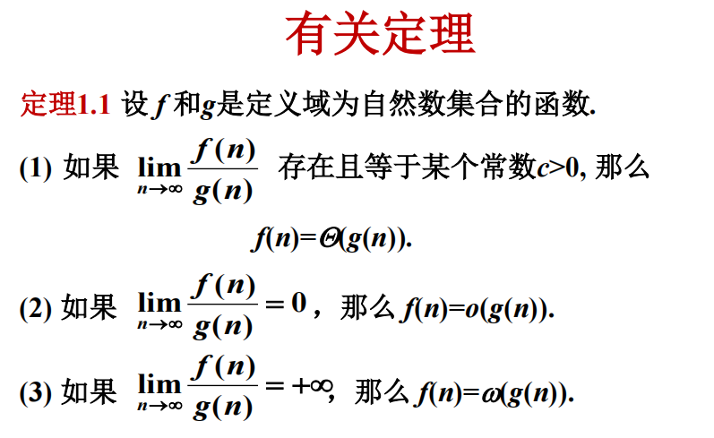

# 基础知识

## 复杂度记号

$f(n) = O(g(n))$，$g$是$f$的上界 存在$c$和$n_0$，$n \geq n_0$时，$f(n) \leq c g(n)$

$f(n) = \Omega(g(n))$ $g$是$f$的下界，存在$c$和$n_0$，$n \geq n_0$时，$f(n) \geq c g(n)$

$f(n) = \Theta(g(n))$ $g$是$f$的确界，满足$f(n)=O(g(n))$ 且 $f(n)=\Omega(g(n))$

$f(n) = o(g(n))$ $g$是$f$的严格上界，存在$c$和$n_0$，$n \geq n_0$时，$f(n) < c g(n)$

$f(n) = w(g(n))$ $g$是$f$的严格下界，存在$c$和$n_0$，$n \geq n_0$时，$f(n) > c g(n)$

## 主定理

$T(n) = aT(n/b) + f(n)$

若 $a>=1 且 b>1$ 是常数，$f(n)$ 是一个函数，$T(n)$ 是定义在非负整数上的递归式，那么 $T(n)$ 有如下渐进界：

1. 若 $f(n) = O(n^{log_b a - \epsilon})$ 对于某个常数 $\epsilon > 0$，则 $T(n) = \Theta(n^{log_b a})$
2. 若 $f(n) = \Theta(n^{log_b a})$，则 $T(n) = \Theta(n^{log_b a} \log n)$
3. 若 $f(n) = \Omega(n^{log_b a + \epsilon})$ 对于某个常数 $\epsilon > 0$，且满足 $a f(n/b) \leq c f(n)$ 对于某个常数 $c < 1$ 和所有足够大的 $n$，则 $T(n) = \Theta(f(n))$

这里$a$是子问题个数，$b$是子问题规模，$f(n)$是子问题之外，将问题分解和合并的代价。

进行一些直观理解：

- 若$f(n)$的增长速度没有$n^{log_b a}$快，则$T(n)$的增长速度为$n^{log_b a}$，即$T(n) = \Theta(n^{log_b a})$
- 若$f(n)$的增长速度比$n^{log_b a}$快，则$T(n)$的增长速度为$f(n)$，即$T(n) = \Theta(f(n))$
- 如果增长同阶，也即$f(n) = \Theta(n^{log_b a})$，则$T(n)$的增长速度为$n^{log_b a} \log n$，即$T(n) = \Theta(n^{log_b a} \log n)$

但是还是要能够找到一个$\epsilon$才行，所以会有上图的红色区域。

## 常用性质

函数的阶有传递性：

$f(n) = O(g(n)) \land g(n) = O(h(n)) \implies f(n) = O(h(n))$

$f(n) = \Omega(g(n)) \land g(n) = \Omega(h(n)) \implies f(n) = \Omega(h(n))$

$f(n) = \Theta(g(n)) \land g(n) = \Theta(h(n)) \implies f(n) = \Theta(h(n))$

注意：$\log_b n = o(n^\alpha)$ 对于任意$\alpha > 0$，也就是对数增长比任何多项式增长都慢。

以及有恒等式$a^{\log_b n} = n^{\log_b a}$

斯特林公式：$n! = \Theta(\sqrt{n} (\frac{n}{e})^n)$  比$n^n$慢。

以及$\log n! = \Theta(n \log n)$

对于不同的$\log$底数，他们在阶数上都是相同的，即$\log_a n = \Theta(\log_b n)$

比较复杂度大小的时候，如果遇到指数很复杂的，两边取log是一个很好的简化方式，比如$(\log n)^{\log n}$和$n^{\log \log n}$，两边取对数就变成了$\log n \log \log n$和$\log \log n \log n$,可以发现是同阶的。

## 迭代法

汉诺塔问题：

$T(n) = 2T(n-1) + 1$

不断用递推方程的右边替代左边，直到出现$T(1)$，然后求解。

对于汉诺塔，$T(n) = 2^n - 1$

正确性验证：数学归纳

一个配套的方法是换元迭代，将对n的递推式换成对其他变元k的递推式。对k直接迭代。

## 递归树

把图画出来，然后求和。

每层计算量固定，只需要计算树高，树高取个$\log$，然后乘以计算量。（就是式子里的分支代价）

