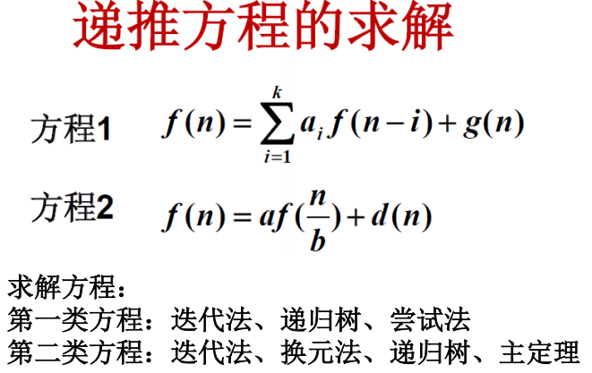
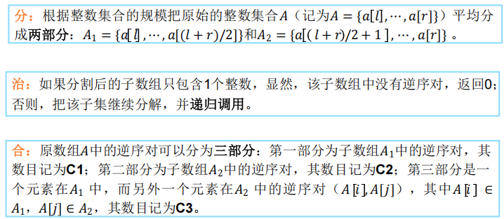

# 分治

逆序对：归并排序

快速排序：用首元素x作为划分标准，小于x的元素放在x的左边，大于x的元素放在x的右边，然后递归处理左右两边。

快速幂：分治

## 如何改进分治算法

- 减少子问题数

W(n) = aW(n/b) + d(n)

a 子问题数， n/b 子问题规模， d(n) 划分与综合工作量

$n^{\log_b a}$阶数比$d(n)$大时，$W(n)$为$n^{\log_b a}$阶，此时降低a就是降低W(n)的阶的途径。

利用子问题的依赖，使得某些子问题的解通过组合其他子问题得到。

- 增加预处理

比如平面点对，n个点，然后输出P中两个点，其距离最小

暴力就是n^2枚举，分治就计算L和R内的最近点对，再计算跨了L和R的最近点对。

不预处理的话每次分治计算跨区点对都要排序，复杂度是$O(n\log^2 n)$

如果预处理先按一维坐标排序，就是$O(n\log n)$，然后计算跨区点对时，由于距离的几何性质，只需要在$[l-d_min,l+d_min]$内计算就行了。

有另一个鸽巢原理的性质是只需要枚举和它最近的有限个点（好像是7个）,所以可以保证计算跨区点对的复杂度只有$O(n)$。由主定理$T(n) = 2T(n/2) + O(n)$，复杂度是$O(n \log n)$

