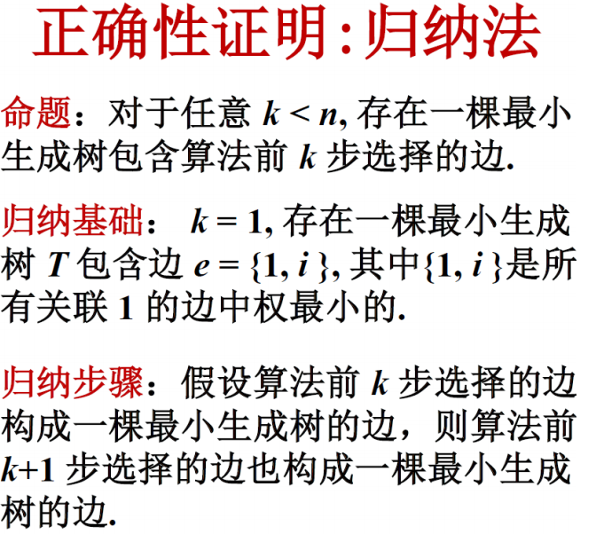
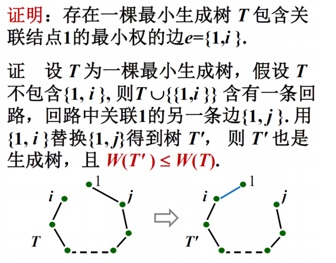

# 贪心法

贪心法必须进行正确性证明！

证明方法：反证法，数学归纳法，交换论证

归纳法证明例子（里面同时用了一些反证法）

## 交换论证

分析一般最优解与算法解的区别

设计一个转换操作（替换成分或者交换次序），可以在有限步内将任意一个普通最优解逐步转换成算法的解

**上述每一步转换都不降低解的最优性质**

## 几种基于贪心的算法

哈夫曼树：借助堆，按出现频率加权建树。

应用：文件归并

Kruskal算法应用：单链聚类，按照算法执行，到有k个联通分量为止。

Dijkstra：无法处理负权边

Bellman-Ford：可以处理负权边，但是无法处理负权回路，每轮对所有边进行松弛，持续迭代$|V|-1$轮，如果$|V|$轮后仍可以松弛，意味着有负权回路。

SPFA: 对BF的优化，每次只有当前的起点到源点的距离变小了，该点联通的其他点才有可能在松弛的时候变小了。所以我们就把有变化的放到队列里，然后只要队列里还有值就更新。（其实和计网路由算法里面的DV算法差不多）

Floyd-Warshall：alltoall的最短路。
