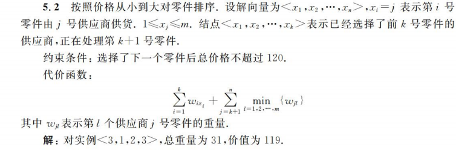

# 回溯与分支限界

状态空间图可以形式化的定义为一个四元组$(S,A,G,F)$
- S：初始状态
- A：操作符集合
- G：目标测试
- F：路径耗散函数

回溯算法 = 深度优先搜索+剪枝策略

剪枝策略：
- 约束函数剪枝
- 限界函数剪枝

## 搜索树节点数估计

蒙特卡洛方法：

1. 从根开始随机选择一条路径，直到不能分支为止，即从$x_1,x_2,...$依次对$x_i$赋值，每个$x_i$是从当时的$S_i$中随机选择的，直到向量不能拓展。
2. 假定搜索树的其他$|S_i|-1$个分支和这个随机选择的路径一样，计数搜索树的节点数。
3. 然后重复1和2，对结果进行概率平均。

在一次抽样过程中

## 搜索算法的改进途径

根据树分支设计优先策略：节点少的分支优先，解多的优先

根据对称性裁切子树

分解为子问题

## 最大团

G=(V,E)是无向图，求G的最大团

团：一个完全子图

G的点独立集：一个点集，其中任意两点不相邻

$U$是$G$的最大团当且仅当$U$是$V-U$的点独立集

这里介绍了朴素的搜索算法，使用了一个简单的最优化剪枝

## 启发式搜索 - A*

$f(n)=g(n)+h(n)$

$g(n)$是已知路径的耗散值

$h(n)$是估计值

算法好坏取决于h是怎么选的，A\*满足$h(n)\leq h^*(n)$，$h^*(n)$是$n$到目标的实际最小耗散值

A\*算法是完备的，最优的

## 做题的注意点

使用解向量来表示解。比如：

搜索的过程状态被称为**节点**或者**部分向量**
