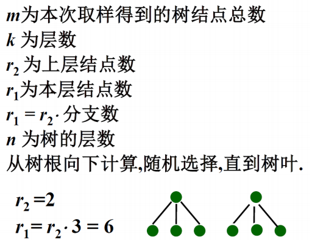
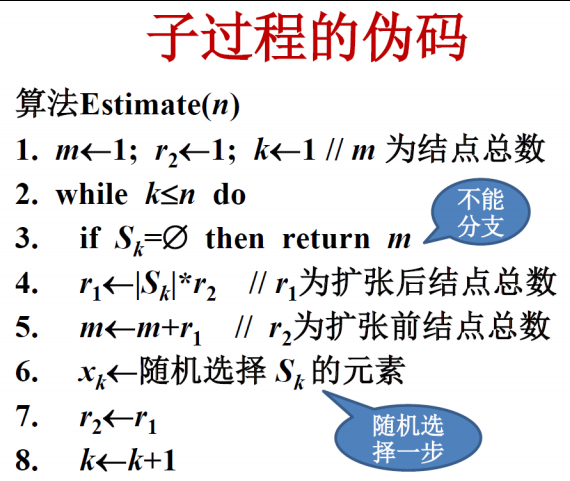

# 回溯与分支限界

状态空间图可以形式化的定义为一个四元组$(S,A,G,F)$
- S：初始状态
- A：操作符集合
- G：目标测试
- F：路径耗散函数

回溯算法 = 深度优先搜索+剪枝策略

剪枝策略：
- 约束函数剪枝
- 限界函数剪枝

## 搜索树节点数估计

蒙特卡洛方法：

1. 从根开始随机选择一条路径，直到不能分支为止，即从$x_1,x_2,...$依次对$x_i$赋值，每个$x_i$是从当时的$S_i$中随机选择的，直到向量不能拓展。
2. 假定搜索树的其他$|S_i|-1$个分支和这个随机选择的路径一样，计数搜索树的节点数。
3. 然后重复1和2，对结果进行概率平均。

在一次抽样过程中

## 搜索算法的改进途径

根据树分支设计优先策略：节点少的分支优先，解多的优先

根据对称性裁切子树

分解为子问题