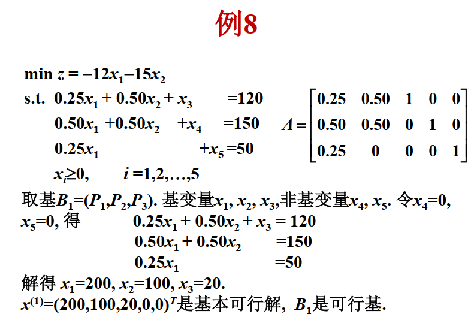
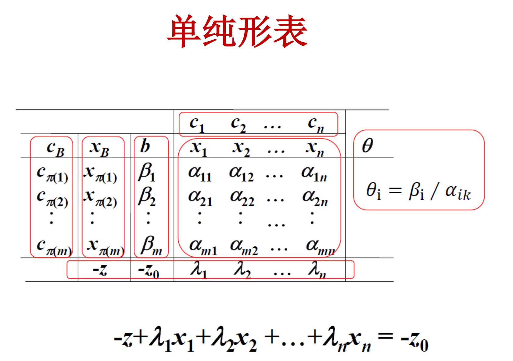
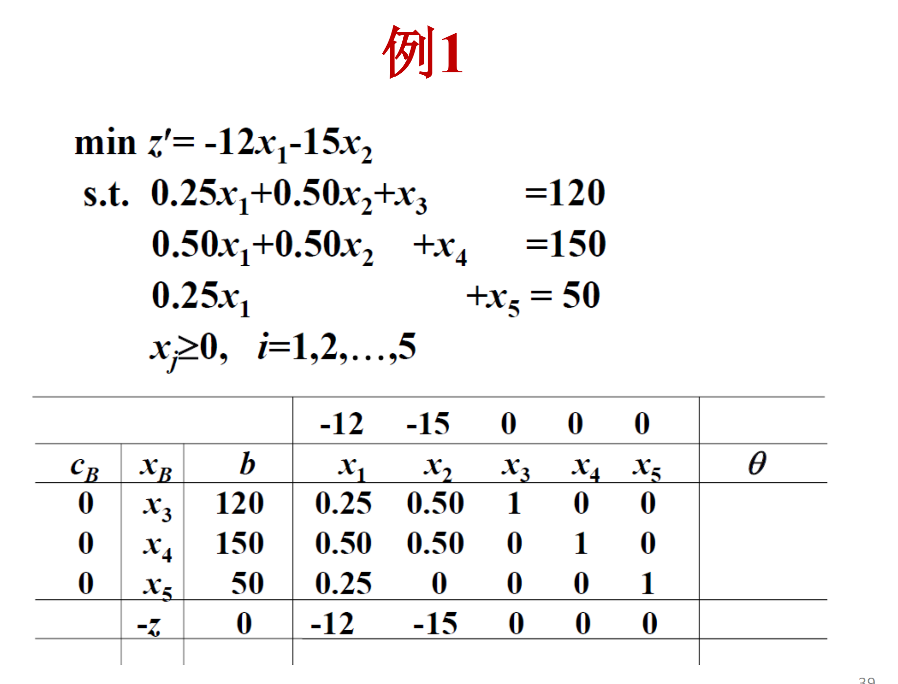
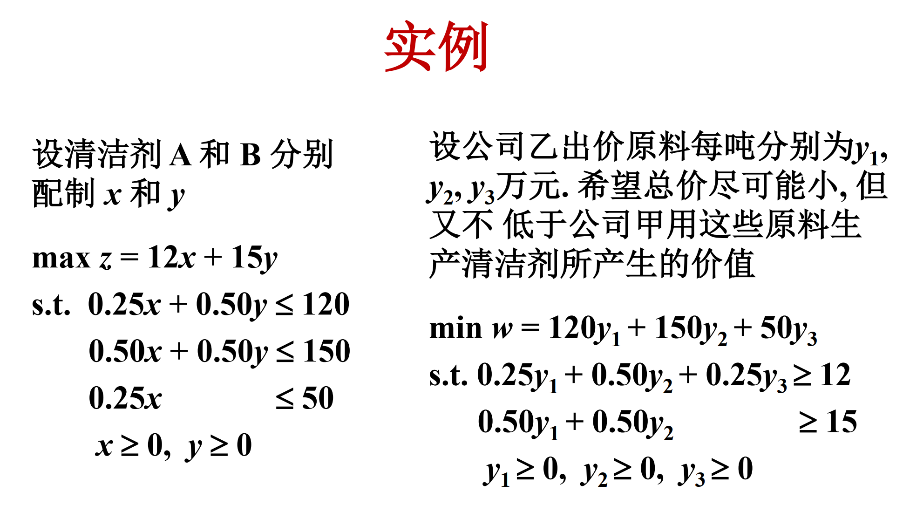
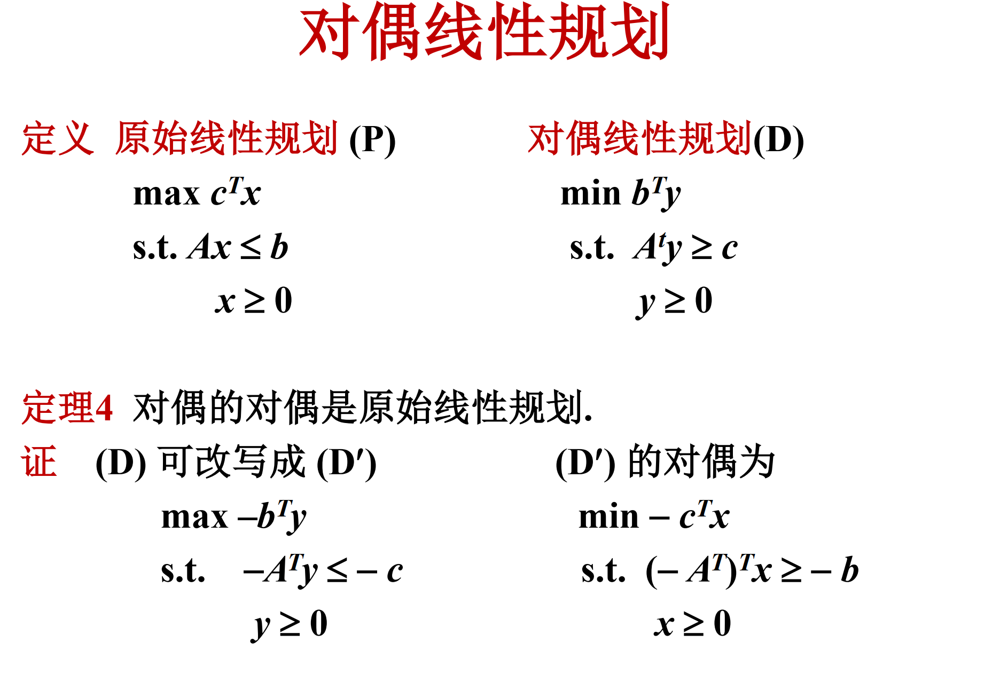

# 线性规划

线性规划问题的解的几种可能：

1. 有唯一最优解
2. 有无穷多最优解
3. 无界解
4. 无可行解

可行域是一个凸多边形

如果有最优解，**一定可以在凸多边形的顶点取到**。

### 标准形

标准形描述如下：

$$
\begin{aligned}
\min {z = \sum_{j=1}^{n} c_j x_j} \\
s.t. \sum_{j=1}^{n} a_{ij} x_j = b_i, i = 1, 2, \cdots, m \\
x_j \geq 0, j = 1, 2, \cdots, n
\end{aligned}
$$

可以将标准形化为矩阵形式：

$$
\begin{aligned}
A = \begin{pmatrix}
a_{11} & a_{12} & \cdots & a_{1n} \\
a_{21} & a_{22} & \cdots & a_{2n} \\
\vdots & \vdots & \ddots & \vdots \\
a_{m1} & a_{m2} & \cdots & a_{mn}
\end{pmatrix}
b = \begin{pmatrix}
b_1 \\
b_2 \\
\vdots \\
b_m
\end{pmatrix}
c = \begin{pmatrix}
c_1 \\
c_2 \\
\vdots \\
c_n
\end{pmatrix}
x = \begin{pmatrix}
x_1 \\
x_2 \\
\vdots \\
x_n
\end{pmatrix}
P_j = \begin{pmatrix}
a_{1j} \\
a_{2j} \\
\vdots \\
a_{mj}
\end{pmatrix}
\end{aligned}
$$

矩阵形式：
$$
\min {z = c^T x} \\
s.t. Ax = b \\
x \geq 0
$$

向量形式：

$$
\min {z = c^T x} \\
s.t. \sum_{j=1}^{n} a_{ij} x_j = b_i, i = 1, 2, \cdots, m \\
x \geq 0
$$

引理：$Ax=b$的解$\alpha$是$Ax=b$的基解，当且仅当$\alpha$的非零分量对应的$A$的列向量线性无关。

定理1：若标准形有可行解，则必有基本可行解。

定理2：若标准形有最优解，则一定存在一个基本可行解是最优解。

根据定理2，解线性规划问题只需要考虑标准形的基本可行解。A有$m$行$n$列，至多$C_n^m$个基解。从而线性规划就变成了一个组合优化问题。

辨析可行解，基本解，基本可行解：

- 可行解：满足约束条件的解（等式约束和非负约束）
- 基本解：不一定可行，但是对应列是线性无关的（且满秩）
- 基本可行解：可行解，且对应列是线性无关的

### 单纯形法

(1) 确定初始基本可行解

(2) 检查当前的基本可行解.

- 若是最优解或无最优解, 计算结束;
- 否则作基变换, 用一个非基变量替换一个基变量, 得到一个新的可行基和对应的基本可行解, 且使目标函数值下降(至少不升).
- 重复(2).

#### 如何确定初始基本可行解

暂时只考虑最简单的情况，设约束条件为：

$$a_{i1}x_1 + a_{i2}x_2 + ... + a_{in}x_n \leq b_i \geq 0, \quad i=1,2,...,m$$

其中 $b_i \geq 0 (i=1,2,...,m)$。

引入 $m$ 个松弛变量 $x_{n+i} \geq 0 (i=1,2,...,m)$，

$$a_{i1}x_1 + a_{i2}x_2 + ... + a_{in}x_n + x_{n+i} = b_i, \quad i=1,2,...,m$$

取 $x_{n+i} (i=1,2,...,m)$ 作为基变量，初始基本可行解为：

$$x^{(0)} = (0,0,...,0,b_1,b_2,...,b_m)^T$$

#### 检查最优性

给定可行基 $B=(P_{\pi(1)}, P_{\pi(2)},...,P_{\pi(m)})$，对方程 $Ax=b$ 两边同乘 $B^{-1}$，得到：

$B^{-1}Ax=B^{-1}b$

记 $A$ 中对应非基变量的列构成的矩阵为 $N$，则有：

$$x_B + B^{-1}Nx_N = B^{-1}b$$

解得：
$$x_B = B^{-1}b - B^{-1}Nx_N$$

将此式代入目标函数 $z = c^Tx$：

$$\begin{aligned}
z &= c_B^Tx_B + c_N^Tx_N \\
&= c_B^T(B^{-1}b - B^{-1}Nx_N) + c_N^Tx_N \\
&= c_B^TB^{-1}b + (c_N^T - c_B^TB^{-1}N)x_N
\end{aligned}$$

此时基本可行解为：
$$x_B^{(0)}=B^{-1}b, \quad x_N^{(0)}=0, \quad 目标函数值 \quad z_0 = c_B^TB^{-1}b$$

目标函数可以进一步变形为：
$$\begin{aligned}
z &= c^Tx \\
&= z_0 + (c_N^T - c_B^TB^{-1}N)x_N \\
&= z_0 + (c_B^T - c_B^TB^{-1}B)x_B + (c_N^T - c_B^TB^{-1}N)x_N \\
&= z_0 + (c^T - c_B^TB^{-1}A)x
\end{aligned}$$

记 $\lambda^T = c^T - c_B^TB^{-1}A$，称为检验数。

则目标函数可以简化为：
$$z = z_0 + \lambda^Tx$$

这里的 $\lambda^T$ 是检验数，它的作用是：
- 如果所有非基变量对应的检验数都 $\geq 0$（最小化问题），则当前基本可行解就是最优解
- 如果存在检验数 $< 0$，则说明可以通过改变对应的非基变量来改进当前解

**具体的，检验数$\lambda_k$可以这么算：$c_k - \sum_{j=1}^{m} c_{\pi(j)} \alpha_{kj}$，其中$\pi(j)$是基变量的下标。（放到单纯形表里，就是一列的最顶上，减掉$\alpha$那一列乘上所选的$c$对应那一列。**

定理3：

记 $B^{-1}A = (\alpha_{ij})_{m\times n}$，$P_j' = B^{-1}P_j \;(1 \leq j \leq n)$，$\beta = B^{-1}b$。

给定基本可行解 $x^{(0)}$：
1. 若所有检验数都 $\geq 0$，则 $x^{(0)}$ 是最优解
2. 若存在检验数 $\lambda_k < 0$ 且所有 $\alpha_{ik} \leq 0 \;(1 \leq i \leq m)$，则问题无最优解

这个定理给出了判断最优解的充分条件：
- 当所有检验数非负时，我们找到了最优解
- 当存在负的检验数，且对应列的所有元素都非正时，问题无界

#### 基变换

取得初始基变量后，如果不是最优解，就进行基变换。每次先选出一个$\lambda_k < 0$的k，然后选取$l$，使得$\beta_l/\alpha_{lk}$最小，然后进行基变换，用k换掉l。

换掉的时候要类似高斯消元那样，把自己那一列变成只有自己是1的，也就是拿自己这一行把其他行的这一列的元素消成0，自己标准化，这里变成1。同时由于$\lambda_k$是被换出的，也要消成0���用新的l行的表，去消$\lambda$那一行的表。

最后再把$x_{\pi{(l)}},c_{\pi{(l)}}$换成$x_k$, $c_k$。

#### 单纯形表

单纯形表可以写成以下形式：

例子如下：

### 两阶段法

上面介绍的求初始可行解的单纯形法只针对最基本的约束

$$
\begin{aligned}
\sum_{j=1}^{n} a_{ij} x_j \leq b_i, i=1,2,...,m \\
\end{aligned}
$$

如果扩展到另外两种情况就需要再讨论：

$$
\begin{aligned}
(1) \sum_{j=1}^{n} a_{ij} x_j \geq b_i, i=1,2,...,m \\
(2) \sum_{j=1}^{n} a_{ij} x_j = b_i, i=1,2,...,m \\
\end{aligned}
$$

对于(1)，引入剩余变量$x_{n+i} \geq 0, i=1,2,...,m$，得到(2)的形式的式子：

$$
\begin{aligned}
\sum_{j=1}^{n} a_{ij} x_j - x_{n+i} = b_i, i=1,2,...,m \\
\end{aligned}
$$

对于(2)，引入人工变量$x_{n+i} \geq 0, i=1,2,...,m$，得到：

$$
\begin{aligned}
\sum_{j=1}^{n} a_{ij} x_j + x_{n+i} = b_i, i=1,2,...,m \\
\end{aligned}
$$

取所有的人工变量和剩余变量作为基变量，就可以得到初始可行基。（但不是初始可行解，人工变量必须为0才是初始可行解）

**注意：要给引入剩余变量的式子也加���人工变量，原因是要在原始的矩阵中凑出一个单位矩阵，用于构造初始基。**

因此引入辅助问题来获得初始可行解：

$$
\begin{aligned}
\min w = \sum_{i=1}^{m} y_i \\
s.t. \sum_{j=1}^{n} a_{ij} x_j + x_{n+i} + y_i = b_i, i=1,2,...,m \\
x_j \geq 0, j=1,2,...,n \\
y_i \geq 0, i=1,2,...,m \\
\end{aligned}
$$

只要对这个问题使用单纯形法，就可以得到初始可行解。

当$w=0$的时候，如果人工变量有作为基变量，需要再次进行分类讨论。

两阶段法：

- 阶段一 引入人工变量, 写出辅助问题, 用单纯形法求解.若为情况(1), 则原问题无可行解, 计算结束. 若为情况(2),则进入阶段二.

- 阶段二 删去人工变量, 得到原问题的一个基本可行解. 以这个解为初始基本可行解, 用单纯形法解原问题

## 对偶线性规划

可以用这个实例来理解对偶线性规划是什么意思

**定理四：对偶的对偶是原始线性规划**

如何写非常规的线性规划对应的对偶式子（不是全是小于等于那种），可以看下面这个截图

定理5 设 x 是原始规划 (P) 的可行解, y是对偶规划 (D) 的可行解, 则恒有 $c^Tx \leq b^Ty$

定理6 设 x 是原始规划 (P) 的可行解, y是对偶规划 (D) 的可行解, 则 $c^Tx = b^Ty$ 当且仅当 x 和 y 分别是原始规划和对偶规划的最优解

定理7 如果原始规划 (P) 有最优解, 则对偶规划 (D) 也有最优解, 且它们的最优值相等. 反之亦然

### 对偶单纯形法

定义 设 B是一个基, 如果 $\lambda \geq 0$，则称 B 是正则的.

如果 B 是正则的, 那么 y 是 (D)的可行解, 从而只要 x 是(P) 的可行解, 亦即 $xB = B^{−1}b ≥ 0$, 则 x 和 y 分别是 (P) 和(D) 的最优解.

**单纯形法**: 保持 x 是 (P) 的可行解 (保持B是可行基), 即保持 $B^{−1}b ≥ 0$, 通过基变换使 y 逐步成为 (D) 的可行解 (B变成正则基), 即逐步使 $\lambda \geq 0$.

**对偶单纯形法**: 保持 y 是 (D) 的可行解 (保持B是正则基),即保持 $\lambda \geq 0$, 通过基变换使 x 逐步成为 (P) 的可行解 (B变成可行基), 即逐步使 $B^{−1}b ≥ 0$.

#### 对偶单纯形法的判断条件

设 $\lambda \geq 0$，$\beta_l < 0$，若所有 $\alpha_{lj} \geq 0$ $(1 \leq j \leq n)$，则(P)无可行解。若存在 $\alpha_{lk} < 0$，则以 $x_{\pi(l)}$ 为换出变量，以 $x_k$ 为换入变量做基变换，必须保证：

$\lambda_j / \alpha_{lj} \leq \lambda_k / \alpha_{lk}$ (当 $\alpha_{lj} < 0$ 时)

故应取 $k$ 使得：

$|\lambda_k / \alpha_{lk}| = \min\{|\lambda_j / \alpha_{lj}| : \alpha_{lj} < 0\}$

注意到 $\lambda_j \geq 0$，$\alpha_{lk} < 0$，当 $\alpha_{lj} \geq 0$ 时，不等式自然成立。

#### 对偶单纯形法的步骤

1. 找到一个正则基（检验数 $\lambda \geq 0$）
2. 检查基本解的可行性：
   - 如果 $\beta \geq 0$，则找到最优解
   - 如果存在 $\beta_i < 0$，选择最小的 $\beta_i$ 对应的行 $l$
3. 检查第 $l$ 行的系数：
   - 如果所有 $\alpha_{lj} \geq 0$，则原问题无可行解
   - 否则在 $\alpha_{lj} < 0$ 中选择使 $|\lambda_j / \alpha_{lj}|$ 最小的 $j$ 作为换入变量
4. 进行基变换，返回步骤2

## 整数线性规划

- 整数线性规划 在线性规划上对变量增添整数的要求

- 纯整数线性规划 (全整数线性规划) 要求所有变量是整数

- 混合整数线性规划 只要求部分变量是整数

- 0-1型整数线性规划 要求所有变量是 0 或 1

- 松弛规划 (简称松弛) 删去整数要求后得到的线性规划

   - 松弛规划的最优值是原整数规划的最优值的界限(最小化的下界,最大化的上界), 但通常不是原整数规划的最优解
