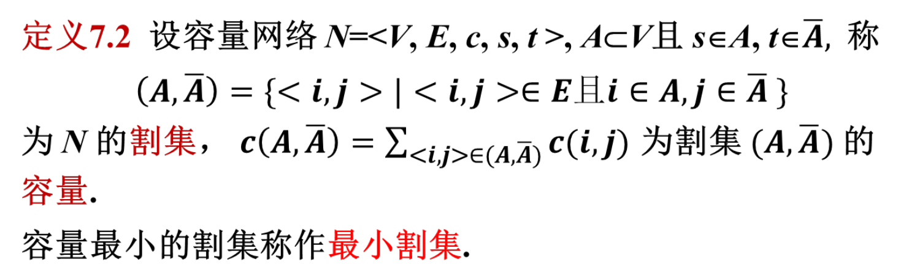

# 网络流

## PageRank

一阶马尔可夫链：随机游走模型，下一步只和当前状态有关，和之前的状态无关。

给一个n个节点的有向图，可以在有向图上定义随机游走模型，节点表示状态，边标识转移，假设一个节点通过有向边转移的概率相等。则转移矩阵是一个n阶矩阵M
$$
M=[m_{ij}]_{n\times n}
$$
其中，$m_{ij}$表示**从节点j到节点i的概率**。

所以M矩阵的元素非负，列和为1.

在时刻t，访问各个节点的概率分布记为$R_t$，满足转移关系式$R_{t+1}=MR_t$。

PageRank的定义：$MR=R$，此时的R为马尔科夫链的稳态分布。列向量的每一个值就代表每一个元素的PageRank值。所以PageRank也在[0,1]之间。

则有$\sum_{i=1}^{n}PR(v_i)=1$, $PR(v_i)=\sum_{v_j\in M(v_i)}\frac{PR(v_j)}{L(v_j)},i=1,2,...,n$。

这里$M(v_i)$表示指向节点$v_i$的节点集合，$L(v_j)$表示节点$v_j$的出度。

强连通且非周期性的马尔可夫链，存在唯一的稳态分布。这种情况可以通过递推式子迭代求得稳态分布。

### 一般图的PageRank

此时M不是一个随机矩阵。为此引入阻尼因子d和完全随机图（转移矩阵所有元素的值都是$\frac 1 n $）。

则有$M=dM+(1-d)\frac 1 n$。

此时的稳态分布：$R=dMR+(1-d)\frac 1 n$。

这里的R就是一般图的PageRank。

求解方法：

- 迭代做法（幂法）：使用递推式迭代，直至分布在精度范围内不再变化（递推过程中记得将R归一化，防止数值溢出）
- 代数做法（矩阵运算）：$R=dMR+\frac {1-d} n \vec 1$，化简后$R=(I-dM)^{-1}\frac {1-d} n \vec 1$。求出逆矩阵后可以得到一般的PageRank。

## 最大流

最大流问题描述：给定一个有向图，每条边有一个容量，求从源点出发到汇点的最大流量。

公式化定义如图：

最大流问题可以写成线性规划问题，使用单纯形法求解。但有更有效的解决方法。

最小割：把一个流网络的顶点集分割为两部分，源点s和汇点t分别在两个部分中，然后跨越分割的边的容量总和最小。

注意边权不能为负数！

最大流最小割定理：一个网络的最大流等于最小割的容量。

> 最小割/最大流可用于决定经营投资策略。如开发产品A1需要先购入工具T1,T2，而产品A2需要先购入工具T2T3，则同时开发仅需要负担T1,T2,T3的成本。
> 建模如下：
> 第一种做法：
> 建立虚拟的s和t，s到所有的产品A连接一条边，容量为开发获利。t到所有工具T连接一条边，容量为工具成本（负值，实际处理中应该加上一个offset，因为最大流边权不能为负）。
> 然后A和T之间按照产品开发工具需求关系连边，边的容量都是无限。
> 对这个图求解最大流，得到最大流后，最小割的容量就是最大流。

> 第二种做法：
> 仍然建立s和t，s到所有的工具T连接一条边，边权为工具成本，T和A之间的连接不变，A到t之间连接一条边，边权为开发获利。最大获利为所有工具的获利减掉最小割。

增广链的概念：

容量网络$N=<V,E,c,s,t>$, f是N上任一可行流，存在以下几个概念
- 饱和边：流量等于容量的边
- 非饱和边：流量小于容量的边
- 零流边：流量为0的边
- 非零流边：流量大于0的边

i-j链：N中由i到j的一条边不重复路径**（不考虑方向）**
- 方向：i->j
- 前向边：链中与链的方向一致的边
- 后向边：链中与链的方向相反的边

i-j增广链：一条i-j链，且链中所有前向边都是非饱和边，后向边都是非零流边。

通过s-t增广链P增加流量
- 设$\delta=\min(\min(\text{P上前向边容量-流量}),\min(\text{P上后向边流量}))$
- 对P上前向边，流量增加$\delta$
- 对P上后向边，流量减少$\delta$

### FF算法

从给定的初始可行流（一般是零流）开始，寻求关于当前可行流的s-t增广链P，修改链上的流量，得到新的可行流，直到不存在s-t增广链。

标号法：从s开始逐个给顶点标号，直到t得到标号。顶点j得到标号表示已经找到从s到j的增广链，标号为$(l_j,\delta_j)$，其中$l_j$是s到j的距离，$\delta_j$是s到j的增广链的流量。$l_j=+i$或者$l_j=-i$表示链是从i到j且<i,j>是前向or后向边。

将节点分为三类，已标号已检查，已标号未检查，未标号的（其实就是搞个队列就行了，每次出队头拓展））

注意找到一条增广路后，**要沿着增广路回溯修改流量！**

记C为源点s的所有邻接边边权之和，m为边的个数，则FF算法的时间复杂度为$O(mC)$。（最坏的情况下）

改进：
- 保证所求增广链有一定性质（比如最短）
- 一次能求得多个增广链

### Dinic

定义关于f的辅助网络$N_f=<V,E_f,ac,s,t>$，其中$E_f$是f的残留网络，$ac$是$E_f$上的容量。
$E^+(f)=\{<i,j>|<i,j>\in E, f(i,j)<c(i,j)\}$
$E^-(f)=\{<j,i>|<i,j>\in E, f(i,j)>0\}$
$E(f)=E^+(f)\cup E^-(f)$
$ac(i,j)=c(i,j)-f(i,j), <i,j>\in E^+(f)$
$ac(i,j)=f(j,i), <i,j>\in E^-(f)$

ac被称为辅助容量，N(f)也是容量网络。

几个引理和定理：

引理：设N的最大流量为$v^*$，f是可行流，则$N(f)$的最大流量为$v^*-v(f)$

定义$f$是N上的可行流，$g$是$N(f)$上的可行流，记$f'=f+g$，满足任意$<i,j>\in E, f'(i,j)=f(i,j)+g(i,j)-g(j,i)$。

设f是N上的可行流，g是N(f)上的可行流，则f+g是N上的可行流，且$v(f+g)=v(f)+v(g)$。

- 分层辅助网络：$AN(f)=\{V(f), AE(f), ac, s, t \}$
- 设在$N(f)$中，$d(i)$表示s到顶点i的广度优先搜索距离，设 $d=d(t)$
- $V_k(f)=\{i|d(i)=k\}$
- $V_d(f)=\{t\}$
- $V(f)=\cup_{k=0}^{d}V_k(f)$
- $AE(f)=\{<i,j>|i\in V_k(f), j\in V_{k+1}(f), <i,j>\in E(f)\}$

通过求$AN(f)$的极大流，得到$AN(f)$中尽可能多的s-t路径，即N中的多条增广链（极大流：无法只通过增广前向边增加流量）

