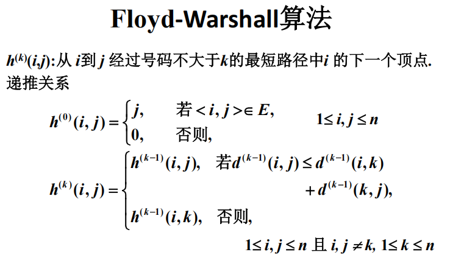
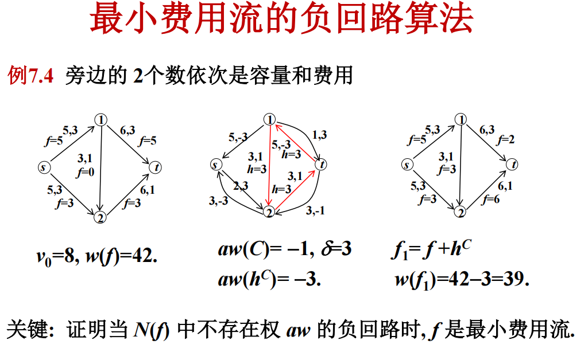

# 网络流

## PageRank

一阶马尔可夫链：随机游走模型，下一步只和当前状态有关，和之前的状态无关。

给一个n个节点的有向图，可以在有向图上定义随机游走模型，节点表示状态，边标识转移，假设一个节点通过有向边转移的概率相等。则转移矩阵是一个n阶矩阵M: $M=[m_{ij}]_{n\times n}$

其中，$m_{ij}$表示**从节点j到节点i的概率**。

所以M矩阵的元素非负，列和为1.

在时刻t，访问各个节点的概率分布记为$R_t$，满足转移关系式$R_{t+1}=MR_t$。

PageRank的定义：$MR=R$，此时的R为马尔科夫链的稳态分布。列向量的每一个值就代表每一个元素的PageRank值。所以PageRank也在[0,1]之间。

则有$\sum_{i=1}^{n}PR(v_i)=1$, $PR(v_i)=\sum_{v_j\in M(v_i)}\frac{PR(v_j)}{L(v_j)},i=1,2,...,n$。

这里$M(v_i)$表示指向节点$v_i$的节点集合，$L(v_j)$表示节点$v_j$的出度。

强连通且非周期性的马尔可夫链，存在唯一的稳态分布。这种情况可以通过递推式子迭代求得稳态分布。

### 一般图的PageRank

此时M不是一个随机矩阵。为此引入阻尼因子d和完全随机图（转移矩阵所有元素的值都是$\frac 1 n $）。

则有$M=dM+(1-d)\frac 1 n$。

此时的稳态分布：$R=dMR+(1-d)\frac 1 n$。

这里的R就是一般图的PageRank。

求解方法：

- 迭代做法（幂法）：使用递推式迭代，直至分布在精度范围内不再变化（递推过程中记得将R归一化，防止数值溢出）
- 代数做法（矩阵运算）：$R=dMR+\frac {1-d} n \vec 1$，化简后$R=(I-dM)^{-1}\frac {1-d} n \vec 1$。求出逆矩阵后可以得到一般的PageRank。

## 最大流

最大流问题描述：给定一个有向图，每条边有一个容量，求从源点出发到汇点的最大流量。

公式化定义如图：

最大流问题可以写成线性规划问题，使用单纯形法求解。但有更有效的解决方法。

最小割：把一个流网络的顶点集分割为两部分，源点s和汇点t分别在两个部分中，然后跨越分割的边的容量总和最小。

注意边权不能为负数！

最大流最小割定理：一个网络的最大流等于最小割的容量。

> 最小割/最大流可用于决定经营投资策略。如开发产品A1需要先购入工具T1,T2，而产品A2需要先购入工具T2T3，则同时开发仅需要负担T1,T2,T3的成本。
> 建模如下：
> 第一种做法：
> 建立虚拟的s和t，s到所有的产品A连接一条边，容量为开发获利。t到所有工具T连接一条边，容量为工具成本（负值，实际处理中应该加上一个offset，因为最大流边权不能为负）。
> 然后A和T之间按照产品开发工具需求关系连边，边的容量都是无限。
> 对这个图求解最大流，得到最大流后，最小割的容量就是最大流。

> 第二种做法：
> 仍然建立s和t，s到所有的工具T连接一条边，边权为工具成本，T和A之间的连接不变，A到t之间连接一条边，边权为开发获利。最大获利为所有工具的获利减掉最小割。

增广链的概念：

容量网络$N=<V,E,c,s,t>$, f是N上任一可行流，存在以下几个概念
- 饱和边：流量等于容量的边
- 非饱和边：流量小于容量的边
- 零流边：流量为0的边
- 非零流边：流量大于0的边

i-j链：N中由i到j的一条边不重复路径**（不考虑方向）**
- 方向：i->j
- 前向边：链中与链的方向一致的边
- 后向边：链中与链的方向相反的边

i-j增广链：一条i-j链，且链中所有前向边都是非饱和边，后向边都是非零流边。

通过s-t增广链P增加流量
- 设$\delta=\min(\min(\text{P上前向边容量-流量}),\min(\text{P上后向边流量}))$
- 对P上前向边，流量增加$\delta$
- 对P上后向边，流量减少$\delta$

### FF算法

从给定的初始可行流（一般是零流）开始，寻求关于当前可行流的s-t增广链P，修改链上的流量，得到新的可行流，直到不存在s-t增广链。

标号法：从s开始逐个给顶点标号，直到t得到标号。顶点j得到标号表示已经找到从s到j的增广链，标号为$(l_j,\delta_j)$，其中$l_j$是s到j的距离，$\delta_j$是s到j的增广链的流量。$l_j=+i$或者$l_j=-i$表示链是从i到j且<i,j>是前向or后向边。

将节点分为三类，已标号已检查，已标号未检查，未标号的（其实就是搞个队列就行了，每次出队头拓展））

注意找到一条增广路后，**要沿着增广路回溯修改流量！**

记C为源点s的所有邻接边边权之和，m为边的个数，则FF算法的时间复杂度为$O(mC)$。（最坏的情况下）

改进：
- 保证所求增广链有一定性质（比如最短）
- 一次能求得多个增广链

### Dinic

定义关于f的辅助网络$N_f=<V,E_f,ac,s,t>$，其中$E_f$是f的残留网络，$ac$是$E_f$上的容量。
$E^+(f)=\{<i,j>|<i,j>\in E, f(i,j)<c(i,j)\}$
$E^-(f)=\{<j,i>|<i,j>\in E, f(i,j)>0\}$
$E(f)=E^+(f)\cup E^-(f)$
$ac(i,j)=c(i,j)-f(i,j), <i,j>\in E^+(f)$
$ac(i,j)=f(j,i), <i,j>\in E^-(f)$

ac被称为辅助容量，N(f)也是容量网络。

几个引理和定理：

引理：设N的最大流量为$v^*$，f是可行流，则$N(f)$的最大流量为$v^*-v(f)$

定义$f$是N上的可行流，$g$是$N(f)$上的可行流，记$f'=f+g$，满足任意$<i,j>\in E, f'(i,j)=f(i,j)+g(i,j)-g(j,i)$。

设f是N上的可行流，g是N(f)上的可行流，则f+g是N上的可行流，且$v(f+g)=v(f)+v(g)$。

- 分层辅助网络：$AN(f)=\{V(f), AE(f), ac, s, t \}$
- 设在$N(f)$中，$d(i)$表示s到顶点i的广度优先搜索距离，设 $d=d(t)$
- $V_k(f)=\{i|d(i)=k\}$
- $V_d(f)=\{t\}$
- $V(f)=\cup_{k=0}^{d}V_k(f)$
- $AE(f)=\{<i,j>|i\in V_k(f), j\in V_{k+1}(f), <i,j>\in E(f)\}$

通过求$AN(f)$的极大流，得到$AN(f)$中尽可能多的s-t路径，即N中的多条增广链（极大流：无法只通过增广前向边增加流量）

dinic的复杂度为$O(n^3)$

### 拓展问题

如果把边权都设置为1，那么最大流的含义就是边不相交路径的最大数量。

如果网络流中有多源多汇，那么建立一个新的s和新的t，然后s连向所有源，t连向所有汇，边权设置为无穷，再求最大流就是等价的了。

如果有顶点容量：把一个点分裂成两个点，然后连一条容量边

最大独立路径：两条路径如果是独立的，他们没有共同的节点。（除了起点和终点）

解决最大独立路径问题，可以给每个点一个1的点权，然后分裂成两个点和一个容量为1的边，这样就可以

## Floyd

可以求带负权的最短路径和检测负环

命题：赋权有向图D中任意两点之间都有最短路径或不存在路径当且仅当D中不含负回路。

注意这里的h是i到j的下一个点的位置！

## 最小费用流

定义：在容量网络$N=<V,E,c,s,t>$中添加单位费用$w: E\to R^*$，称为容量-费用网络，记为$N=<V,E,c,w,s,t>$

设f是N上的一个可行流，称$w(f)=\sum_{<i,j>\in E} w(i,j)f(i,j)$为f的费用。

在所有流量为$v_0$的可行流中费用最小的称为流量$v_0$的最小费用流。

最小费用流问题：给定容量-费用网络N和流量$v_0$，求流量$v_0$的最小费用流。

### 最小费用流的负回路算法

设容量-费用网络$N=<V,E,c,w,s,t>$，关于可行流f的辅助网络$N(f)=<V,E(f),ac,aw,s,t>$，其中$E(f)$和$ac$的定义和最大流一样（正向边是剩余流量，反向边是已经用了的流量）

辅助费用

$$
aw(i,j) = \begin{cases}
w(i,j), & \text{if } <i,j>\in E^+(f) \\
-w(j,i), & \text{if } <j,i>\in E^-(f)
\end{cases}
$$

可以看着上面的示意图理解一下算法流程，在有对应的$v_0$流后，在**辅助费用网络aw中**，找一个环路交换流量，网络总流量不变，但是费用减少，直到没有费用负环就可以得到最小费用流。

定理：设 $f$ 是$N$上流量 $v_0$ 的可行流, 则 $f$ 是最小费用流当且仅当 $N(f)$ 中不存在以辅助费用 $aw$ 为权的负回路.

### 最小费用流的最短路径算法

从一个初始最小费用流f（如零流）开始，如果$v(f)<v_0$，找一条费用最少的s-t增广链P，需要用Floyd算法计算P。（这里的floyd算的**是费用边权aw**而不是流量边权）

**这样子增广出来的流一定是最小费用流。**

### 运输问题

经典费用流问题，建超级源超级汇，连边：

- $c(s,A_i)=a_i$, $w(s,A_i)=0$
- $c(B_j,t)=b_j$, $w(B_j,t)=0$
- $c(A_i,B_j)=+\infty$, $w(A_i,B_j)=w_{ij}$

产销不平衡：建立虚拟销地/产地，和另外一边都连边，销量/产量为剩余产品，单位运费为0.

### 运输问题的位势算法

给每个A处的点一个值$u_i$，给每个B处的点一个值$v_j$，对每个选中边$(A_{ir},B_{jr})$，有$u_{ir}+v_{jr}=w_{ir,jr}$。

由于选中边有m+n-1条但是有m+n个变量，所以有无穷多个解。一般会定一个变量然后求出一组解。

它的一组解被称为G的顶点的**位势**，记$\lambda_{ij}=w_{ij}-u_i-v_j$，记为检验数，如果是选中边，检验数为0.

调运方案x对应N上流量$v_0$的可行流，也记作x。由于离开s和进入t的边都是饱和边，不会在$N(x)$中，所以$N(x)$的回路C都在A-B二部图G中。

非选中边都是零流边，只能从A到B，选中边既是非饱和边又是非零流边，可以从A到B（前向）也可以B到A（后向）。

用方格手算的方法如下：

最小元素法：每次找到还可以选择的最小运价的方格，然后取$min(A_i,B_j)$然后填入方格，然后对应的被取空的产量/接受量就没了，剩下的那个大的减掉划掉。接着找第二小的重复这个过程。

然后怎么确定u和v呢？直接随便定一个$u_i=0$，然后就把剩下按照约束关系写出来就好了。

接着就可以按照$\lambda_{ij}=w_{ij}-u_i-v_j$求出检验数，如果检验数都大于等于0，那么就得到了最小费用流。

如果检验数小于0，那就做回路替换。

在表格里，*将检验数填在右上角小方格中*。

回路替换：找一个闭回路，除了检验数为-的那个方格外，其他**转角**的都是有填数的（**也就是除了更换的边外，其他都是检验边**）。比如上面那个。

可能的闭回路形状：

然后从检验数为负的地方沿着回路走一圈，进行奇偶标号，对偶数顶点取$\min$，得到$\delta$。

接着从那个检验数为负的地方开始$+\delta,-\delta$循环，就完成了一次更改。

接着在新的选中边下，求新的$u,v$，再求检验数，进行循环。

如果检验数都为大于等于0的数，那么现在的选中边就是最终的选中边。

## 二部图匹配

设简单二部图$G=<A,B,E>$,$M\subseteq E$, 如果M中任意两条边都不相邻，则称M是G的匹配。

边数最多的匹配称为最大匹配，当|A|=|B|=n时，变数为n的匹配称为完美匹配。

匹配边：M中的边

饱和点：与匹配边关联的顶点

由匹配边和非匹配边交替构成的路径称为交错路径，起点和终点都是非饱和点的交错路径称为增广交错路径。

**二部图的匹配是最大匹配**当且仅当不存在关于它的增广交错路径。

也可以转化为0-1最大流问题，建超级源汇即可。复杂度为$O(\sqrt{n} m)$

### 匈牙利算法

## 带权二部图匹配

可以视为特殊的运输问题，把$A_i$和$B_j$都设置为1，就可以使用指派问题的方法解决了。

怎么用匈牙利算法解决还没看懂。

