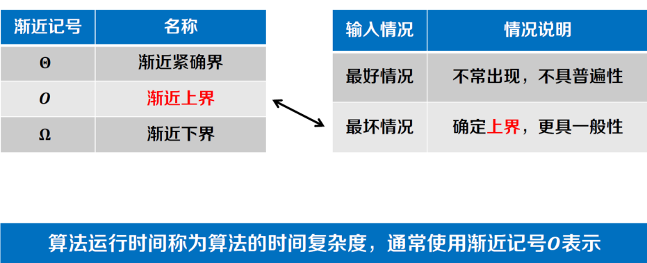
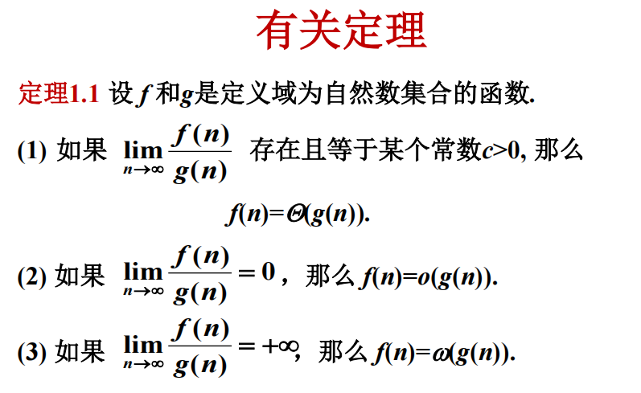

## 复杂度记号

$O(g(n))$ 是上界 存在c和n0，n>=n0时，f(n)<=cg(n)

$\Omega(g(n))$ 是下界，存在c和n0, n>=n0, f(n)>=cg(n)

$\Theta(g(n))$ 确界，满足$f(n)=O(g(n))$ 且 $f(n)=\Omega(g(n))$

还有两个是o和w，是任意c 存在n0, n>=n0 的上界和下界

## 主定理

$T(n) = aT(n/b) + f(n)$

若 $a>=1 且 b>1$ 是常数，$f(n)$ 是一个函数，$T(n)$ 是定义在非负整数上的递归式，那么 $T(n)$ 有如下渐进界：

1. 若 $f(n) = O(n^{log_b a - \epsilon})$ 对于某个常数 $\epsilon > 0$，则 $T(n) = \Theta(n^{log_b a})$
2. 若 $f(n) = \Theta(n^{log_b a})$，则 $T(n) = \Theta(n^{log_b a} \log n)$
3. 若 $f(n) = \Omega(n^{log_b a + \epsilon})$ 对于某个常数 $\epsilon > 0$，且满足 $a f(n/b) \leq c f(n)$ 对于某个常数 $c < 1$ 和所有足够大的 $n$，则 $T(n) = \Theta(f(n))$

