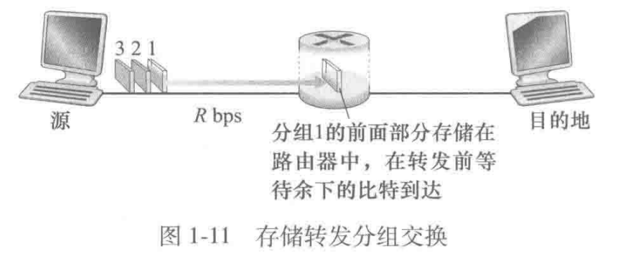
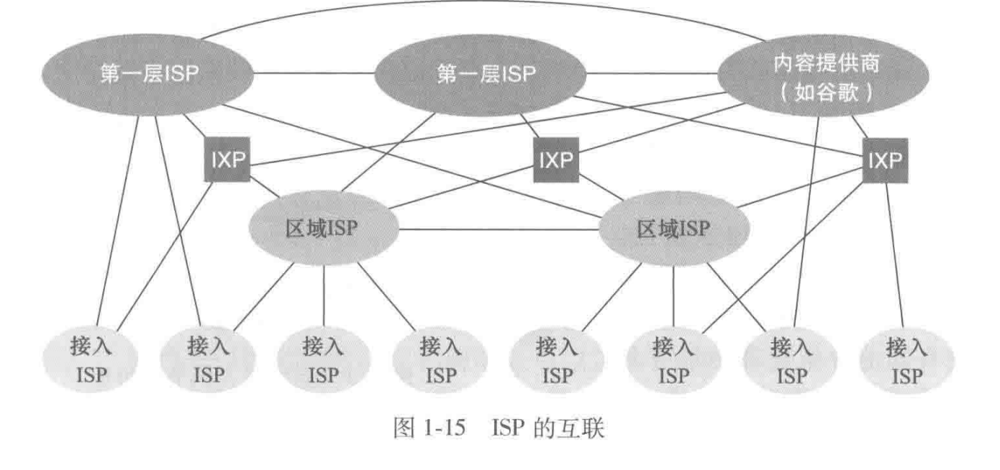
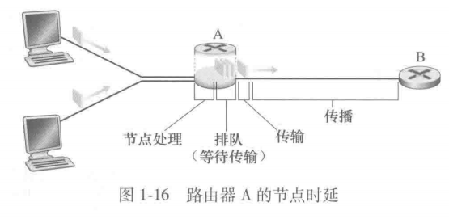
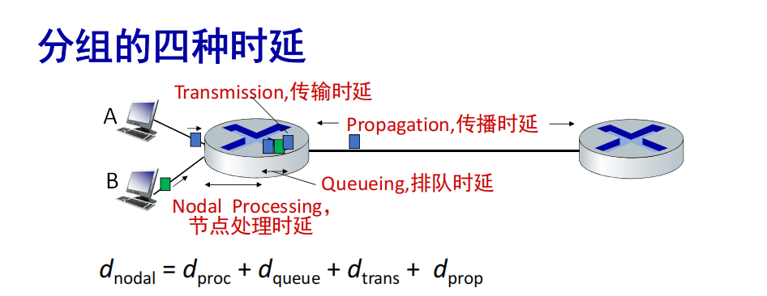

# 计算机网络与因特网

这一章的内容主要是一些互联网常识，同时也提供了对计算机网络的总体主要认知。

### 网络设备与互联

网络设备分为**边缘网络设备**和**网络核心设备**。边缘设备和其他设备通过通信链路和分组交换机相连。

网络边缘：端系统、接入网、物理媒介

网络核心：路由器、交换机、链路层交换机
- 通信链路是各种物理电缆/光缆，每种有自己的传输速率
- 分组交换机主要有链路层交换机和路由器，链路层交换机负责接入网中，路由器一般在网络核心中（但是现在反正是都叫路由器了）
- 每次通信以组(package,包)的方式进行，长报文要切分为多组，一个而分组所经历的一系列通信链路和分组交换机称为*路径*。路径中经过的每个节点（路由器节点）称为*一跳* 。通信过程有对应的 *协议* 。

协议：定义通信实体间发送/接收报文的格式、顺序以及对报文发送和接收所采取的动作

而分组交换已经是现行标准，一个很重要的原因是可以节约成本。举一个例子就是电路交换，电路交换总是有对应的线路，然后如果没用的话线路就空置，在大家使用时间是符合泊松分布或者其他比较随机的分布的情况下，其实远不需要那么多。一个可以用于验证的小问题是：有一个小区有 1 Gbps 的链路，每户人家要用100 Mbps，用户的活动时间比例是10%。由生日悖论可以得知，在有35户人家的情况下，超过10个用户同时活动的概率不会超过0.0004。

> 假设上网是独立的，X表示几个用户同时在线，X服从分布$B(35,0.1)$（当然你也可以换成泊松分布等更符合现实情况的分布，一样可以得到一个很小的值）
>
> 可以写一个python程序简单计算一下

网络核心的主要设备是 **路由器** ，其主要功能有 *转发* 和 *路由* 

- 转发：局部行为，将到达的分组(package)从输入链路移动到适合的输出链路
- 路由：*全局行为*，确定分组从源到目的的路径，有不同的路由选择算法

​路由选择算法通过路由表查询如何输出，路由表很大，很大的一个开销在这里

路由器传输数据的时候使用的方式是：**存储转发传输**

> 存储转发分组交换（Store-and-Forward Packet Switching） 是一种网络数据传输技术，广泛应用于现代计算机网络（如互联网）中。它的核心思想是将数据分割成小的数据包（分组），每个分组独立传输，并在每个网络节点（如路由器）上存储、检查后再转发。

每个分组是L bit。那么一跳耗时 $\frac{L}{R}$，总时间延迟$\frac{2L}{R}$ 。一般对于简单链路有$d_{e2e}=\frac {NL} {R}$ 

而实际情况不可能和上图一样简单。一个路由器应该有多个输入和多个输出，而输出链路一共只有固定的带宽，如果输入速率大于输出速率，就会造成排队等待，路由器一般会有一个buffer对此进行存储。然后在buffer满了之后新来的包就会被丢弃掉。因此一般路由器还有一个排队时延的指标。

### 网络的结构：网络的网络

想要互联当然不能全连接，复杂度不可接受，如果以树状结构可以以$\log_2$的级别减少，但是也还是太多了，而且只有一个树根不安全。所以会有IXP（Internet eXchange Point），以及一些区域网络提供商。因此会是几个团通过IXP连接在一起，内部再组织链路。以及会有CDN等网络服务缓存，这样才能保持高可用并且用户体验好。

### 性能与时延

几个比较重要的时延是：节点处理时延，排队时延，传输时延，传播时延

传输和传播的区别：**传输是把一个分组整个推到链路上**，时延为$\frac {L} {R}$ ，其中L是size，R是速率。而传播是在线缆上传播的时间，和路由器距离有关，传输和距离无关。

- 传输：把一个分组从**路由器出口**送出去，所以和出口带宽和分组长度有关。
- 传播：在**物理链路**上传播，所以和距离有关，距离/传播速度，如果两个路由器比较近，那么传播时延可以忽略不计。

排队时延也比较有意思，排队时延和流量强度并不是线性的关系，而是接近1的时候快速增长。非常堵的时候会变得更堵。

测试链路时延工具：`tracert`，如果想用带可视化的可以用 `besttrace`

有另外一个指标是带宽-时延积，也就是$R*d_{prop}$，在课后题P25提出来的，代表链路上最大可以传输的比特数。也即“管道容量”。

比特宽度是一个用来描述在物理链路上，一个比特（bit）所占用的实际空间长度的概念。表达式为$\frac s R$，其中s是在链路上传播的速度。R是传输速度。一个计算表达式是$\text{比特宽度}=\frac {m}{R\cdot t_{prop}} = \frac {m} {R\cdot \frac m s} = \frac {s} {R}$，其中m是链路长度。
