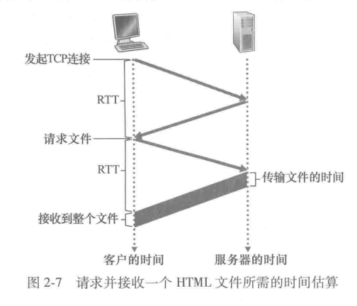
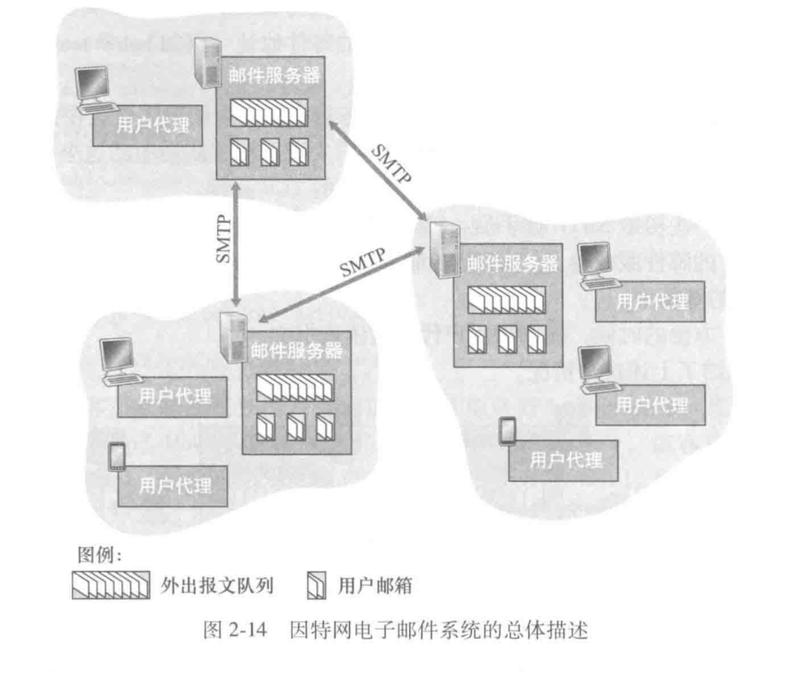
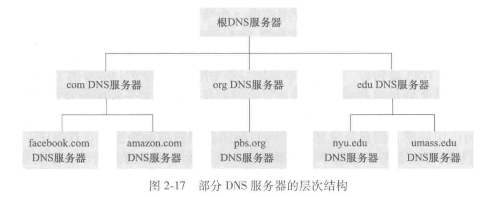
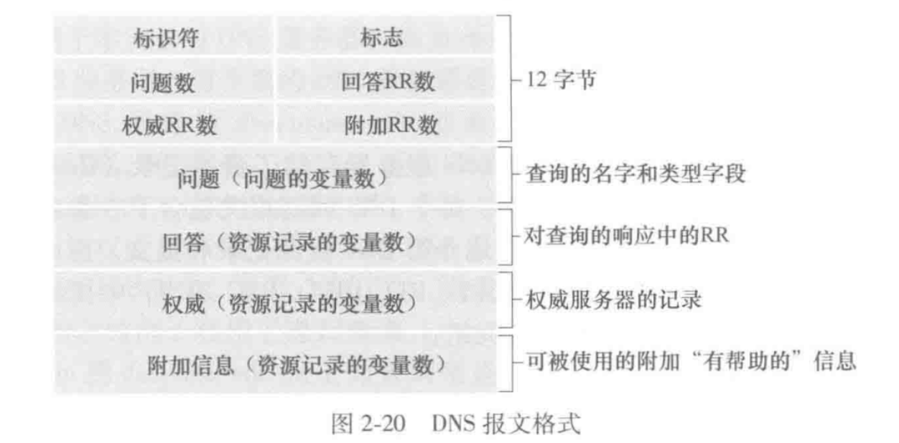
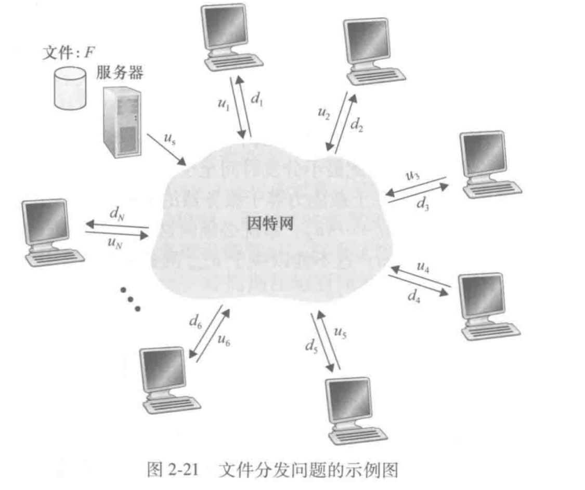
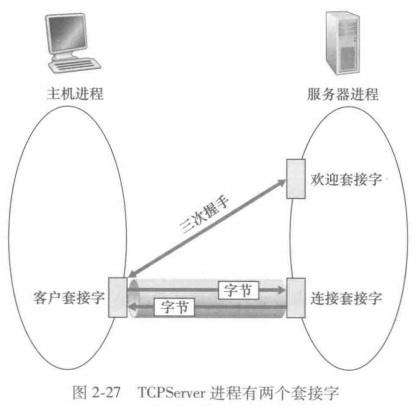

# 应用层

应用层是分层体系中的最顶层，下层为应用层提供统一的抽象接口（即套接字，Socket），让应用层程序无需关心网络传输的具体实现，就可以基于使用的协议得到满足完整性保证，传输时延保证等的功能。

每个应用层程序都有其对应使用的应用层协议，而每个应用层协议都需要选择自己所使用的传输层协议：TCP还是UDP。

有TCP有以下特点:

1. 面向连接
2. 可靠传输
3. 流量控制
4. 拥塞控制

UDP的特点:

1. 无连接
2. 不可靠传输
3. 高效、低延迟

选择TCP还是UDP取决于应用程序的具体需求。对于要求可靠传输的应用(如文件传输)，通常选择TCP；对于实时性要求高的应用(如视频通话)，则可能选择UDP。

需要注意的是无论是TCP和UDP都没有提供对于安全性的保证，因为初始的因特网是保证信任的。但是当前的互联网显然无法提供这种保证。因此衍生出了TLS(Transport Layer Security)，这是一种对TCP的加强。

而这一章中选取了几个经典的应用进行说明，包括Web、电子邮件、DNS、流式视频和P2P。

## Web

Web的应用层协议是超文本传输协议(HpyerText Transfer Protocol, HTTP)，Web page由具体的对象构成。一个Web Page一般有一个base HTML file，然后使用超链接引用其他的对象。

HTTP定义了Web客户端向Web服务器请求页面的方式，以及服务器向客户传输Web页面的方式（注意，这并不保证Web客户端，即浏览器，如何渲染对应的页面，而是只能保证得到的html是一样的，因此会有不同的浏览器渲染出来的页面有区别的情况存在）

**HTTP使用TCP作为它的支撑运输协议**。HTTP是一个无状态协议，所以实际的应用，尤其是商业应用，会有 Cookie 这种东西来保存用户状态，以获取一定的用户信息。在大家都使用PC的时代还可以选择是否给出自己的Cookie，但在大家都使用手机 APP 的年代用户cookie被收集基本是不可避免的，比如小红书不带追踪信息/cookie的话直接给你重定位到首页。

TCP连接有两种方式，一是持续连接，而是非持续连接。前者是打开一个socket后一直保留着，后面的请求可以一直用这个socket，直到主动关闭或超时。而后者则是对于每个请求都会开一个新的socket。前者的好处非常明显，缩减了大量的TCP握手时间，并且服务器端也可以不打开那么多个socket，降低负载。 

下图是一个典型的TCP三次握手后传输，如果使用持续连接，后续的分组就不用进行握手直接使用原有socket进行传输。

一般用时也如图，**两个RTT+传输时间。**

同时，为了满足现代互联网上巨大的请求量能在合理的延迟得到响应，各大服务提供商也会在不同位置部署Web缓存器，这种一般称为CDN(Content Distribution Network)。同时内网也可以设置Web缓存器，以加快对已访问过资源的访问速度。

### HTTP/2

HTTP/1存在一些问题，比如只使用一个TCP连接时，可能一个巨大的资源会阻塞后面很多小资源的传输[Head Of Line(HOL) blocking]，HTTP/1.1的解决方法是开多个TCP连接，可以使一个Web Page的内容并行地发送给浏览器，以减少用户感知时延。同时TCP拥塞控制也使得应用倾向于开多条TCP并行连接以获取尽可能多的带宽。

HTTP/2的基本目的之一就是解决这个问题，从而可以减少所需要维护的socket数量，并且允许TCP拥塞控制像其所设计的那样子运行。

- HTTP/2 成帧

HTTP/2 引入了一种新的二进制分帧层，它将 HTTP/1.x 的消息分解为更小的帧，并对它们进行二进制编码。这种方法有以下几个优点：

1. 多路复用：允许多个请求和响应同时在一个 TCP 连接上进行，解决了 HTTP/1.x 的队头阻塞问题。

2. 优先级和依赖性：可以为不同的流设置优先级，确保重要的资源先传输。

3. 头部压缩：使用 HPACK 算法压缩头部，减少了数据传输量。

4. 服务器推送：允许服务器主动向客户端推送可能需要的资源，减少了客户端请求次数。

这种成帧机制使得 HTTP/2 能够更高效地利用网络资源，显著提高了 Web 性能。

### HTTP/3

QUIC是一种新型的运输协议，基于UDP，HTTP/3 是设计在QUIC上运行的新HTTP。

## 电子邮件

SMTP(Simple Mail Transfer Protocol)是电子邮件的传输协议，使用TCP作为其传输协议。

如上图所示，电子邮件系统有以下几个部分构成：

1. 用户代理(User Agent)：在用户设备上提供邮件的创建、编辑、发送、接收、存储等功能。

2. 邮件服务器(Mail Server)：接收、存储、转发邮件。

3. 简单邮件传输协议(SMTP)：用于在邮件服务器之间传输邮件。

一般的电子邮箱发送流程如下：

1. 用户代理将邮件发送给邮件服务器。

2. 邮件服务器将邮件存储在收件人的用户代理中。

3. 用户代理从邮件服务器中读取邮件。

可以注意到的一个事实是一般SMTP不使用中间邮件服务器，而是直接将邮件从发送方发送到接收方的邮件服务器。特别的，如果接收方未开机，邮件服务器会保存邮件，直到接收方开机。

### 邮件访问协议

前面提到的SMTP协议虽然好，但是一个不容忽视的情况是SMTP不使用中间邮件服务器，而个人用户通常不会一直开机，也不会有公网IP。所以才会像前面提到的那张图和对应的流程所说，两个用户要通过各自的邮件服务器进行邮件的传输。

但是用户代理要怎么从邮件服务器中读取邮件呢？这就需要用到邮件访问协议(Mail Access Protocol)。

常用的邮件访问协议有 POP(Post Office Protocol)，IMAP(Internet Mail Access Protocol)和HTTP。

## DNS

DNS(Domain Name System)是一个分布式数据库，主要用于将域名转换为IP地址。DNS服务器通常使用UDP作为其传输协议，并使用53号端口。其通常被其他应用层协议使用，比如HTTP。

DNS的作用有：域名解析，负载均衡，故障转移，缓存，安全性和隐私保护。

### DNS的工作机理

对于用户而言，只需要向网络中使用UDP数据经过53号端口发送一个DNS请求，网络中的DNS服务器会返回对应的IP地址。这是一个简单好用的黑盒子，但是本身DNS的实现会复杂很多。

DNS的一种简单设计是在一个中心DNS服务器上存储所有的域名和IP地址的映射关系。但是这样会存在单点故障和容量限制的问题。因此一般会使用以下几种方法：

1. 分层域名空间：将域名空间划分为多个层次，每个层次由一个DNS服务器管理。

2. 分布式数据库：将域名和IP地址的映射关系分布在多个DNS服务器上，每个服务器存储一部分数据。

3. 负载均衡：将域名和IP地址的映射关系分布在多个DNS服务器上，每个服务器存储一部分数据，并使用负载均衡算法将请求分发到不同的服务器上。

分层DNS的结构如下：

但并不是所有的DNS服务器都存有所有的域名和IP地址的映射关系，而是每个DNS服务器只存有部分域名和IP地址的映射关系。那么DNS服务器之间是如何通信，以获取未知的映射关系呢？

答案是递归查询和迭代查询。

1. 递归查询：当一个DNS服务器收到一个DNS请求时，它会尝试自己解决这个请求。如果不能解决，它会向其他DNS服务器发送请求，直到找到对应的IP地址。

2. 迭代查询：当一个DNS服务器收到一个DNS请求时，它会向其他DNS服务器发送请求，直到找到对应的IP地址。

### DNS缓存

为了改善时延并减少DNS报文数量，DNS服务器一般都会使用缓存。

DNS记录有如下的格式：(Name, Value, Type, TTL)

- Name: 域名
- Value: IP地址
- Type: 记录类型
- TTL: 生存时间

Name和Value的含义不言自明。而TTL是时间到值(Time To Live)，表示记录的生存时间。时间到期后应该删除。Type有以下几种：

- A: 将域名映射为IP地址
- NS: 将域名映射为负责该域名的DNS服务器
- CNAME: 将域名映射为另一个域名
- MX: 将域名映射为邮件服务器
- AAAA: 将域名映射为IP地址(IPv6)

### DNS报文

DNS只有查询和回答两种报文，并使用相同的格式。

## P2P 文件分发

P2P(Peer-to-Peer)文件分发是一种分布式文件分发技术，它允许多个用户共享文件，而不需要中央服务器。P2P文件分发通常使用UDP作为其传输协议。

最流行的P2P文件分发协议是BitTorrent。也就是我们常提到的磁力链接下载。

P2P 的一个很大的优势是扩展性好，具体的计算可以看书。

## 视频流与内容分发

流式视频主要关心的特征量是平均端到端吞吐。它应该高于压缩视频的比特率（也通常称为码率）。

视频流的分发一般有HTTP流和DASH流两种。HTTP流是最早使用的方式，它可以在建立一个TCP连接后，以尽可能快的速率发送，而客户端在收到一定量的内容后即可以开始播放，并缓存后续内容。但是它的问题主要在于，每个客户端接收到的是相同编码方式的视频（因为本质就是服务器上的一个普通文件，如果没有复制多个不同码率的视频放在服务器上，那所有人就只能看一个码率的视频），并且无法切换。

DASH流一定程度上解决了这个问题。他的全称是Dynamic Adaptive Streaming over HTTP，直译过来是使用HTTP的动态自适应流。在DASH中，视频被分为几个不同的版本，每个版本对应一种码率。客户端会首先下载一个小的文件，其中包含了视频的元数据，包括每个版本的码率和对应的URL。然后客户端根据当前的网络状况和播放质量要求，选择一个合适的码率进行播放，并且可以随时切换码率。

但是只有对应的传输协议还不够，要让每个人都体验到流畅的视频体验，我们还需要考虑实际用户的网络距离中心服务器的距离，和其通信链路上任何一跳的最大吞吐。由于木桶效应，某个位置的最大吞吐不够，其他地方的吞吐量再高也接收不到那么多的数据，进而导致不可忽视的时延。使用内容分发网络(CDN)可以解决这个问题。

但是CDN要怎么给用户重定向合适的IP让其访问以使得用户可以得到较好的体验呢？

首先需要看一看CDN是怎么实现截获IP并进行重定向这件事情的。

用户首先会通过LDNS解析视频网站的网址，然后LDNS转发到权威DNS中，权威DNS再转发到CDN的服务分配DNS上，这个DNS会返回一个CDN域的主机名。在获取这个主机名后，用户会重新发送第二次相同的请求，此时CDN的DNS系统会返回一个IP地址，最终这才是用户会收到的资源的所在地址(具体哪个CDN)。

所以集群在选择返回哪个节点的时候一般都会选择地理位置相近的，这里的地理位置指的是LDNS的位置。但是一个问题就是不一定每个人的LDNS都会在本地，有些可能会在很远的地方，所以这也会导致一些可能存在的问题。（比如我有一个服务器就是hk->jp->cn）

## 应用层应用编写

书里最后的例子部分是编写一个TCP应用和一个UDP应用。

一些需要知道的概念：

- 当你创建了一个套接字后，应该为这个套接字绑定一个端口号，这样别人才能访问到你。
- 如果你编写一个协议标准所定义的操作和实现，那么你应该使用标准中定义的套接字接口。并且如果你完全按照协议标准实现，并且另一个人也实现了（比如你写client他写server），那么你们俩就可以互相通信。
- 如果你编写一个协议标准未定义的操作和实现，那么你应该避免使用公开协议的套接字接口。
- 接收到的报文中会有src IP，src port，dst IP，dst port，这些信息可以帮助你确定对方是谁。但是发送的时候只需要加入dst IP和dst port。剩下的src IP，src port由OS自动加上。
- 由于TCP协议是面向连接的，而UDP是无连接的，消息在发送时有所不同。TCP只要握手成功后就可以把数据丢进socket中。但是UDP每条消息都要附上dst ip和dst port。
- 一个TCP连接会有两个socket，一个用于握手，一个用于连接。

## 习题中的注意点

建立一个HTTP连接需要**两个RTT！**（TCP三次握手然后开始传输）传输时间另算。以及获取目标IP地址需要和DNS服务器进行通信，这里也有对应的RTT。

即使存在并行TCP连接，也必须先获取HTTP base文件，然后再传输其所引用的对象，所以**base文件传输时间和对象并不能一起并行**。

由于相同的原因，即使使用了HTTP持续连接，也不会一次性给出所有对象（并流水线重叠），而是会先获取base文件（这里有两个RTT），然后再流水线获取base文件引用的对象（**这里有一个RTT**）。如果没有采用流水线，那就是后面所有对象都需要一个RTT+本身的传输时间。

SMTP的Mail From和邮件内的From的区别：

- Mail From：是**协议中的一个字段**，指定发件人地址。
- From：是**邮件正文内容**，和协议无关。

P2P文件传输的一些计算：

假设上传一个大小为F的文件给N个对等方，上传速率是u，下载速率最小是$d_{\min}$，那么最快的完成时间是$\max \{ \frac{NF}{u}, \frac{F}{d_{\min}}  \}$。（构造方案也很简单，就是N等分上传速率就行了，卡在上传和卡在下载的区别）

现在再考虑不卡下载的情况，并且每个对等方都能做上传，就有这么几种情况：

- $u_s\leq \frac {(u_s+u_1+...+u_n)}{N}$，分发时间是$\frac F {u_s}$. 方案构造：由于上传速度小于平均，会卡在原始文件的上传，按照速率比例将文件的不同部分按这个速度比率分发给N个对等方（$r_i=\frac{u_i}{\sum u} u_s$），然后这些对等方再按这个比例互相发送。就行。（因为有前面的小于等于的条件，所以$(N-1)r_i\leq u_i$是成立的。）
- $u_s\geq \frac {(u_s+u_1+...+u_n)}{N}$，这种情况下，瓶颈在于对等方的上传，而不是原始文件的上传，因此定义$r_i=\frac{u_i}{N-1}$, $r_{N+1}=\frac{u_s-u/(N-1)}{N}$，然后按照$r_i$的速率分发给对应的对等方，对等方也以$r_i$的速率互相发送给剩余的部分。接着，第$n+1$part由原始发送方自己发送。相当于能力强就多做一点。这样总耗时就是$\frac {NF}{(u_s+u_1+...+u_n)}$。

