# 运输层

运输层协议为运行在不同主机上的应用进程之间提供了逻辑通信。其在端系统中实现，在两个端系统上运行的运输层协议必须匹配。运输层协议通过套接字接口与应用层交互。它在通信双方交换的报文段中增加了运输层首部。

一个需要注意的事实是，分层的体系结构中，各层之间只负责自己的工作。比如网络层收到运输层的数据后并不会进行检查，而只会封装成网络层分组并发送，对侧的网络层也是解包后把内容向上传递给运输层，运输层再解析其中的运输层报文。

运输层分组称为**报文段(segment)。**

一个UDP socket由一个二元组标识，包含一个目的IP地址和一个目的端口号。而与此相对，TCP socket由一个四元组标识，包含源IP地址、源端口号、目的IP地址和目的端口号。每当一个报文到达主机的时候，根据对应的标识送到对应的UDP/TCP的socket中。他们分别用这些信息进行多路分解。

多路复用/多路分解在所有层都适用。

## UDP

TCP可以提供可靠的交付服务，但是仍然有很多应用选择UDP，主要的原因是：关于发送什么数据以及何时发送数据的控制更加精细；**无需建立连接；无连接状态；分组首部开销小**。而对于需要实时延迟要求的应用，如电话、视频等，TCP的拥塞控制会使其性能下降。这往往是不能接受的。

UDP报文段的结构如图：

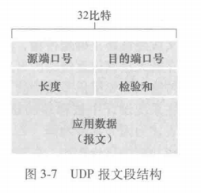

可以注意到的是，UDP的首部只有4个字段，且一共只占8个字节。这是一个相对比较小的开销了。

UDP只需要一个src port和一个dst port，而IP由网络层加到数据报中，但是TCP段在网络层报文和segment段都有一个srcIP和dstIP。

checksum计算: 先求和，**溢出的话回环加到最低位**。然后求反码。验证时把原本的所有字节求和再加上checksum，**不为全1就代表数据包损坏**。

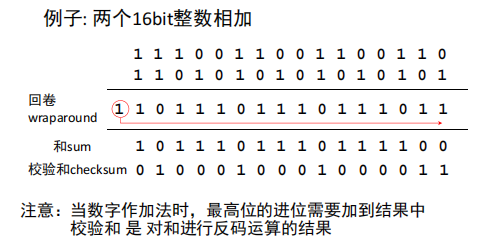

而UDP在尽可能小的前提下仍然引入了checksum，这是因为无法保证链路上每条链路都检测数据可靠性，而且即使都有也有可能在某个路由器的内存处出现比特翻转。所以端到端数据传输服务要提供差错检测，UDP就需要在端到端基础上在**运输层**提供差错检测。

系统设计的端到端原则：“与在较高级别提供这些功能的代价相比，在较低级别设置的功能可能是冗余的或完全没有价值的”。

同时UDP只提供错误检测，但并不保证错误恢复，处理方法通常是重传。

## 可靠数据传输原理

可靠数据传输是这样的一种抽象：数据可以通过一条可靠的信道传输，其比特不会损坏，也不会丢失，且按序到达。

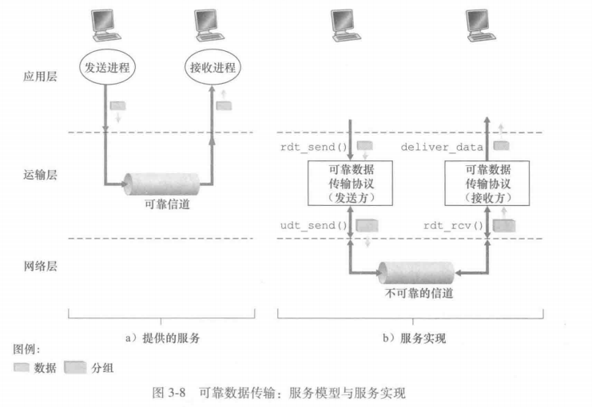

**可靠数据传输的实现是在不可靠信道上的！** 其复杂性很大程度上取决于不可靠信道的特性

### rdt1.0 完全可靠信道的可靠数据传输

就直接传输数据就好，自动机只有一个操作

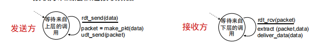

### rdt2.0 比特差错信道

比特可能受损，使用checksum检验

如何恢复？

- ACKs
- NAKs
- 发送方收到NAKs后重传

停等协议：发送方发送一个分组，然后等待接收方响应

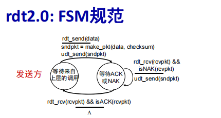

rdt2.0的缺陷：如果ACK/NAK受损，发送方不知道接收方发生了什么情况，如果一味超时重传，那会导致冗余

解决方法：发送方对每个分组增加 **序列号** 接收方丢弃冗余分组（停等协议下只需要2个序列号）

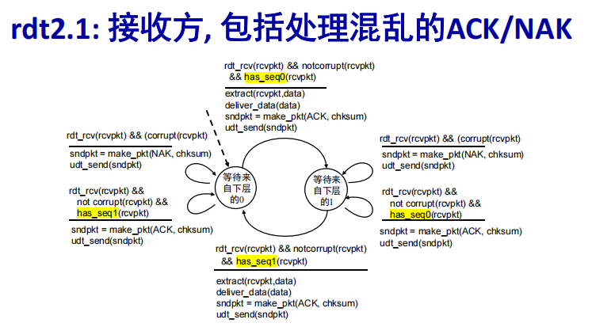

- 讨论：

  rdt2.1 两个序列号seq（0,1）就够用了，必须检查收到的ACK/NAK是否受损，状态增加了一倍（状态必须记住当前的序列号）

  接收方必须检查收到的分组是否是冗余的，而且接收方不能知道它发送的最后一个ack/nak是否发送方已经接受

rdt2.2: 与rdt2.1相同，但仅使用ack，ack回复确认的分组序号

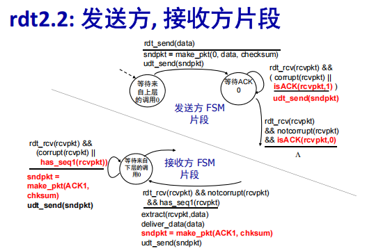

发送方接收冗余的ACK导致如同NAK相同的动作:知道接收方没有正确接收到跟在被确认两次的分组后面的分组，发送发需要**重传当前分组**

**发送方收到冗余的ACK意味着收到NAK，重传当前的分组。**

### rdt3.0 具有比特差错和丢包的信道

由于存在丢包的情况，加入一个计时器，如果超时，则重传。

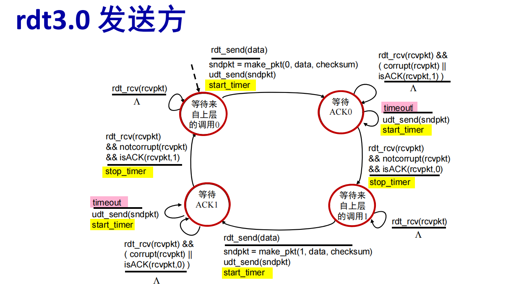

停等协议的效率：非常低，$\frac {\text{传输时间}}{\text{传输时间+RTT}}$，一般RTT远大于传输时间。

可以使用流水线的方式，一般的实现形式是维护一个滑动窗口，窗口内一次性流水线发送，重传策略有GoBack-N和选择重传。

假设窗口长度为N，此时序号不能只是2了，必须是k满足，$2^k\geq N$。（对于Go-Back-N）

- GoBack-N: 如果一个分组丢失，则重传所有已发送但未确认的分组
- 选择重传: 如果一个分组丢失，则只重传丢失的分组

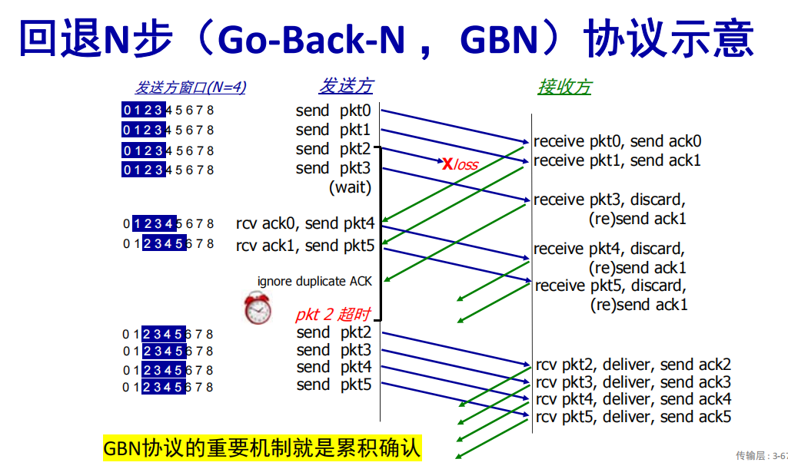

GoBack-N中，每次发送ack只发送连续接收到的最后一个，如果现在接收到的是失序的包n，将不会回复ack n。

**对于选择重传，注意序号长度必须是窗口长度的两倍**，不然可能会出现找错了重传的标识的情况

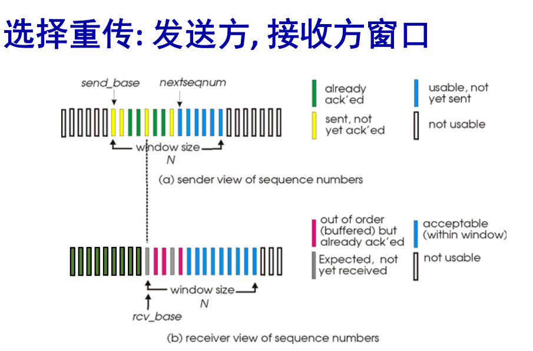

## TCP

TCP的特点：点到点，全双工，稳定可靠，面向连接，流水线，流量控制，拥塞控制，累计确认。

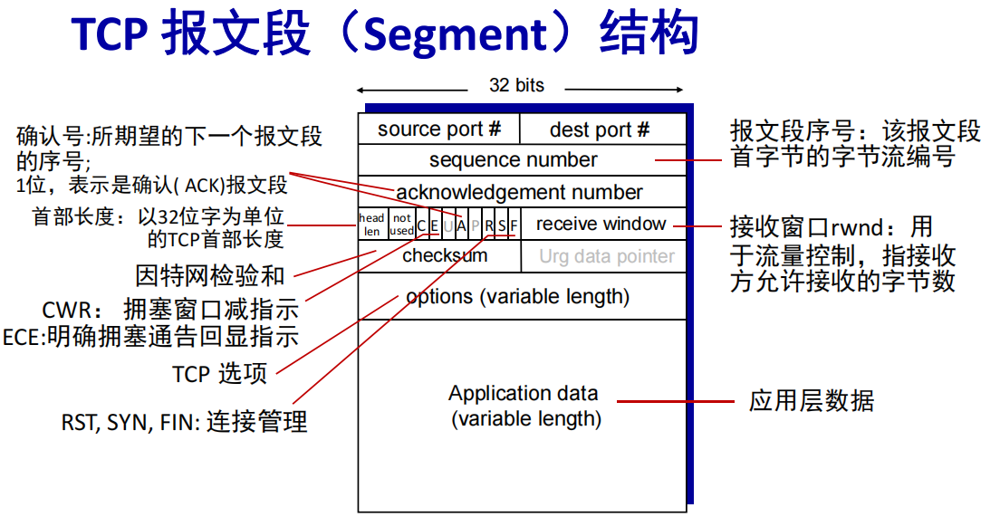

- TCP序列号和确认号

序列号：报文段中第一个数据字节在字节流中的位置编号

确认号：期望收到**对方**下一个报文段中的第一个数据字节的序号，使用累计确认

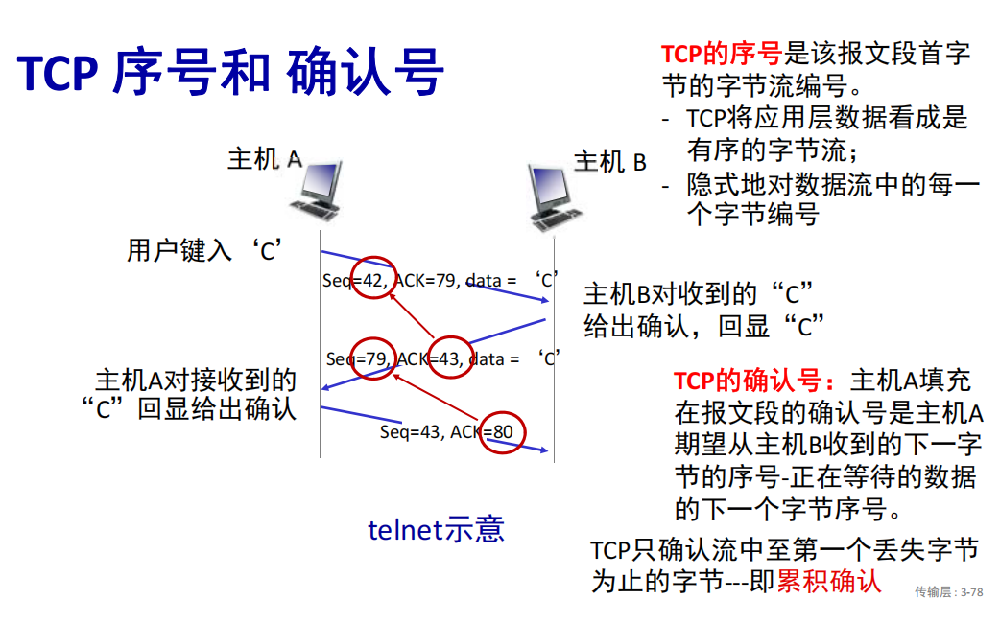

ACK和Seq可能是不同步的！**因为是全双工的！**他们分别跟踪自己发送和接受的字节流，而双方发送的包的长度并不一样。

> TCP使用三次握手（Three-Way Handshake）来建立连接，而不是两次握手，主要是为了确保双方都能可靠地确认彼此的接收和发送能力，并避免资源浪费或连接异常。以下是三次握手的原因及其详细分析：
>
> ### 1. 三次握手确保双方都确认了彼此的通信能力
>
> TCP连接的建立过程需要确认双方的发送和接收能力，三次握手过程如下：
>
> - **第一次握手**：客户端发送一个SYN包，表示它希望建立连接，同时发送一个初始序列号。
> - **第二次握手**：服务器收到SYN包后，向客户端回复一个SYN+ACK包，表示同意连接并确认收到客户端的SYN，同时发送自己的初始序列号。
> - **第三次握手**：客户端收到服务器的SYN+ACK包后，再发送一个ACK包，确认收到服务器的SYN。此时，双方均确认了发送和接收能力，连接建立完成。
>
> 如果仅有两次握手，可能会出现以下问题：
>
> ### 2. 防止旧的重复连接请求导致错误连接
>
> 在网络传输过程中，可能会出现旧的连接请求（比如由于网络延迟）到达接收方。如果只用两次握手，可能会出现以下情况：
>
> - 客户端发送SYN请求，但因网络延迟或其他原因，服务器未及时收到。
> - 客户端放弃连接并重新发送新的连接请求。
> - 旧的SYN请求突然到达服务器，服务器以为是新的连接请求，并回复SYN+ACK。
> - 若此时采用两次握手，服务器已经认为连接成功，分配了资源并等待数据，但客户端并未确认这次连接，导致资源浪费或连接错误。
>
> 三次握手可以有效避免这种情况，因为第三次握手的ACK包是由客户端发送的，服务器收到后才认为连接建立成功，这样可以确保连接是“活跃”的，而不是陈旧的连接请求。
>
> ### 3. 防止“半开连接”导致资源浪费
>
> 两次握手中，服务器在收到客户端的SYN后就认为连接已建立，开始为连接分配资源（如缓存、控制块）。如果客户端因为网络异常没有收到服务器的回复并放弃连接，服务器的资源将被白白占用，可能导致“半开连接”（服务器在等待客户端的确认）。
>
> 三次握手中，服务器只有在收到客户端的第三次ACK确认后，才正式认为连接建立并分配资源，减少了资源浪费的可能性。

三次握手：

- 第一次: client 发 SYN
- 第二次：server 发 SYN+ACK
- 第三次：client 发 ACK

关闭TCP连接：

- 任何一个进程都可以关闭，发送FIN为1的TCP报文段
- 收到FIN之后发送ACK+FIN

> TCP连接的关闭过程采用**四次挥手（Four-Way Handshake）**，这是因为TCP是全双工通信协议，允许双方独立地关闭各自的发送通道。四次挥手可以确保双方都能够可靠地释放资源，下面是具体过程及其原因：
>
> ### 四次挥手过程
>
> 假设有一个TCP连接，客户端主动发起关闭连接的请求，过程如下：
>
> 1. **第一次挥手（FIN 1）**
>    客户端向服务器发送一个`FIN`包，表示它不再发送数据了（即关闭客户端到服务器的传输通道），但仍可以接收来自服务器的数据。
> 2. **第二次挥手（ACK 1）**
>    服务器收到客户端的`FIN`包后，发送一个`ACK`包，确认已经收到客户端的关闭请求。此时，客户端到服务器的通道关闭，服务器到客户端的通道仍然保持开放。
> 3. **第三次挥手（FIN 2）**
>    服务器在确认客户端的关闭请求后，如果也完成了数据传输，就向客户端发送`FIN`包，表示它不再发送数据了（  即关闭服务器到客户端的传输通道）。
> 4. **第四次挥手（ACK 2）**
>    客户端收到服务器的`FIN`包后，发送一个`ACK`包，确认已经收到服务器的关闭请求。至此，双方都已确认了对方的关闭请求，TCP连接完全断开。
>
> ### 为什么需要四次挥手
>
> 1. **双向通信独立性**
>    TCP连接是全双工的，客户端和服务器可以各自独立地关闭发送和接收。因此，关闭一个方向的通道不意味着另一个方向也立即关闭。四次挥手可以分别控制两个方向的关闭过程，确保数据能够完整地传输。
> 2. **确保双方的数据传输完全结束**
>    当客户端发送`FIN`时，仅表示它不再发送数据，但仍然可以接收数据。服务器可以在确认收到`FIN`后继续发送未完成的数据，等到所有数据发送完成后再发送`FIN`。这保证了双方在完全确认数据传输完毕后再关闭连接。
> 3. **避免资源浪费**
>    四次挥手过程中，双方明确释放各自的资源（如缓存、控制块），确保连接关闭后不再有数据流动，避免了资源的冗余占用。

### TCP超时时间设置

首先显然应该大于RTT，但是RTT是动态变化的，所以需要有一个估计的方法。

首先定义EstimatedRTT，然后定义DevRTT，然后定义TimeoutInterval。

EstimatedRTT = $\alpha \times \text{SampleRTT} + (1-\alpha) \times \text{EstimatedRTT}$

DevRTT = $\beta \times |\text{SampleRTT} - \text{EstimatedRTT}| + (1-\beta) \times \text{DevRTT}$

TimeoutInterval = $\text{EstimatedRTT} + 4 \times \text{DevRTT}$

DevRTT相当于是一个安全余量，估计的RTT加上4倍的DevRTT作为超时时间。（4倍是经验值）

这样可以让估计的超时时间相对平滑一点。

### TCP重传

首先，TCP有累计确认的特性，可以节约重传的包。

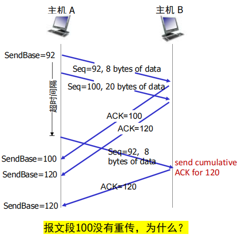

可以看上面这一张图，由于累计确认的存在，ACK 120意味着120以前的都已经收到了，即使没有收到ACK 100，也可以跳过100的重传。

**TCP每次重传会把超时时间翻一倍**

快速重传：如果收到3个重复的ACK，则认为该包丢失，立即重传。（因为有流水线存在，所以收到3个ACK后，可以认为使用类似GoBack-N的做法后面传的包都是没有意义的，所以可以立即重传）

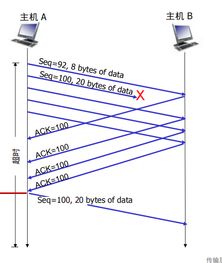

实际上TCP的重传方法是和GBN还有SR都相似但不相同的。

### TCP流量控制

segment头中有一个字段是rwnd（receiver window），表示接收方允许发送方发送的数据量。在握手时会协商初始值，然后每次发送会直接发送windows size的数据。数据传输过程中，rwnd会动态调整。

## TCP拥塞控制

拥塞：长时延，丢包

拥塞控制:太多的发送源；发送得太快（多对一）

流量控制: 发送方给接收方发送的数据太快。（一对一）

TCP拥塞控制的目标：**保持瓶颈链路忙于传输，但避免高延迟**

拥塞的原因与代价：

- 吞吐量永远不能超过传输能力
- 延迟随着传输速度接近传输能力而增加
- 丢失/重传降低有效吞吐量
- 不必要的重传进一步降低了有效吞吐量（可能高时延导致还在buffer中排队的包已经被发送方timeout重传了）
- 上游传输能力/缓冲区被下游丢包所浪费

拥塞控制方法：

- P2P拥塞控制，不能从网络得到明确的反馈，根据观察到的时延和丢包现象推断出拥塞
- 网络辅助的拥塞控制: 路由器向发送/接收主机*直接* 反馈；可以指示拥塞的程度或者显式地设置发送速率
- AIMD方法（加性增，乘性减）：没丢包之前一直增加速率（一点一点加），丢一个包就开始/2，速率随时间图像是锯齿状的（增减的都是cwnd）

TCP 发送行为:

 发送cwnd 字节,在RTT时间内等待ACK，然后发送更多的字节

$TCP rate =\frac {cwnd}{RTT} bytes/sec$

拥塞控制条件：**LastByteSent- LastByteAcked < cwnd**

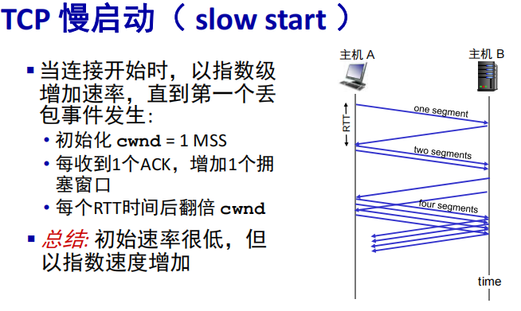

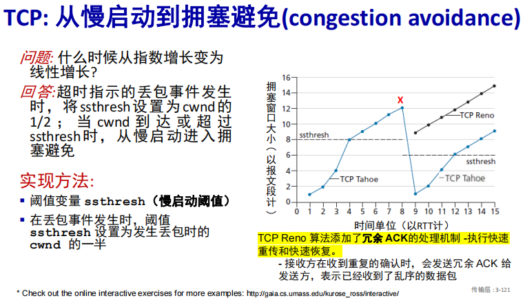

注意将ssthresh设置为cwnd的一半的条件是：**超时**导致的丢包重传出现。然后设置ssthresh之后，将cwnd设置为1，直接进入**慢启动**。

而**冗余ACK**导致的重传会进入**快速恢复阶段**，此时ssthresh=cwnd/2，cwnd=ssthresh+3

**拥塞避免阶段**则是cwnd>ssthresh时进入。

可以仔细看上面的状态机。

> 1. 慢启动（Slow Start）
> 特征：拥塞窗口（cwnd）呈指数增长。
> 图中表现：在初始阶段，cwnd 从 1 开始快速增长，直到达到 ssthresh（慢启动阈值）。
> 位置：图中 cwnd 从最低点开始快速上升的部分。
> 2. 拥塞避免（Congestion Avoidance）
> 特征：cwnd 呈线性增长（每次 RTT 增加 1 个 MSS）。
> 图中表现：cwnd 达到 ssthresh 后，增长速率放缓，呈线性增长。
> 位置：图中 cwnd 缓慢上升的部分。
> 3. 快速恢复（Fast Recovery）
> 特征：在检测到冗余 ACK 后，cwnd 减半并保持稳定，同时快速重传丢失的数据包。
> 图中表现：cwnd 在某个点突然下降（减半），然后保持稳定或缓慢增长。
> 位置：图中 cwnd 突然下降并保持稳定的部分。

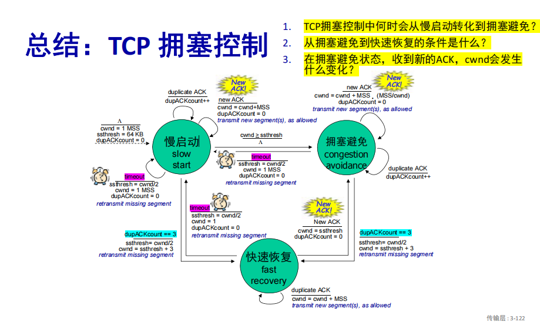

- TCP CUBIC

基于丢包进行拥塞控制，定义W是丢包时的发送速率，拥塞时先减半，一开始先以较快的速度爬升到接近$W_{max}$的地方，然后以以一个较慢的速度接近$W_{max}$。

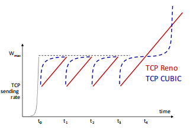

**TCP的公平目标**: 如果K 个TCP会话共享带宽为R的瓶颈链路，每个会话应有R/K的平均链路速率

> 并行TCP连接影响公平性
>
>  WEB浏览器通常使用多个并行
>
> TCP连接来传送一个Web页中的多个对象
>
> 例子:支持9个连接的速率R的链路：
>
> • 某新应用若请求一个TCP连接，则得到R/10的带宽
>
> • 某新应用若请求11个TCP连接，则得到R/2的带宽

## 习题中的注意点

有一种方式是只用NAK不用ACK的可靠数据传输协议，这样知道x丢包了当且仅当收到了x-1和x+1的包，这时候发个NAK x的回应。如果x-1和x+1很容易丢，双方都会等待很久。但如果在一个大量传输数据且端到端很少丢包的时候，NAK only就可以减少频繁发ack的开销。

信道利用率：$U=\frac {L/R}{RTT+L/R}$

TCP在收到已经收到过的冗余包后，会把这个包丢弃，然后发送目前期望得到的下一个包的ACK。（比如ack207(丢失),ack247，然后丢失包的超时重传再来到后，会丢弃然后发送ack247）

为什么累计确认要三次才重传：堆在一块的一两个包可能由于传播中环境因素的干扰出现了乱序，但只要三个都接收到了就是符合预期的（因为带序号，接收方可以直接自己排序），一次两次就直接重传可能会有浪费。但如果累计确认三次，大概率就是完全丢了。可以理解为一种tradeoff。

**拥塞控制好好看好好学**，之前理解的不够好，已补充在上面，最后复习的时候可以看一下课本课后题P40.

TCP Tahoe和TCP Reno的区别：在3个冗余ack的时候Reno会认为是轻微拥塞，进入快速恢复(/2和/2+3)，但是Tahoe会认为是严重拥塞，进入慢启动。

慢启动在cwnd>ssthresh的点时，会让cwnd=ssthresh然后进入拥塞避免阶段。

