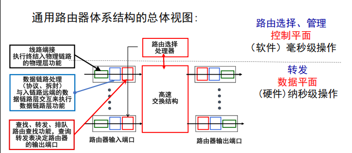
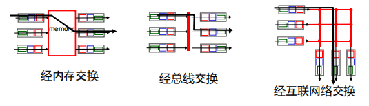
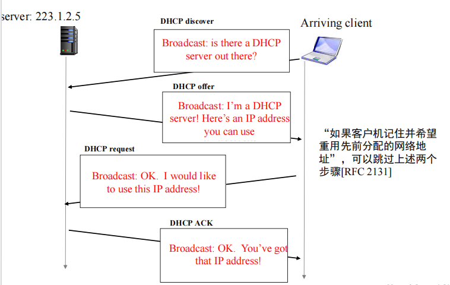
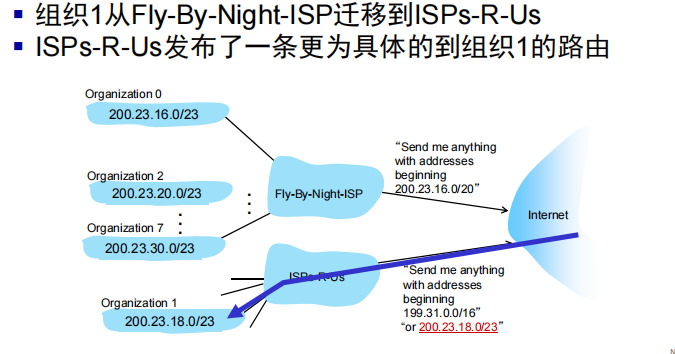
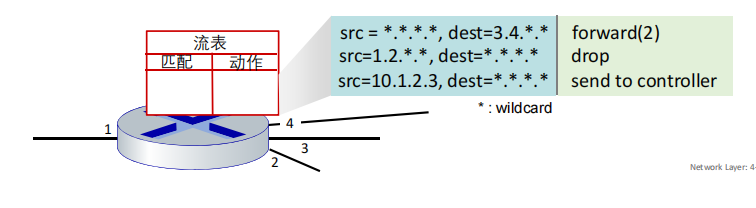
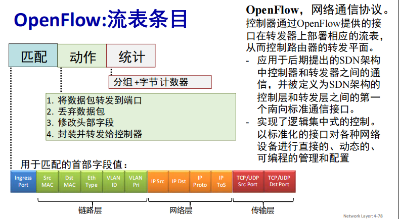

# 网络层：数据平面

网络层负责从发送主机到接受主机的报文段传输，这一阶段的数据包称为**数据报**

网络层设备：主机和路由器

网络层的两个功能：转发和路由选择（转发是一个短距离操作问题，路由选择是一个长距离规划问题）

网络层一般被分为数据平面和控制平面。数据平面负责实际的数据包转发，执行控制平面的决策；控制平面负责网络的管理和控制，决定数据包的转发路径。

因特网服务模型：尽力而为，什么都无法保证（无法保证成功将分组送到，端到端的时延和顺序还有最小流量都不能保证）
- 网络中心尽可能简单，将复杂的部分留在边缘
- 简单的机制使得互联网可以广泛部署

## 路由器

路由器架构如下：

在路由器的输入端口处集成有物理层、链路层、网络层的功能。在输入端口的网络层固件中，其进行分布式的交换，完成匹配+转发的功能。

转发表中，使用最长前缀匹配算法：在查找给定目标地址的转发表条目时，使用与目标地址匹配的最长地址前缀。

交换结构：将数据包从输入链路传输到适当的输出链路。有三种主要的类型：

- 经内存交换
- 经总线交换
- 经互联网络交换

交换速率定义为数据包可以从输入传输到输出的速率

**HOL阻塞**：当一个数据包到达时，如果交换结构正在忙于处理另一个数据包，则该数据包必须等待，直到交换结构完成当前数据包的处理。（队列前端阻塞但是已经进队了）

排队调度策略：FIFO，RR，优先级，加权公平排队

## 网络协议IP

IPv4编址：CIDR
- IP地址的任意长比特作为网络部分，地址格式是a.b.c.d/x，其中x是网络部分的长度

IPv6为了解决IPv4地址空间不足的问题，将IP地址长度从32比特增加到128比特。但是IPv4路由器不能处理IPv6数据报。解决方法是建隧道，IPv6数据报作为IPv4数据报的payload。

### DHCP

当主机加入网络时，动态地从网络服务器获取IP地址

加入时先broadcast DHCP discover，DHCP服务器会给它分配一个IP，发送给客户端，客户端再发送DHCP request，确认使用这个IP，最后DHCP服务器再发送DHCP ACK，客户端确认使用这个IP。**（注意，默认情况下，四个都是广播）**

**DHCP可以返回的不只是IP地址，还有客户机的第一跳路由器地址，DNS服务器的名称和IP地址，以及网络掩码（指示子网网段）**

DHCP是**应用层**协议，使用**UDP**

### 获取IPv4地址

ISP会分配其地址空间的一部分给下面各个公司/组织的子网，公司/组织再分配给剩下的主机。

分层寻址：路由聚合
- 可以有效发布路由信息

### NAT

由于IPv4地址空间不足，NAT（网络地址转换）被广泛使用。NAT将私有IP地址转换为公共IP地址，从而节省了IP地址。一个内网的机器共享一个公网IP，然后通过NAT转换为公网IP。NAT专用地址（10/8， 172.16/12， 192.168/16）

实现：NAT路由器是透明的，将每个传出数据报的(srcIP, port)转换为(NATIP, new_port)，然后NAT路由器会有转换表，将所有目标是(NATIP, new_port)的数据包转换为目标为(srcIP, port)的数据报然后发到内网。

NAT跨越了网络层和运输层，不符合分离原则。饱受争议，但仍然广泛使用。

## 通用转发和SDN

通用转发：**匹配加操作**
- 基于目的地的转发：基于目的IP地址进行转发
- 通用转发
  - 基于多个首部字段值进行匹配
  - 匹配后的操作：删除/复制/修改/日志/分组

转发表也被称为流表。

匹配+操作的抽象统一了不同类型设备，防火墙/NAT/路由器/交换器都可以使用这个抽象。

可以利用流表编程规划路由路线。