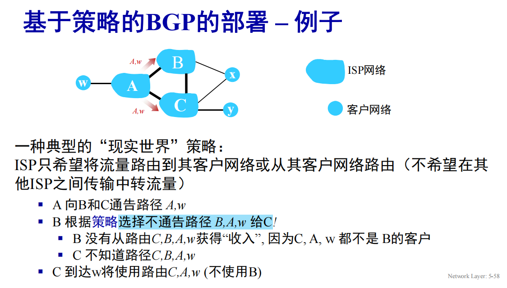

# 网络层：控制平面

## 链路状态路由选择算法

注意每次更新的时候记录更新他的前继节点（方便最后写路由表）

## 距离向量算法

设$D_x(y)$为节点$x$到节点$y$的距离，$D_x$为节点$x$的距离向量，$D_x(y)$为节点$x$到节点$y$的距离。

更新的BF方程：$D_x(y) = min_v\{c(x, v) + D_v(y)\}$

每个节点不时地向它的邻居发送它的距离向量，邻居再向它的邻居发送它的距离向量，直到收敛。

距离向量算法有一个特性是好消息传得快，坏消息传得慢。

## ISP内部路由选择协议

上面的路由选择算法是理想化的，假定所有路由器相同，网络扁平化。但实际上节点数特别特别多，且管理自治。

AS(自治系统)：一个ISP管理下的网络。

一个AS内的所有路由器必须选择相同的路由选择算法，网关路由器是AS的边界路由器。自治系统间也有不同的路由选择协议。

假设AS1中的路由器接收发往AS1外部的报文，AS1域间路由选择协议必须：

- 学习到通过AS2,AS3能到达哪些目的地
- 传播可达信息到AS1中的所有路由器

路由协议的分类：

- IGP：内部网关协议，AS内部的路由选择协议
- EGP：外部网关协议，AS之间的路由选择协议

### OSPF

OSPF：**IGP**协议，使用链路状态路由选择算法。

经典的链路状态算法

-  使用洪泛链路状态信息和Dijkstra最低开销路径算法

-  各条链路开销由网络管理员配置，可以有多个链路成本指标：带宽，延迟，或者将
所有链路开销设为1

-  每台路由器向自治系统内的所有其他路由器广播路由选择信息：链路状态发生变化
时，就会广播；若链路状态未变化，也要周期性地（至少每隔30分钟一次）广播链
路状态。

-  链路状态通告包含在OSPF报文中，该报文由IP承载，其IP报头协议号为89。 OSPF
协议须自己实现诸如可靠报文传输、链路状态广播等功能。OSPF链接状态通告泛
洪到整个AS中的所有其他路由器

-  每台路由器都具有完整的拓扑，使用Dijkstra的算法来计算转发表

-  安全：可以配置两类鉴别：简单的和MD5。仅有受信任的路由器能参与
一个AS内的OSPF协议，以防止恶意入侵，防止将不正确的信息注入路
由器转发表内

一个OSPF可以配置两级层次结构：区域和主干区域

链路状态通告仅在本区域和主干区域泛洪，每个节点都有本地区域的详细拓扑，只知道到达其他目的地的方向。

## BGP

BGP：**EGP**协议，使用路径向量算法。

允许子网向互联网其余部分通告其存在以及如何到达

BGP为每个AS，每台路由器提供了完成以下目标的手段：
- 从邻居AS获得前缀（子网）的可达信息
  - 外部BGP(eBGP)：从邻居AS获得前缀的可达信息
  - 内部BGP(iBGP)：将前缀的可达信息传播到AS内的所有路由器
- 确定到该前缀的“最好的”路由

BGP路由：前缀+属性。其中有两个比较重要的属性：AS-PATH和NEXT-HOP。

- AS-PATH：记录了到达该前缀所经过的AS路径(可以用于回环检测)
- NEXT-HOP：到达该前缀的下一跳路由器

AS间的路由选择主要是可达和现实策略，不会特别注意开销。

比如ISP只希望将流量路由到其客户网络或者从其客户网络出去，不希望将流量路由到其他ISP的网络。

比如上面这张图的状态中，就只会存在x->C->A->w这样的路径，不会有x->C->B->A->w这样的路径，ISP B不会给非自己客户的流量做中转。

以及客户网络是双宿主的情况下，不会通告给其中一个ISP，通过我可以中转到另一个ISP。

BGP报文的TCP连接是长连接，可以持续发送报文。

### AS内如何确定最好的路由

热土豆算法：选择域内开销最小的本地网关，不必担心域间成本。尽可能快地将分组送出AS，不关心AS外部到目的地的开销。

路由器可能知道到达一条前缀的多条路由，在这种情况下，路由器会遵循下面的规则选择一条路由
- 本地偏好值（管理员设定）
- 在余下路由中，具有最短AS-PATH的
- 在余下的路由中，具有最近NEXT-HOP路由器的路由将被选择，即热土豆路由
- 附加规则，如使用BGP标识符等选择

## 为什么采用不同的AS内和AS间路由选择协议

- 策略
  - AS之间，策略问题占主导
  - AS内策略问题微不足道，主要是开销主导
- 规模
  - AS内，路由器数目少，规模小，可以采用复杂算法，如果单个过大，总是能够划分成两个，如OSPF层次划分
  - AS间，路由器数目多，规模大，需要简单算法
- 性能
  - AS内，性能要求高
  - AS间，性能要求低

Internet中主流的路由协议是RIP，OSPF和BGP。

RIP基于UDP，OSPF基于IP，BGP基于TCP。

前两者是AS内路由选择协议，后者是AS间路由选择协议。

## SDN控制平面

比起传统网络，SDN网络的控制平面和数据平面分离，控制平面负责路由选择，数据平面负责转发。

为什么使用逻辑集中式的控制平面？

- 简化网络管理
- 可编程，基于表的转发允许编程路由器
- 控制平面的实现是开放式的，非专有

比如使用传统路由算法无法简单的进行网络流量工程，权重只能微调流向，但使用SDN可以直接控制路由表。

SDN通过北向API与上方的网络控制的程序交互，通过南向API与下方的受控设备交互，在实现中会使用分布式服务器集合，以实现故障容忍、高可用、可伸缩、高性能。

## ICMP

ICMP：Internet控制报文协议，用于在IP主机、路由器之间传递控制消息。

ping命令使用ICMP回显请求和回显应答报文。

traceroute命令使用ICMP超时报文。

其被主机和路由器用来沟通彼此的网络层信息。

traceroute向目的主机发送一系列普通的IP数据报，携带了一个具有不可达UDP端口号的UDP报文，数据包TTL设置为逐步减小的。当第n个数据报到达第n台路由器时，TTL正好过期，根据IP协议规则，路由器丢弃该数据报并发送ICMP告警报文给源主机。该报文包含该路由器的名称和它的IP地址。

由于目的地是不可达的，所以src主机收到不可达回应报文就可以停止发送了。

