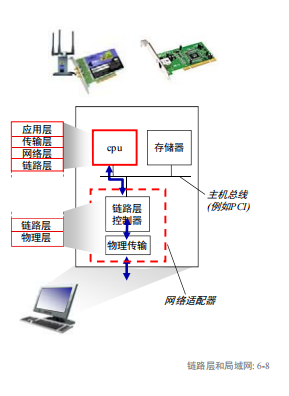
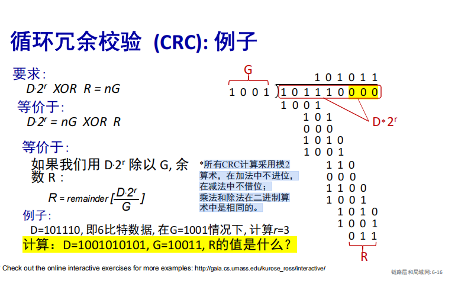
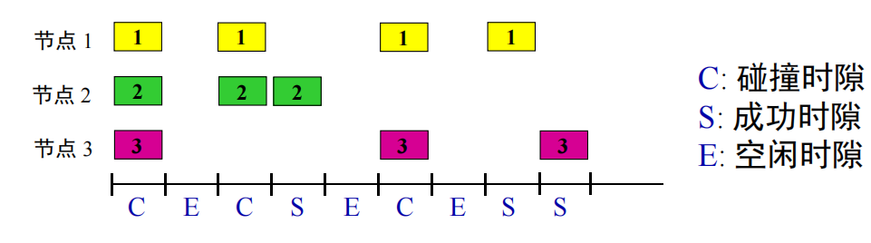
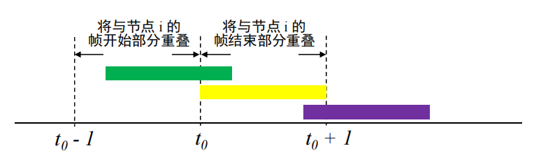
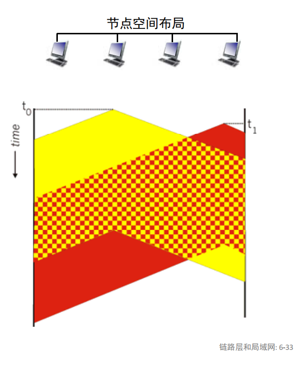
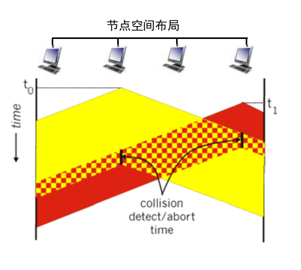
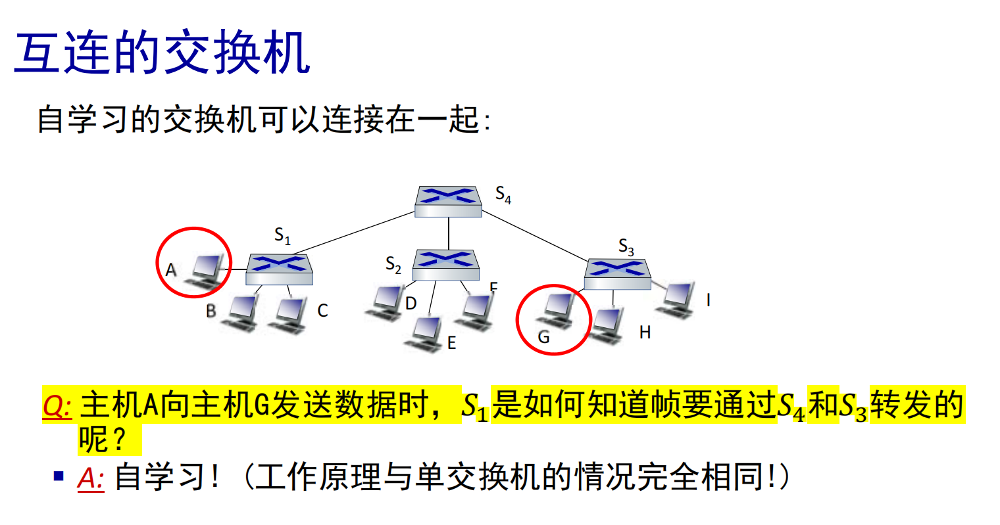
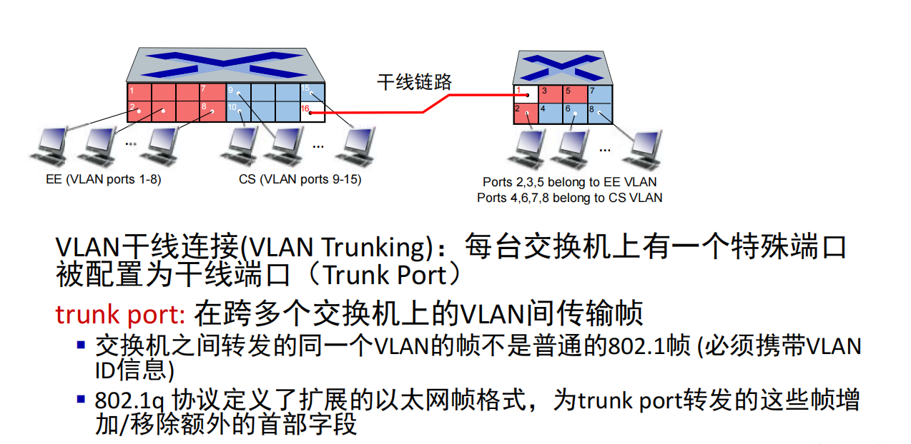

# 链路层

链路层的几个术语：

节点：运行链路层协议的任何设备

链路：沿着路径连接相邻节点的通信信道

帧：链路层数据单元，封装了网络层数据报

链路层负责将数据报从一个节点传输到链路上**物理相邻**的另一个节点

链路层实现在 网络适配器（NIC）上，许多功能是由硬件实现的

## 链路层服务

- 成帧
- 链路接入
- 可靠交付
- 差错检测

Q:为什么链路层和端到端都有可靠交付?
A:其目的是本地（即在差错发生的链路上）纠正一个差错，而不必迫使进行端到端的数据重传（开销低）

## 差错检测

- 奇偶校验

一维：只需要加入一个比特让1的个数为奇数或偶数（分别对应奇校验和偶校验）

拓展：二维的奇偶校验，对D中的d个bit划分为i行j列，产生i+j+1差错比特，可以检验和纠正所有的单比特差错，可以检测（但不能纠正）2比特差错

- 检验和方法

- 循环冗余检测（CRC）

链路层常用的差错检测方法，由专用的硬件实现

D: 被发送的数据， G：生成多项式（给定的，发送方和接收方协商好的），**G的最高位和最低位必须是1**

满足$<D,R>=D*2^r + R$ 且 $<D,R> \mod G = 0$，接收方将接收到的数值除以G，如果得到非零余数即可知道出错。

**所有CRC计算采用模2算术，在加法中不进位，在减法中不借位；乘法和除法在二进制算术中是相同的。**

可以检测到所有小于等于r位的突发比特差错。

## 多路访问协议（Multiple Access Protocol, MAC）

类型有三种：

- 信道划分协议
- 随机接入协议
- 轮流协议

三种协议的对比：

- 信道划分协议，按时间、频率或编码
    - 时分多址、频分多址、码分多址协议
    - 高负载下有效和公平地共享信道
    - 低负载时效率低下
- 随机接入协议（动态的）, 
    - ALOHA, 时隙ALOHA, CSMA, CSMA/CD协议
    - 载波侦听：在有线传输中容易做到碰撞检测，但在无线传输中难以做到
    - 以太网使用 CSMA/CD协议
    - 无线网802.11使用 CSMA/CA 协议
    - 低负载高效
    - 高负载碰撞开销大
- 轮流协议
    - 轮询协议、令牌传递协议
    - 蓝牙传输协议（主设备控制）、 FDDI（光纤分布式数据接口，在光纤上发送数字信号的一组协议，使用双令牌环）、令牌环IEEE802.5局域网协议（基于令牌传递）

### 信道划分协议

TDMA：时分多址，将时间划分为时间帧，每个时间帧再划分为时间槽，每个时间槽分配给一个用户

FDMA：频分多址，将频率划分为多个频段，每个频段分配给一个用户

CDMA：码分多址，将码片划分为多个码片，每个码片分配给一个用户

### 随机接入协议

在随机接入协议中，节点之间不存在协调，每个节点以全部的速率R进行传输，然后如果发生碰撞有对应的恢复策略。

随机接入协议主要规定了**如何检测碰撞**以及**如何从碰撞中恢复**

#### 时隙ALOHA

时隙ALOHA：将时间划分为时间帧，所有时间帧大小相同，用户在时隙开始时发送数据，节点是同步的，每个节点都知道时隙何时开始，如果发生碰撞，则等待下一个时隙（以概率p重传，直到成功传输）

- 优点：单活跃节点可以以全信道传输速度R连续传输
- 缺点：当有大量帧传输时，碰撞开销很大，还有空闲时隙和时钟同步的问题

时隙ALOHA的最大效率约等于$\frac 1 e =0.37$

#### 纯ALOHA

纯ALOHA：不使用时隙，用户在任意时刻发送数据，如果发生碰撞，则等待一个随机时间后重传，直到成功传输

- 优点：简单，不需要同步
- 缺点：碰撞开销很大，需要重传

在$t_0$时刻发送的帧会与在$[t_0-1,t_0+1]$发送的其他帧进行碰撞，纯ALOHA的最大效率约等于$\frac 1 2 e =0.18$

#### CSMA

CSMA：**载波侦听多路访问协议**，发送前先侦听信道，如果信道忙则等待，如果信道空闲则发送

类似于：说话之前先听，如果别人正在说话，等他们说完为止

但是在存在信道传播时延的情况下，两个节点可能无法听到对方刚开始的传输，导致碰撞。

#### CSMA/CD

CSMA/CD: 有碰撞检测的CSMA，当一个节点再传输时一直侦听，检测到碰撞后就停止传输，减少信道浪费

类似于：有礼貌的健谈者，如果与其他人同时开始说话，则停止说话

和上面朴素CSMA对比，在碰撞发生后及时停止，可以减少碰撞带来的损失。

以太网CSMA/CD: 

- 发送帧前，先侦听信道，如果信道忙则等待，如果信道空闲则发送
- 如果发送帧时检测到碰撞，则立即停止发送，等待一个随机时间后重传，直到成功传输
- 使用二进制指数回退算法，等待一个从$\{0,1,2,3,...,2^m-1\}$中随机选的K，等待K\*512比特时间，m是碰撞次数

选择K的集合长度随着碰撞次数指数增长，更多的碰撞带来更长的后退间隔。

性能优于ALOHA

### 轮流协议

轮询协议：主设备控制，主设备轮流询问每个从设备是否要发送数据，从设备只有在被询问时才发送数据，主设备负责调

- 缺点：轮询开销，只有一个活跃节点时时延大，单点故障的可能

令牌传递协议：令牌在设备之间传递，只有持有令牌的设备才能发送数据，发送完毕后将令牌传递给下一个设备

- 带来了令牌开销，时延以及单点故障（没有释放令牌时如何重新正常跑）

## 局域网

### 寻址

MAC地址：48位，“本地”使用，将“本地”的帧从一个接口连接到另一个物理连接的接口（从IP寻址意义上，本地意思是相同的子网）

LAN中的每个接口，有一个唯一的48位MAC地址，MAC地址是固化在NIC的ROM中的，也有唯一的32位本地IP地址。

MAC地址由IEEE管理，制造商分配，固定烧写在ROM中。

MAC 地址的可移植性

- 可以将接口从一个局域网移动到另一个局域网

- IP地址不可移植性：节点的IP地址取决于节点所在的IP子网

### ARP

ARP：地址解析协议，将IP地址转换为MAC地址

已知IP，求MAC地址，怎么做？使用ARP协议。

ARP表：LAN中每个IP节点都有一个ARP表，表中存储了某些LAN节点的IP/MAC地址映射，并且有TTL。格式为<IP,MAC,TTL>

广播地址：FF-FF-FF-FF-FF-FF

ARP协议的执行过程：

1. 主机A要向主机B发送IP数据报，先检查ARP表，如果B的MAC地址已知，则直接发送，否则执行ARP协议。
2. 主机A广播ARP请求，包含自己的IP地址和MAC地址，请求知道B的MAC地址。
3. 主机B收到请求后，广播ARP响应，包含自己的IP地址和MAC地址。
4. 主机A收到响应后，将B的MAC地址和IP地址存入ARP表，然后发送数据报。 

区分ARP表和路由表：

- ARP表：LAN内IP和MAC的对应
- 路由表：要到达目标地址需要进行的下一跳是什么

发送数据报到子网外，**链路层封的dstMAC地址是下一跳的目标节点的地址！**，然后到达后会去掉链路层帧，在网络层通过路由表找下一跳，根据这个下一跳重新封链路层帧，重复这个过程直到到达最终的目的地址。

### 以太网Ethernet

物理拓扑：星形拓扑，总线拓扑

前同步码: 

- 用于同步接收方和发送方的时钟速率。
- 前七个字节为10101010，最后一个字节为10101011

地址: 源网络适配器或目标网络适配器的6字节MAC地址

- 适配器收到一个帧时，若该帧的目的地址是适配器的MAC地址或是广播MAC地址，那么适配器将把该帧传递给本机的网络层协议。
- 否则，适配器丢弃该帧。

类型: 标识高层协议

- 多数情况下是IP协议，但是也有可能是其他协议, 如Novell IPX, AppleTalk
- 用于复用多种网络层协议。

CRC: 在接收方进行循环冗余检测

- 若检测到错误，则丢弃该帧

以太网是 **无连接，不可靠** 的服务。没有握手，接收网卡不向发送网卡发送确认。

- 只有当原始发送者使用了更高层的协议（如TCP）时，丢弃帧中的数据才会被重发, 否则丢弃的数据就丢掉了。

以太网的MAC协议使用指数回退的CSMA/CD协议。

## 交换机

通常情况下，交换机是一种**链路层**设备，扮演一个主动的角色。存储和转发以太网帧。检查传入帧的MAC地址，选择性地将帧转发到一台或多台主机。使用CSMA/CD访问网段。

即插即用，自学习，对于主机来说是透明的。

主机与交换机之间有专用的直接连接，每条链路是自己的冲突域。

A-to-A'和B-to-B'可以同时传输，但是A-to-A'和C-to-A'不能同时传输。

每个交换机有自己的交换机表，记录了不同端口对应的MAC地址。和路由表类似。

目的地址未知：洪泛

目的地址已知：直接转发

**如果收到了一个目的地和发送地的当前MAC是一样的，那么交换机就会丢弃这个帧。**

## 虚拟局域网(VLAN)

VLAN：将一个物理LAN逻辑地划分为多个虚拟LAN。

在一个广播域过大的情况下，缺乏流量隔离，所有的二层广播都需要跨越整个局域网（ARP，DHCP报文或者那些还没有被自学习到的帧，都需要泛洪），且无法隔离不同组的流量。

彼此隔离的VLAN需要**通过路由转发**才能传递消息（即使实际在同一个交换机上）

trunk port: 在**跨多个交换机的vlan间**传输帧

## 链路虚拟化（MPLS）

MPLS：多协议标签交换，到达目的地的路径可以基于src和dst，而不是和传统的IP协议一样只基于dst。

可以用于实现流量工程，在出现问题时快速重新路由。

## Web请求的历程

Q: 学生在校园网中访问www.google.com，请描述Web请求的历程。

- 首先是要连接到网络
    - 首先使用DHCP协议，获取**自己的IP地址，第一跳路由器地址，DNS服务器地址**
    - DHCP请求从上到下封装为UDP报文，IP报文，802.3以太网报文
    - 以太网帧在LAN上广播（FF-FF-FF-FF-FF-FF），被路由器上的DHCP服务器接收到
    - 以太网报文解封装为IP报文，**UDP报文**，DHCP报文
    - DHCP服务器构造DHCP ACK报文，包含客户端请求的内容，报文在DHCP服务器封装，通过LAN转发，客户端接收到后解封装
    - DHCP客户端接收到DHCP ACK回应报文
- 然后是使用ARP拿到第一跳路由器的MAC地址
    - 发送ARP广播，被路由器接收，返回带有路由器MAC地址的ARP响应报文
- 客户端已知第一跳路由的MAC地址，可以发送DNS请求
    - DNS请求被封装为**UDP报文**，IP报文，802.3以太网帧
    - 通过LAN交换机从客户端发送到第一条路由器
    - IP数据报文从校园网转发到运营商网络，被路由到DNS服务器（过程通过RIP，OSPF，IS-IS和/或BGP路由协议创建的路由表转发）
    - IP数据报文解封到DNS报文，DNS服务器返回www.google.com的IP地址给客户端
- 现在客户端知道了IP地址，可以准备发送HTTP请求了，为了发送请求，先建立TCP socket
    - 客户端发送TCP SYN报文，进行封装后路由到web服务器
    - Web回复TCP SYN/ACK报文(第二步)
    - 客户端回复TCP ACK报文(第三步)，然后数据报在操作系统中分解到对应的TCPsocket中，进入连接状态
    - HTTP请求通过TCP socket发送，照例进行路由
    - web服务器回应HTTP响应报文（包含web页面），同样封装为IP数据报，路由回客户端

这样客户端上再经过前端的渲染，就看到了web页面

## 习题中要注意的点

CRC校验码中，R的长度比G的长度少1。

做题的时候注意时隙ALOHA中，一个timeslot中有节点成功当且仅当只有它一个节点发送了消息。所以失败的概率不是都没发的概率而是用1-有节点成功的概率。

在 ARP（地址解析协议）中，当一台主机发送 ARP 请求以获取某个 IP 地址对应的 MAC 地址时，**只有拥有该 IP 地址的主机会回应这个 ARP 请求**。

分组在网络中传输时，srcIP和dstIP应该是都不变的，但是链路层的srcMAC和dstMAC应该是每次都变的，就是这次传输从哪个MAC出到哪个MAC，帧上就怎么写。