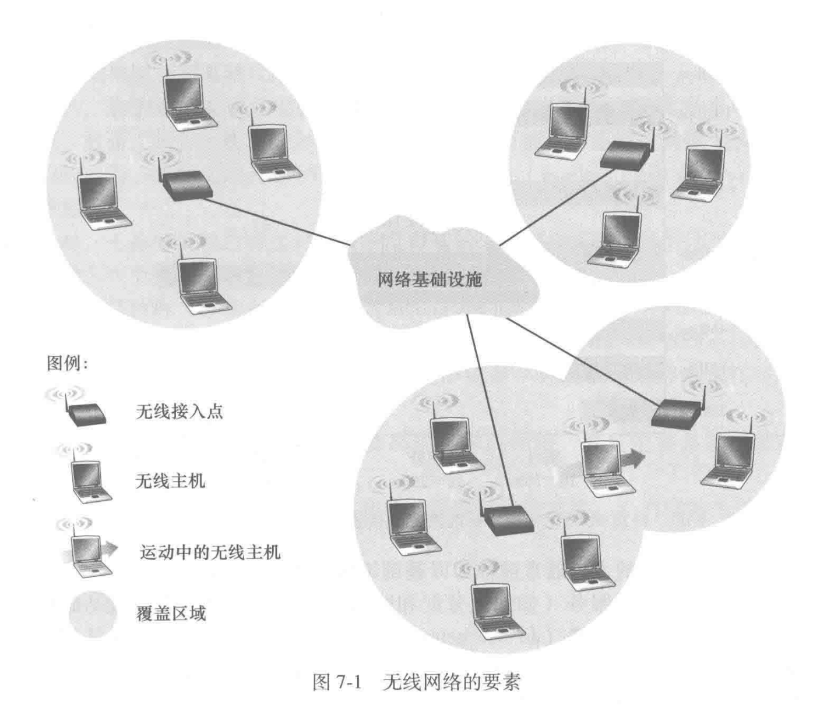
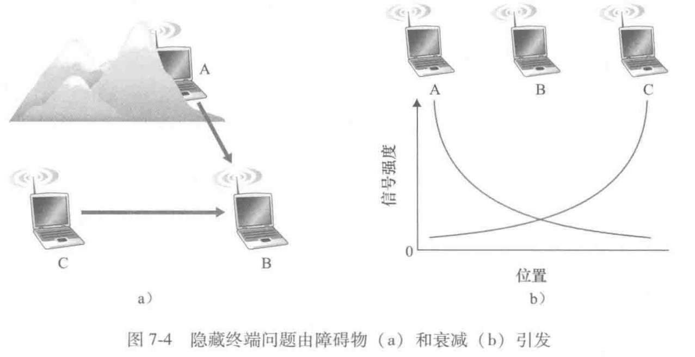
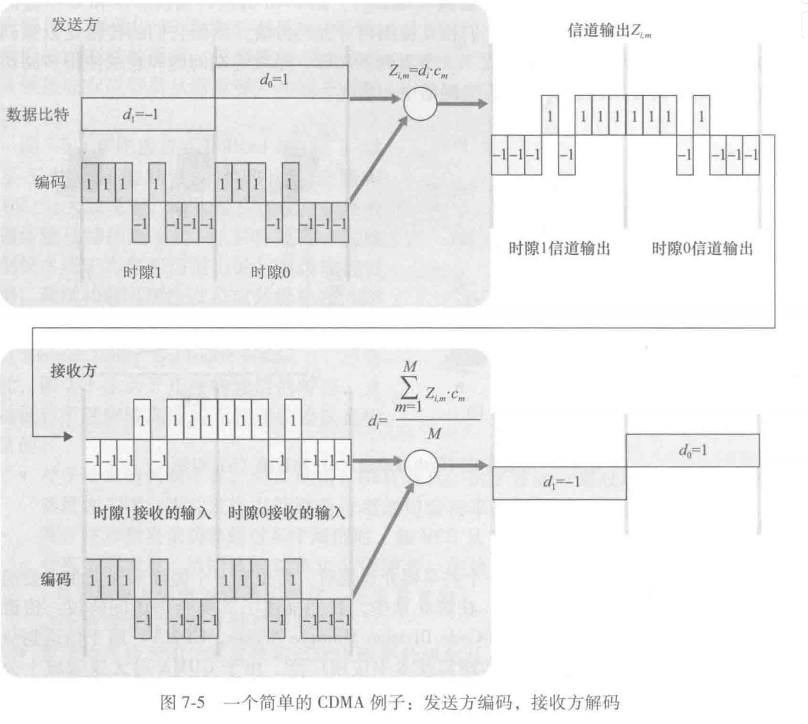
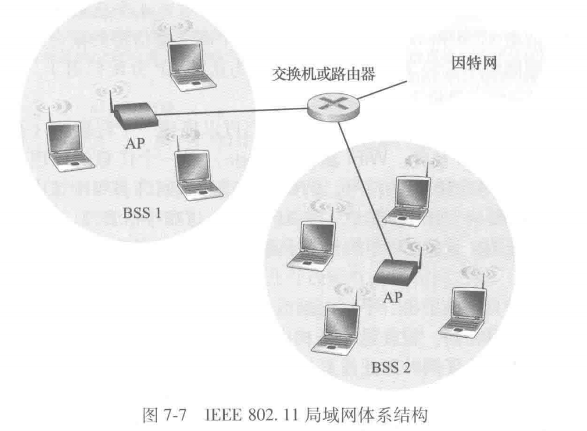
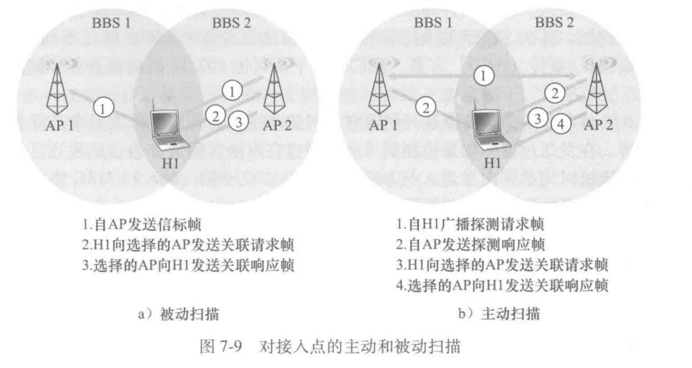
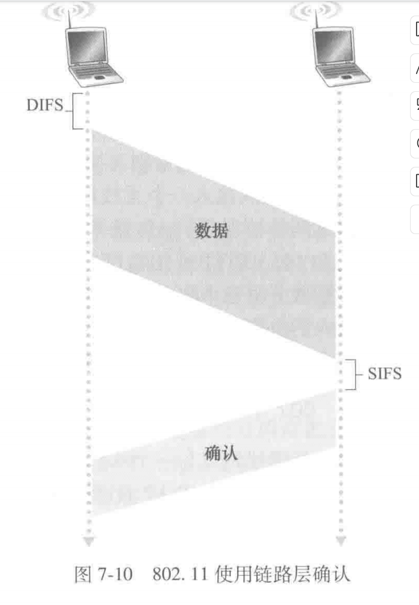
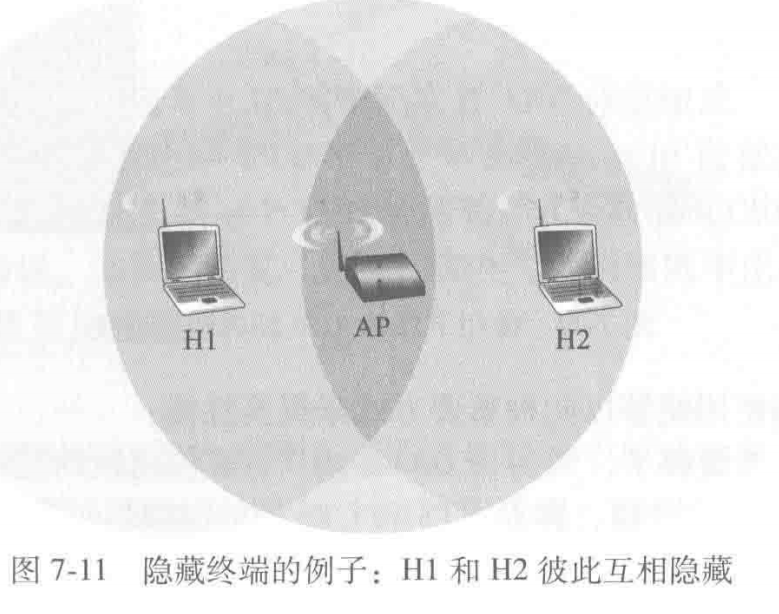
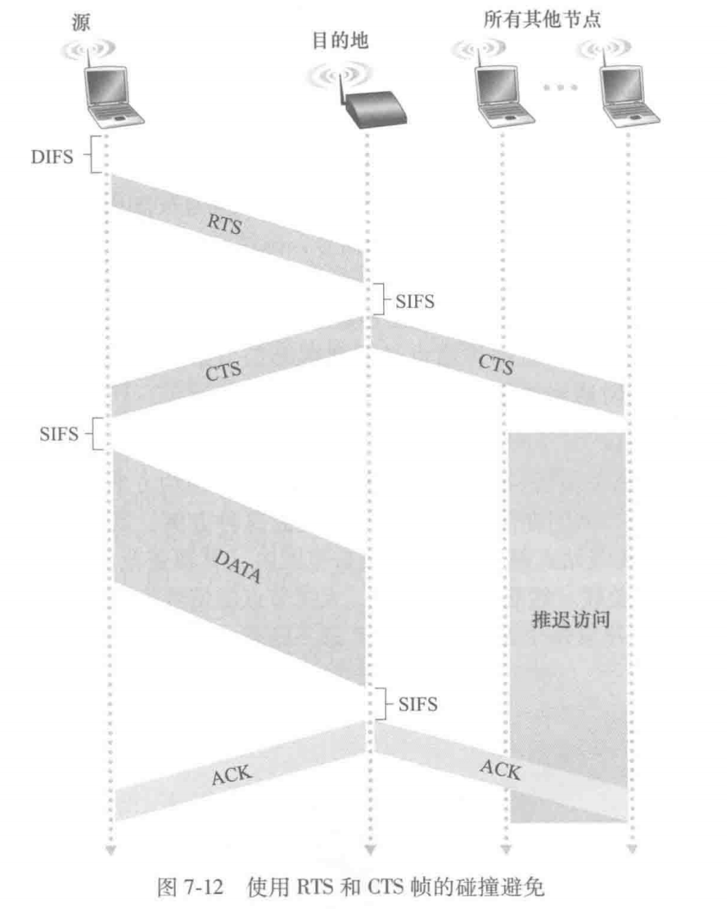
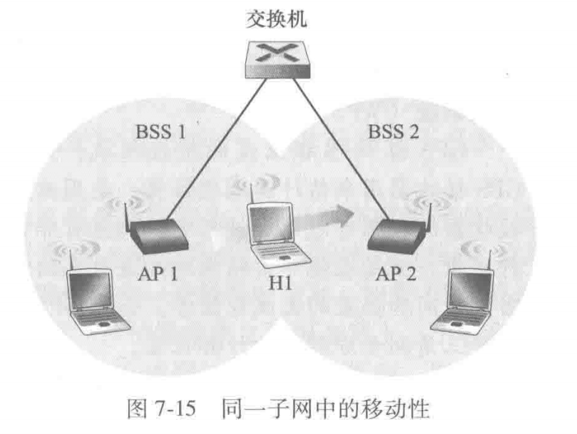
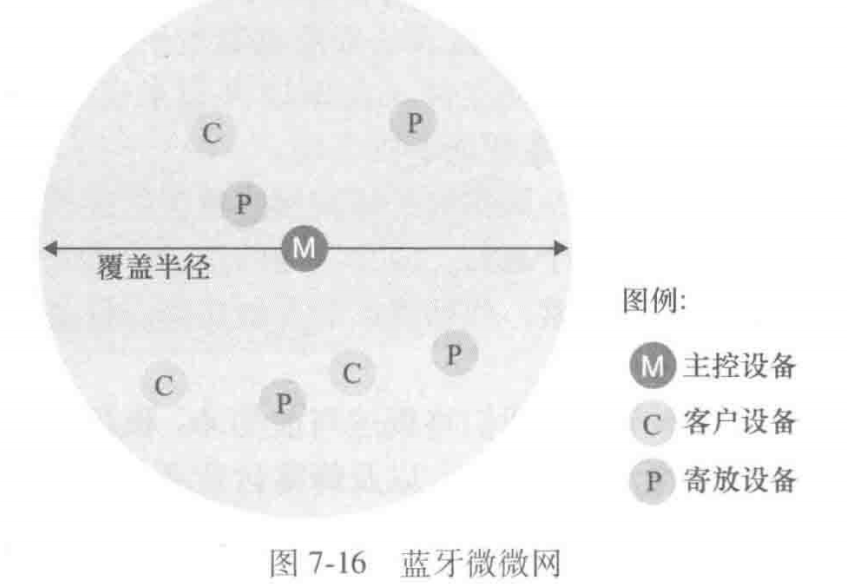

# 无线网络和移动网络

## 概述

无线网络包含的要素：无线主机，无线链路，基站。

**基础设施模式**：无线设备通过一个中央设备进行通信，而不是直接通信。（这个中央设备一般是AP）

**自组织模式**则没有这样的中央设备。主机本身需要提供诸如路由选择，地址分配以及类似dns的名称服务转换服务。

一台移动主机超出一个基站的覆盖范围而到达另一个基站的覆盖范围后，接入更大的网络连接点，这一过程称为**切换**。

可以借助以下的准则对无线网络进行分类：

- 在该无线网络中的分组是否跨越了一个无线跳或者多个无线跳
- 网络中是否有诸如基站这样的基础设施

举例几种无线网络。

- 单跳、基于基础设施。具有与较大有线网络连接的基站。比如802.11网络（WiFi），4G网络。
- 单跳，无基础设施。在这类网络中，不存在与无线网络相连的基站。在这种单跳网络中的节点之一可以协调其他节点的传输。**蓝牙网络**是单跳、无基础设施的网络。
- 多跳，基于基础设施。一个基站表现为以邮箱方式与较大网络相连。但是有些无线节点为了经过该基站通信，可能不得不通过其他无线节点中继。如无线网状网络(wireless mesh network)
- 多跳，无基础设施。这类网络被称为移动自组织网络。

这章主要讨论单跳且基于基础设施的网络。

## 无线链路和网络特征

无线链路有以下特点：

- 递减的信号强度
- 来自其他源的干扰
- 多路径传播

所以无线链路中的比特差错将会比有线链路中更常见，所以无线链路协议不仅采用CRC错误检测，还采用链路层可靠的数据传送协议来重传受损的帧。

信噪比(SNR)是所受到的信号和噪声强度的相对测量。

无线网络的环境十分复杂，干扰检测也比较困难。比如A和C的信号在B处接收时会互相干扰，但是可能存在环境干扰或者距离因素导致A和C没办法检测到这个实际存在的干扰。

### CDMA

CDMA(Code Division Multiple Access)，码分多址。在无线局域网和蜂窝技术中广泛应用。

设$d_i$为发送的比特，$Z_i$为发送的码片，$c_m$为发送方使用的CDMA编码，一共有M个。则$Z_{i,m} = d_i \cdot c_m$。

则$d_i = \frac 1 M \sum_{m=1}^{M} Z_{i,m} \cdot c_m$。

## WiFi: 802.11 无线局域网

使用的频段有2.4GHz和5GHz。一般的经验是2.4G的WiFi网络比5G的WiFi网络更稳定（更能抗干扰），但是5G更快速。

### 802.11 网络体系结构

基本构件是基本服务集(Basic Service Set, BSS)。BSS包含一个或多个无线站点以及一个接入点(Access Point, AP)。

与以太网设备类似，每个802.11无线站点都具有一个6字节的MAC地址。

当某一个网络管理员安装一个AP时，该管理员为该接入点分配一个服务集标识符(Service Set Identifier, SSID)。

#### 信道与关联

802.11在2.4GHz频段使用11个信道，这11个信道相互重叠，{1,6,11}是唯一的3个非重叠信道的集合。

我们可以将环境里有多个AP的情况形象地称为WiFi丛林。这在现代的都市环境中非常的常见。

为了获取互联网接入，无线站点（你的手机）需要和多个AP中的一个相关联。802.11标准要求每个AP周期性地发送**信标帧**，每个信标帧包括该AP的SSID和MAC地址（就是手机的wifi页面上的wifi名称）。你的手机为了得知正在发送信标帧的AP，会扫描11个信道，找出来自可能位于该区域的AP所发出的信标帧。

扫描信道和监听信标帧的过程被称为被动扫描。同时无线站点也可以进行主动扫描。向位于其范围内的所有AP广播探测帧完成的。

选定一个关联的AP后，无线主机会向该AP发送一个关联请求帧，并且该AP以一个关联响应帧进行响应。对于主动扫描需要第二个请求/响应握手（因为AP并不知道主动扫描的主机最终选择谁）。类似DHCP客户可以从多个DHCP服务器中进行选择。

同时还有鉴权的问题，为了创建关联无线主机可能需要向某个AP鉴别它自身。一种方式是基于一个站点的MAC地址允许其接入，第二种方式是应用用户名和口令（也就是密码接入）

### 802.11 MAC 协议

802.11 MAC协议是基于CSMA/CA的。（带碰撞避免的CSMA）

其使用链路层确认/重传（ARQ）来实现可靠的数据传送。

链路层确认：目的站点在接收到一个通过CRC校验的帧后，等待一个被称为短帧间间隔(SIFS)的一小段时间后，发送一个确认帧，如果发送站点在给定的时间内未收到确认帧，就会假定出现了错误并重传该帧。如果若干次重传后仍然未收到确认，传输站将会放弃该帧。

CSMA/CA 的过程：

1. 如果某个站点最初监听到信道空闲，将会在一个分布式帧间间隔(DIFS)的段时间段后发送该帧
2. 否则，选取一个随机回退值，并且在侦听到信道空闲时递减该值。单侦听到信道忙时，计数值不变。
3. 计数值降为0时，该站点发送整个数据帧并等待确认
4. 如果收到确认，传输站知道它的帧已经被目的地正确接收，如果要发送另一帧，它将从第二步开始CSMA/CA协议，如果未收到确认，传输站将重新进入第二步中的回退阶段，并从一个更大范围内选取随机值。

CSMA/CD在侦听到信道空闲直接发送，而CSMA/CA在侦听到信道空闲时只是减少等待值。这是因为CSMA/CA采用在无线环境下，这种环境十分复杂，侦听到空闲不一定就真的是空闲（有干扰），**而且CSMA/CA并不对碰撞进行检测**。

- 隐藏终端的处理

如图，这种情况下H1和H2互相检测不到对方的存在。二者都检测到空闲，然后进行发送，这导致了一个碰撞，H1和H2的整个发送阶段信道都被浪费了。

针对这种情况，802.11引入了短请求发送(Request to Send, RTS)控制帧和允许发送(Clear to Send, CTS)控制帧来预约对信道的访问。

当发送方要发送一个DATA帧时，它能够首先向AP发送一个RTS帧，指示传输DATA帧和确认帧需要的总时间。AP收到RTS帧后，广播一个CTS帧作为响应。（不仅给发送方一个许可，也抑制其他发送方不要发送）

### 802.11 帧

不作细致的展开，应该不是考试重点，可以直接看书。

一个比较有意思的是802.11帧中有4个地址，分别是：

- 源地址：发送该帧的站点的MAC地址
- 目的地址：接收该帧的站点的MAC地址
- 访问点地址：如果该帧是发往AP的，则该地址为AP的MAC地址，否则为广播地址
- 发送方地址：如果该帧是发往AP的，则该地址为发送该帧的站点的MAC地址，否则为广播地址

以及有序号，这里跟rdt中的序号是一样的作用。（作为标识，防止丢包和乱序）

### 在相同子网中的移动性

当H1从BSS1移动到BSS2中，它可以保持自己的IP地址和所有正在进行的TCP连接。如果互联设备是一个路由器，则H1必须在它移动进入的子网中获得一个新的地址，这种地址的变化将打断在H1中进行的任何TCP连接。使用网络层移动协议（如移动IP）可以避免这种情况。

但是H1从BSS1移动到BSS2时，在主机和AP角度，H1收到来自AP2的信标帧，AP1的信号逐渐减弱且AP2的信号更强，并且AP2和AP1有相同的SSID，H1然后与AP1接触关联，并与AP2关联起来，保持其IP地址和正在维护的TCP对话。

对于交换机，自学习可以解决偶尔的移动，但是没有设计用来支持在不同BSS间高度移动且又**保持TCP连接**。一种解决方法是在移动到AP2后，让AP2以H1的源地址向交换机发送一以太网广播帧。交换机收到该帧后更新转发表。

### 个人域网络：蓝牙

蓝牙网络是单跳、无基础设施的网络。是一个自组织的网络，会将自己组织成一个最多有8个活动设备的微微网，其中一个设备是主控设备，其他是客户机。

也不是特别重要，书上就简单介绍了一下，应该不会考就不看了。